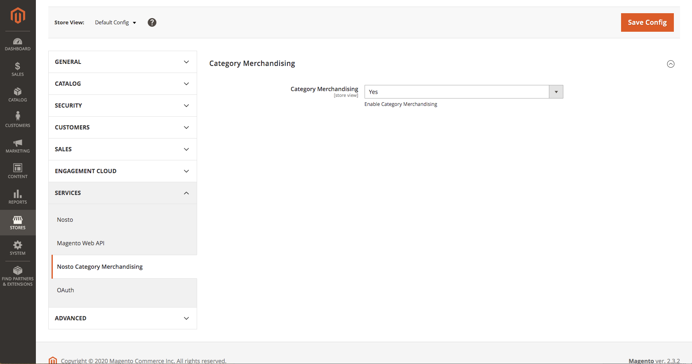

# Configuring

The extension can be configured by navigating to Stores &gt; Configuration &gt; Services &gt; Nosto Category Merchandising.

## Enabling/Disabling CMP

Navigate to `Stores -> Settings -> Configuration -> Service -> Nosto Category Merchandising` and select `Yes` in the dropdown

## 

