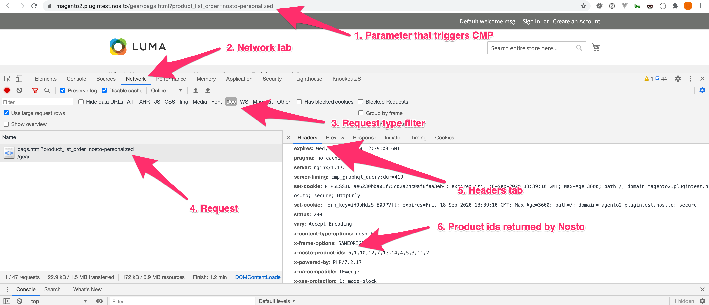

# Debugging the CMP

If CMP is not working on Magento 2 while being enabled and configured, there are ways to debug it on store front and backend.

## How to debug on store front? 

1. Navigate to the category page and select *Relevance* as a sorting option from the sorter dropdown menu. 
   If *Relevance* sorting is not available, you need to manually add the parameter `product_list_order=nosto_personalized` *(screenshot, step 1)* 
   to the URL, e.g. https://magento2.plugintest.nos.to/gear/bags.html?product_list_order=nosto-personalized. If your URL already has parameters, 
   you can append with the `&` symbol.

2. Open developer tools in your browser, select *Network* tab (screenshot, step 2), display only *Doc* responses (screenshot, step 3) 
   and click on the actual request *(screenshot, step 4)* on the left side. 
   
3. Finally, choose *Headers* tab (screenshot, step 5) and scroll to the response header named *x-nosto-product-ids* (screenshot, step 6). 
   These are the product ids Nosto CMP sequence has returned. If there’s no such header or it is empty
   it means that Nosto could not find the sequence or there are issues on the plugin side.
   
4. Category product list results may be cached. To reset the cache it is possible to add a random parameter to the URL (e.g. `&random=random`)  

## How to debug on the backend (server) ?

1. Enable debug logging in Magento 2 (https://devdocs.magento.com/guides/v2.4/config-guide/cli/logging.html).

2. Visit category pages where Nosto CMP sequence is configured.

3. See debug logs (the actual file name and location may vary).