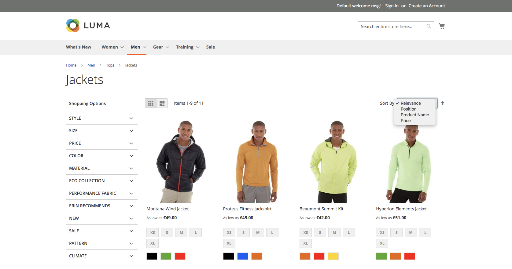

# Translating

Nosto adds a new sort order option called "Relevance" which is visible in the front end. If your store is localised and you would like to translate the text into other languages, please follow the Magento 2 documentation on [Translation dictionaries and language packages](https://devdocs.magento.com/guides/v2.3/config-guide/cli/config-cli-subcommands-i18n.html).

