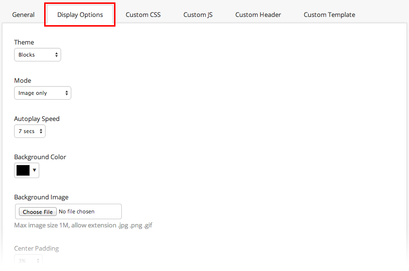
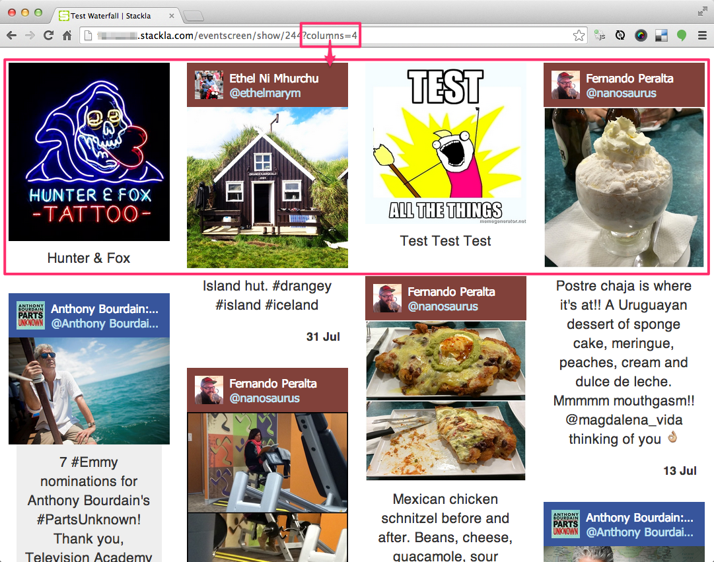
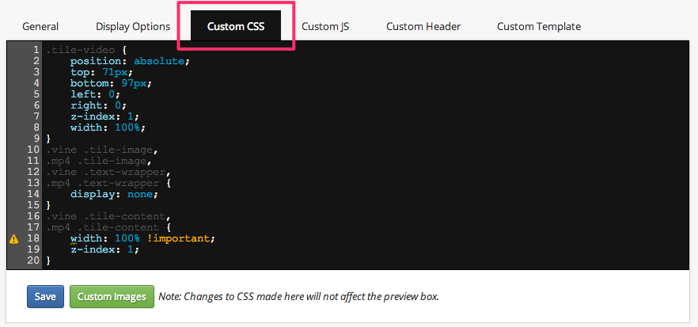
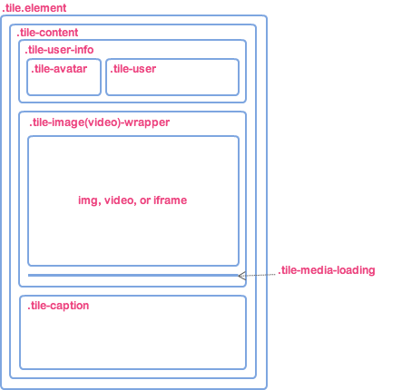
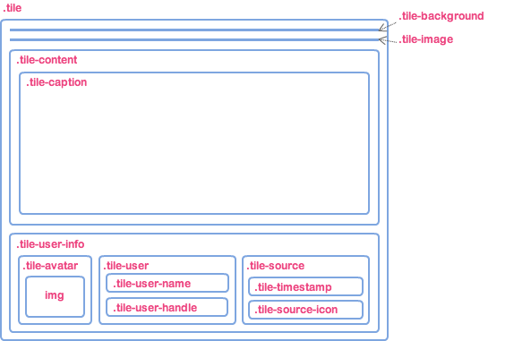
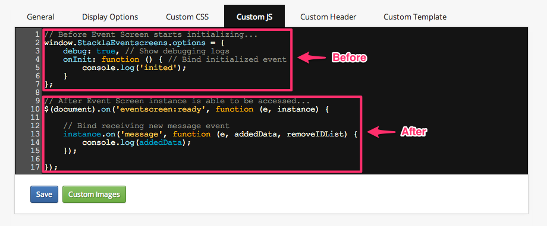
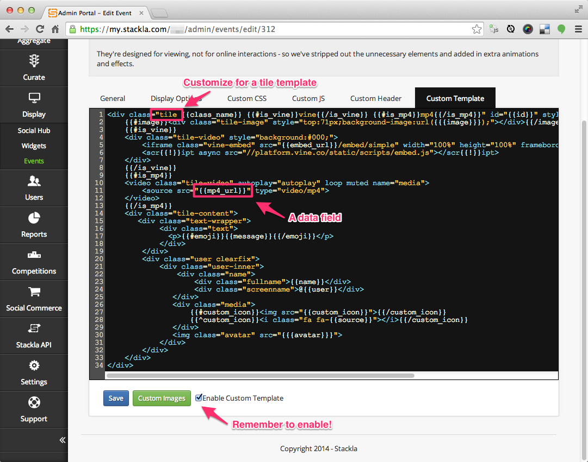
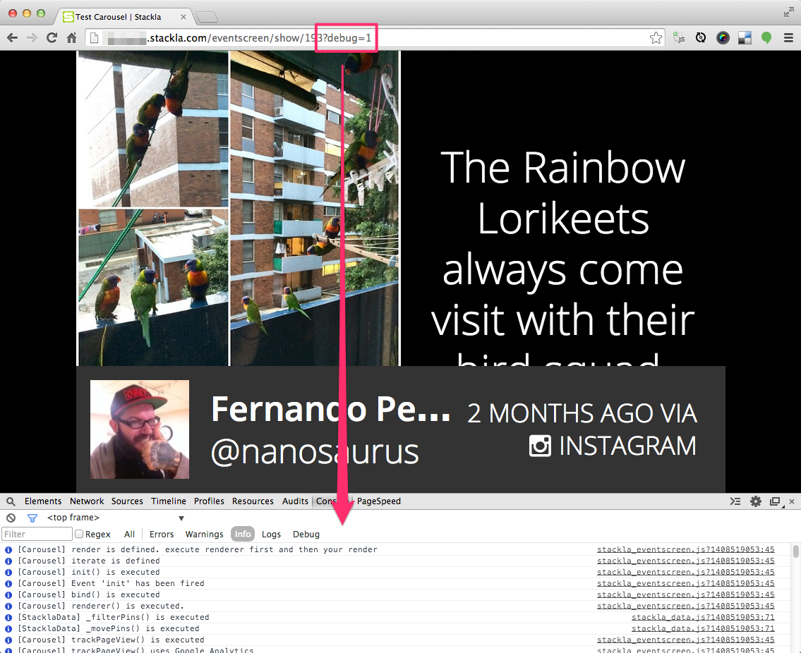

# Introduction

Nosto's UGC Digital Screens features a full templating framework, as well as custom HTML, JavaScript, and CSS capabilities for developers to add their layouts, transition, data management and so much more.

## Display Options

Without writing any code, you can easily change Digital Screen's look and feel by adjusting its display options. The available options vary according to the Digital Screen type you selected.



## On-the-fly Settings

Ideally, you should change any Event Screen settings via the Admin Portal. However, you might feel that it's extremely useful to preview changes by modifying URL parameters. The following snapshot illustrates a Wall Screen that is configured to show 2 columns, but uses the _?columns=4_ GET parameter to show 4 columns on-the-fly. You can see the [Configurable Options](eventscreen.md#configurable-options) section for more information.



## Configurable Options

### Global

| Name             | Default       | Description                                                                     |
| ---------------- | ------------- | ------------------------------------------------------------------------------- |
| appendRoot       | '#container'  | CSS selector of tiles being appended to.                                        |
| debug            | 0             | Whether or not to enable showing the debugging logs.                            |
| enableImageCheck | 0             | Whether or not to enable minimal image size filter.                             |
| listUrl          | <$list\_url>  | Data service URL.                                                               |
| filterId         | <$filter\_id> | Filter ID. You can switch to use a different filter to load different data set. |
| imageMinHeight   | null          | Minimum image height. It only takes effect when enableImageCheck is turned on.  |
| imageMinWidth    | null          | Minimum image width. It only takes effect when enableImageCheck is turned on.   |
| queueLength      | 30            | Available items in queue, not including pinned tiles.                           |
| template         | '#template'   | CSS selector of Tile Mustache template.                                         |

### Waterfall

| Name                  | Default | Description                                          |
| --------------------- | ------- | ---------------------------------------------------- |
| columns               | 2       | How many columns should be shown.                    |
| use\_circular\_avatar | 'false' | Set 'true' to make all avatar images to be circular. |

### Carousel

| Name                      | Default               | Description                                                                                            |
| ------------------------- | --------------------- | ------------------------------------------------------------------------------------------------------ |
| autoplay\_speed           | 7000                  | Autoplay speed in milliseconds.                                                                        |
| background\_image         | null                  | Background image URL.                                                                                  |
| center\_padding           | '9.5%'                | Side padding (px or %).                                                                                |
| event\_name               | <$event\_name>        | Event Screen name which is displayed at header.                                                        |
| header\_color             | '#ffffff'             | Header font color in RGBA or HEX format.                                                               |
| header\_hashtag           | ''                    | Event Screen hashtag which is displayed at header.                                                     |
| header\_background\_color | '#c80000'             | Header background color in RGBA or HEX format.                                                         |
| header\_background\_image | ''                    | Header background image URL.                                                                           |
| header\_visible           | 'true'                | Enable to show heaer which contains name and hashtag.                                                  |
| mode                      | 'text-over-image'     | Text/image rendering mode which includes 'text-over-image', 'image-only', 'side-by-side' and 'random'. |
| speed                     | 500                   | Slide/Fade animation speed in milliseconds.                                                            |
| spotlight                 | 'true'                | Enables to highlight the text.                                                                         |
| stackla\_icon             | ''                    | Icon URL for custom tile.                                                                              |
| use\_circular\_avatar     | 'true'                | Set 'true' to make all avatar images to be circular.                                                   |
| theme                     | 'blocks'              | Specifying theme which includes 'blocks' and 'less-is-more'.                                           |
| transition                | 'slide'               | Available transition mode including 'slide' and 'fade'.                                                |
| tile\_background\_color   | 'rgba(0, 0, 0, 0.75)' | Tile background color in RGBA or HEX format.                                                           |

## Custom CSS

You can customize stylesheet by updating Custom CSS tab



The following diagrams illustrate the default tile HTML structure of current 2 Event Screen types.

|

### Waterfall

|

### Carousel

\| | --- | --- | |  |  |

## Custom JavaScript

We've exposed our Event Screen JavaScript instance for you to hack. You can customize it by providing `window.StacklaEventscreens.options` config object before the Event Screen instantiates. You can also subscribe `eventscreen:ready` event which is triggered immediately after Event Screen has been instantiated.



### Before Instantiation

```
// Before Event Screen starts initializing...
window.StacklaEventscreens.options = {
    debug: true, // Show debugging logs
    onInit: function () { // Bind initialized event
        console.log('inited');
    }
};
```

### After Instantiation

```
// After Event Screen instance is able to be accessed...
$(document).on('eventscreen:ready', function (e, instance) {
    // Bind receiving new message event
    instance.on('message', function (e, addedData, removeIDList) {
        console.log(addedData);
    });
});
```

For more detail, please check the [Event Screen JavaScript API](https://github.com/Stackla/docs/blob/master/docs/api-docs/javascript/reference/README.md) documentation.

## Custom Template

No matter which Event Screen type you are using, it is always composed by many **tiles**. You can have your customized tile template by enabling the Custom Template. To write your own template, you must learn to use [Mustache](http://mustache.github.io), a very famous template engine. Check [Tile Data](eventscreen.md#tile-properties) section to see what are the fields you can use in your template.



## Tile Data

You can use all fields from data service in Custom Template. Besides, we also added several useful data fields that you might need as well.

### Global

| Name                  | Type       | Description                                                                    |
| --------------------- | ---------- | ------------------------------------------------------------------------------ |
| caption               | (String)   | Tile message which escaped and decorated properly.                             |
| ecal\_data            | (Array)    | Ecal data.                                                                     |
| emoji                 | (Function) | Mustache lambda to show emoji icons.                                           |
| has\_avatar           | (Boolean)  | Indicate if the user has avatar.                                               |
| has\_image            | (Boolean)  | Indicate if the tile has image.                                                |
| has\_image\_dimension | (Boolean)  | Indicate if the image has size.                                                |
| has\_title            | (Boolean)  | Indicate if the tile has title.                                                |
| has\_video            | (Boolean)  | Indicate if the tile has video.                                                |
| image\_alt\_text      | (String)   | Alternative text for image.                                                    |
| image\_max            | (Array)    | Image maximum size in array.                                                   |
| image\_max\_width     | (Number)   | Image maximum width.                                                           |
| image\_max\_height    | (Number)   | Image maximum height.                                                          |
| image\_type           | (String)   | Image size type. It could be 'small' or 'standard'.                            |
| is\_ecal              | (Boolean)  | Indicates if it's a ecal tile.                                                 |
| is\_firefox           | (Boolean)  | Indicates if user's browser is firefox.                                        |
| is\_ie8               | (Boolean)  | Indicates if user's browser is IE8.                                            |
| is\_stackla\_feed     | (Boolean)  | Indicates if it's a custom tile.                                               |
| is\_video             | (Boolean)  | Indicates if it's a video tile.                                                |
| last\_queued\_comment | (Object)   | Returns the last queued comment object.                                        |
| message               | (String)   | Tile message which its tags has been striped.                                  |
| original\_link        | (String)   | The link to original post.                                                     |
| show\_html            | (Boolean)  | Indicates if the tile should show HTML for custom tile.                        |
| show\_image           | (Boolean)  | Indicates if the media type is 'image'.                                        |
| show\_video           | (Boolean)  | Indicates if the media type is 'video'.                                        |
| status                | (String)   | Current status of this tile. It could be 'published', 'disabled', or 'queued'. |
| tag\_name\_list       | (String)   | Tag names which is separated by comma.                                         |
| tag\_id\_list         | (String)   | Tag IDs which is separated by comma.                                           |
| terms                 | (String)   | Terms which is separated by comman.                                            |
| timephrase            | (String)   | Formatted time string.                                                         |
| user\_link            | (String)   | URL to user's profile page.                                                    |
| via\_source           | (String)   | Shows the name of origin social media. (e.g. Twitter)                          |
| video\_url            | (String)   | Video playing URL.                                                             |

### Wall

| Name          | Type      | Description                                    |
| ------------- | --------- | ---------------------------------------------- |
| avatar\_style | (String)  | Inline style of user avatar.                   |
| class\_names  | (String)  | CSS class names which are separated by spaces. |
| enable\_tag   | (Boolean) | Indicate if the tag list should be shown.      |
| font\_size    | (String)  | Font size in %.                                |
| has\_video    | (Boolean) | Indicates if tile has video.                   |
| hide\_profile | (Boolean) | Indicates if user profile should be hidden.    |
| hide\_detail  | (Boolean) | Indicates if detail should be hidden.          |
| image\_height | (Number)  | Image height.                                  |
| image\_width  | (Number)  | Image width.                                   |
| info\_height  | (Number)  | User info height.                              |
| margin        | (Number)  | The margin.                                    |
| margin\_left  | (String)  | The left margin in pixel.                      |
| margin\_right | (String)  | The right margin in pixel.                     |
| official      | (Boolean) | Indicate if this tile is an official tile.     |
| video\_size   | (Array)   | Video dimension.                               |
| width         | (String)  | Tile width in pixel.                           |

### Carousel

| Name                     | Type      | Description                                            |
| ------------------------ | --------- | ------------------------------------------------------ |
| avatar\_class            | (String)  | Avatar CSS class name. It could be 'img-circle' or ''. |
| background\_image        | (String)  | Background image URL.                                  |
| background\_color        | (String)  | Background color in RGBA or HEX format.                |
| class\_names             | (String)  | Tile relevant CSS class names separate by spaces.      |
| is\_blocks\_theme        | (Boolean) | Indicates if it is using 'Blocks' theme.               |
| is\_less\_theme          | (Boolean) | Indicates if it is using the 'Less is More' theme.     |
| is\_side\_by\_side\_mode | (Boolean) | Indicates if it is using 'Side-by-Side' mode.          |
| speed                    | (Number)  | Transition speed in milliseconds. Default is 500.      |

## Debugging Mode

Our developers add debugging logs for every methods that event screen executes. By adding **?debug=1** as an extra URL parameter, you will see these logs in Developer Console. It's sometimes easier for you, as a developer, to investigate your Custom JavaScript issues.


