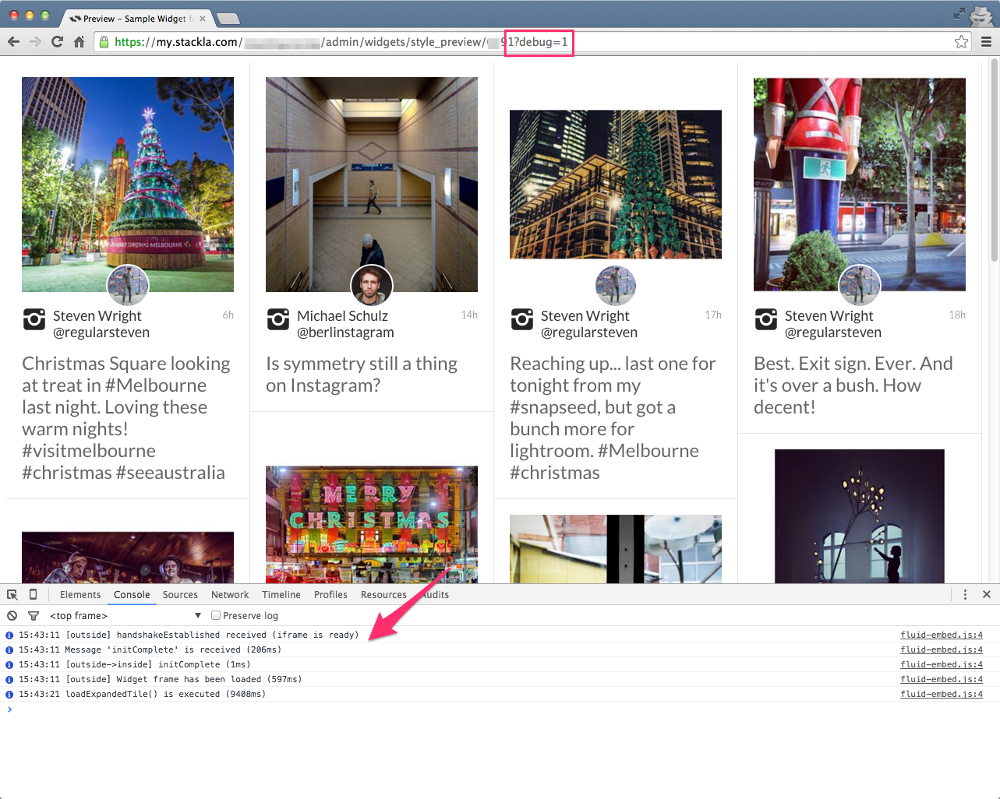
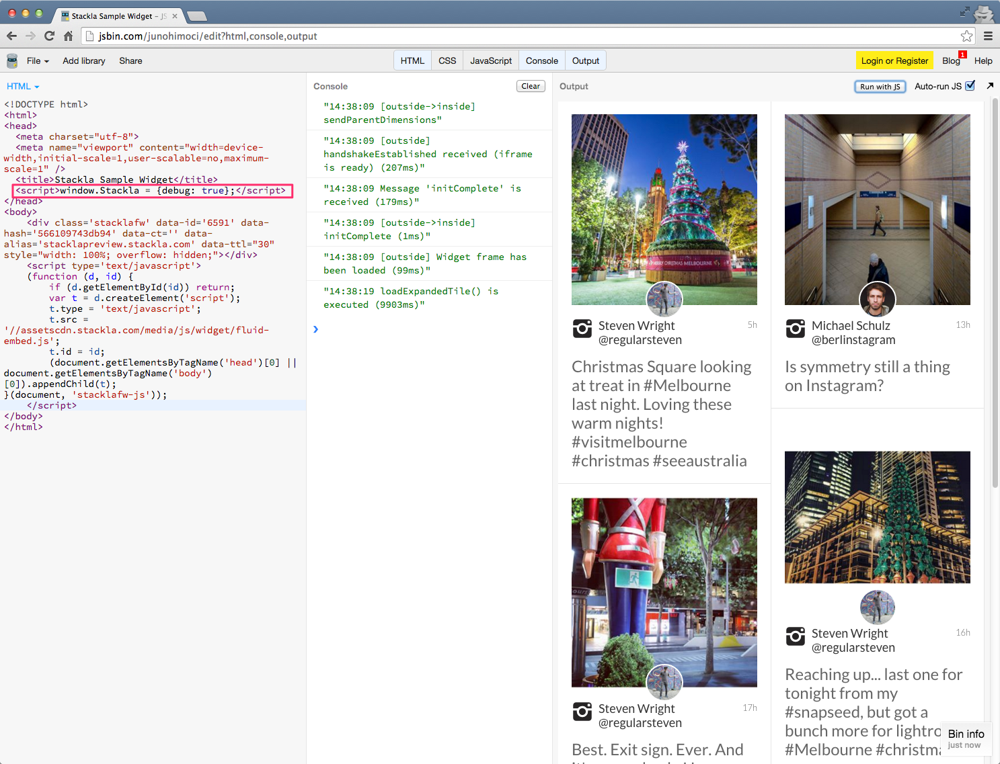

# Introduction


You are reading the **Classic Widget Documentation**

Classic widgets are a previous widget version for onsite widgets created before September 23rd.

From September 23rd 2025, all new widgets created will be NextGen.

Please check your widget version on the **Widget List page** to see if it is **Classic** or **NextGen** widget.

You can read the [Nextgen widget documentation here](../../../guides/widgets-nextgen/).


* [Debugging Mode](howto.md#debugging-mode)
* [Use the Code Editor](howto.md#use-the-code-editor)
* [Customize Inline Tile](howto.md#inline-tile)
* [Customize Expanded Tile](howto.md#expanded-tile)
* [Create Your Widget - Blank Canvas](howto.md#blank-canvas)

## Debugging Mode

Sometimes it’s easier for you, as a developer, to investigate Custom JavaScript issues by viewing the widgets through the Debugging Mode in your browser. Our developers add debugging logs for almost all methods that widgets execute. You can view these logs in your Developer Console using the following methods.

### Via URL Parameter

You can enable it by simply adding **?debug=1** as an extra URL parameter.

[](https://github.com/Stackla/docs/blob/master/wp-content/uploads/2017/11/snapshot-enable-logging-by-url-3.png)

### Via Global Variable

Or you can enable it by adding the following JavaScript global variable. You must place it before the widget embed code.

```javascript
<script>window.Stackla = {debug: true};</script>
```

[](https://github.com/Stackla/docs/blob/master/wp-content/uploads/2017/11/snapshot-enable-logging-by-global-3.png)

[Open in JSBin](http://jsbin.com/junohimoci/edit?html,console,output) | [Back to Top](howto.md#top)

## Use the Code Editor

You can use the Code Editor to modify both your Custom CSS, HTML and JavaScript. The CSS editor supports [LESS CSS pre-processor](http://lesscss.org). That means you can use both traditional CSS syntax and the better LESS syntax.

### Fork from Nosto's UGC

You can now also click the **fork** link at the top-right corner of each editor pane. This brings the boilerplate code from the Nosto's UGC codebase so that you don't need to write from scratch or copy & paste from our Developer Portal.

.png>)

## Customize Inline Tiles

All inline tiles reside in an Iframe with the **widgetapp.stackla.com** URL. You can't just write JavaScript on your website to access it because of browser security restrictions. The only way to access it is via our Code Editor.

### Boilerplate

To quickly get started with Custom Expanded Tile JavaScript, you can [fork](howto.md#fork-from-stackla) or copy & paste the following code into the editor.

```
$.extend(Callbacks.prototype, {
    onCompleteJsonToHtml: function (tileObject, t) {
        return tileObject;
    },
    onCompleteRenderImage: function(img) {

    },
    // tiles is a jQuery array object, use tiles. each when traversing
    onCompleteAddingToDom: function (tiles) {
    },
    //Call first, before render/window resize
    onBeforeRenderIsotope: function (containerWidth, maxTileWidth, margin, numColumns, currentTileWidth) {
        //Can be used to handle break-points for responsiveness, for example:
        /*
        if (containerWidth > 900) {
            var columns = 6;
            return {
                tileWidth: Math.floor(((containerWidth - margin) / columns) - margin);
                numColumns: columns
            }
        } else {
            var columns = 3;
            return {
                tileWidth: Math.floor(((containerWidth - margin) / columns) - margin);
                numColumns: columns
            }
        }
        */

        // return tile width, the isotope will be init as tile width + margin
        return {
            tileWidth: currentTileWidth,
            numColumns: numColumns
        }
    },
    // call second, before each tile width and height is set
    getTileWidth: function (tile, tileWidth, margin, numColumns) {
        // return tile width
        return tileWidth;
    },
    //Call third, after tile width and height are set
    onCalculateDimensions: function (tile) {

    },
    // After the filtering changed
    onCompleteChangeFilter: function (tiles, prevFilterId, nextFilterId) {

    },
    // Before more tiles are rendered
    onBeforeRenderTiles: function (addedIds, addedData) {

    },
    // After more tiles are rendered
    onCompleteRenderTiles: function ($addedTiles, addedData) {

    },
    // Triggers when it's the end of the scrolling
    onScrollLoad: function (tiles, jsLoading) {

    },
    // Triggers when it's the end of the scrolling
    onScrollEnd: function (tiles, jsLoading) {

    },
    // Triggers when the parent page triggers a customized postMessage
    onMessage: function (type, data) {

    }
});
//======================
// Customisable Strings
//======================
Strings.load_more = 'Load more content';
Strings.scroll_load = 'Loading...';
Strings.scroll_end = 'There is no more content to be displayed.';
```

For more information, please check the [Widget Inline Tile JavaScript API](howto.md) documentation.

[Back to Top](howto.md#top)

### Available JavaScript Libraries

* **jQuery**: You can access it by using the `$` global variable. The current version is **1.7.1**.
* **lodash**: You can access it by using `_` global variable. The current version is **3.10.1**.
* **Mustache.js**: You can access it by using the `Mustache` global variable. The current version is **0.8.1**.
* **CryptoJS**: You can access it by using `CryptoJS` global variable. The current version is **3.1.2**.

[Back to Top](howto.md#top)

## Customize Expanded Tile

We would recommend the use of our Expanded Tile Code Editor when customizing your Expanded Tiles. However, as the Widget Expanded Tiles are rendered in their parent page, you can also customize them by adding JavaScript to your parent page HTML.

### Boilerplate

To quickly get started with Custom Expanded Tile JavaScript, you can [fork](howto.md#fork-from-stackla) or copy and paste the following code into the editor.

```
// Events
Stackla.WidgetManager
    .on('tileExpand', function (e, data) {
        console.log(e.type, data.expandType,  data.tileData,  data.widgetId);
    })
    .on('beforeExpandedTileOpen', function (e, data) {
        console.log(e.type, data.el, data.tileData,  data.widgetId);
    })
    .on('expandedTileImageLoad', function (e, data) {
        console.log(e.type, data.el, data.tileEl, data.widgetId);
    })
    .on('beforeExpandedTileImageResize', function (e, data) {
        console.log(e.type, data.sizes, data.el, data.tileEl, data.widgetId);
    })
    .on('expandedTileOpen', function (e, data) {
        console.log(e.type, data.el, data.tileData,  data.widgetId);
    })
    .on('expandedTileImageResize', function (e, data) {
        console.log(e.type, data.sizes, data.el, data.tileEl, data.widgetId);
    })
    .on('userClick', function (e, data) {
        console.log(e.type, data.tileData, data.widgetId);
    })
    .on('shareClick', function (e, data) {
        console.log(e.type, data.shareNetwok, data.tileData, data.widgetId);
    })
    .on('moreLoad', function (e, data) {
        console.log(e.type, data.page, data.widgetId);
    })
    .on('shopspotFlyoutShow', function (e, data) {
        console.log(e.type, data.productTag, data.tileData, data.widgetId);
    })
    .on('shopspotActionClick', function (e, data) {
        console.log(e.type, data.productTag, data.tileData, data.widgetId);
    });

// Callbacks
var widgetId = '-1'; // TODO - Change to your widget ID.
window.StacklaFluidWidgetProperties = {};
window.StacklaFluidWidgetProperties[widgetId] = {
    callbacks: {
        'onAfterWidgetLoaded': function () {
            console.log('onAfterWidgetLoaded');
        },
        'onBeforeExpandedTileOpen': function (tile, data) {
            console.log('onBeforeExpandedTileOpen');
            return tile;
        },
        'onAfterExpandedTileOpen': function () {
            console.log('onAfterExpandedTileOpen');
        },
        'onBeforeExpandedTileImageResize': function () {
            console.log('onBeforeExpandedTileImageResize');
        },
        'onAfterExpandedTileImageResize': function () {
            console.log('onAfterExpandedTileImageResize');
        },
        'onAfterExpandedTileImageLoad': function () {
            console.log('onAfterExpandedTileImageLoad');
        }
    }
};

// Methods
// Stackla.WidgetManager.postMessage(typeName, data, [widgetId])
// Stackla.WidgetManager.sync();
// Stackla.WidgetManager.search(widgetId, keyword);
// Stackla.WidgetManager.changeFilter(widgetId, filterId);
```

For more information, please check the [Widget Expanded Tile JavaScript API](reference.md#parent-page) and [How to use "Filter and search" in Widget](https://github.com/Stackla/docs/blob/master/docs/guides/how-to-use-filter-and-search-in-widget/README.md) documentation.

[Back to Top](howto.md#top)

### Available JavaScript Libraries

* **jQuery**: You can access it by using the `$tackla` global variable. The version is 1.10.2.

[Back to Top](howto.md#top)

## Create Your Widget - Blank Canvas

We provide a Blank Canvas widget so that you can build your widget when you find that the current UGC Widgets don't fit your customization needs.

[.png>)](http://sdp-media.dev/images/api-docs/javascript/widgets/snapshot-blank-canvas.png)

### Boilerplate

To quickly get started with the Blank Canvas widget customizations, you can copy and paste the following code into the Custom Code Editor in Nosto's UGC.

#### Custom Layout

```
<div class="track">
    <div class="container">
        {{#tiles}}
            {{>tpl-tile}}
        {{/tiles}}
    </div>
</div>
```

#### Custom Tile (#tpl-tile)

```
<div class="tile">
    <div class="hd">#{{id}}</div>
    <div class="bd">{{message}}</div>
    {{#image}}
    <div class="ft">
        
    </div>
    {{/image}}
</div>
```

#### Custom JavaScript

```
// Load tiles data from selected filter
Stackla.loadTilesByFilter(function (tiles) {
    // Render the layout template
    Stackla.render({tiles: tiles});
});
```

#### Custom CSS

```
@import url(https://fonts.googleapis.com/css?family=Open+Sans);
body {
    background: #ccc;
    padding: 10px 0 0 10px;
    font-family: 'Open Sans', sans-serif;
    -webkit-font-smoothing: antialiased;
    -moz-osx-font-smoothing: grayscale;
}
.tile {
    background: #fff;
    border: solid 1px #ccc;
    color: #666;
    font-size: 13px;
    padding: 10px;
    margin-right: 10px;
    margin-bottom: 10px;
    .hd {
        margin-bottom: 10px;
    }
    .bd {
        color: #333;
        font-size: 16px;
    }
}
```

For more information, please check the [Blank Canvas JavaScript API](blank-canvas.md) documentation.

[Back to Top](howto.md#top)
