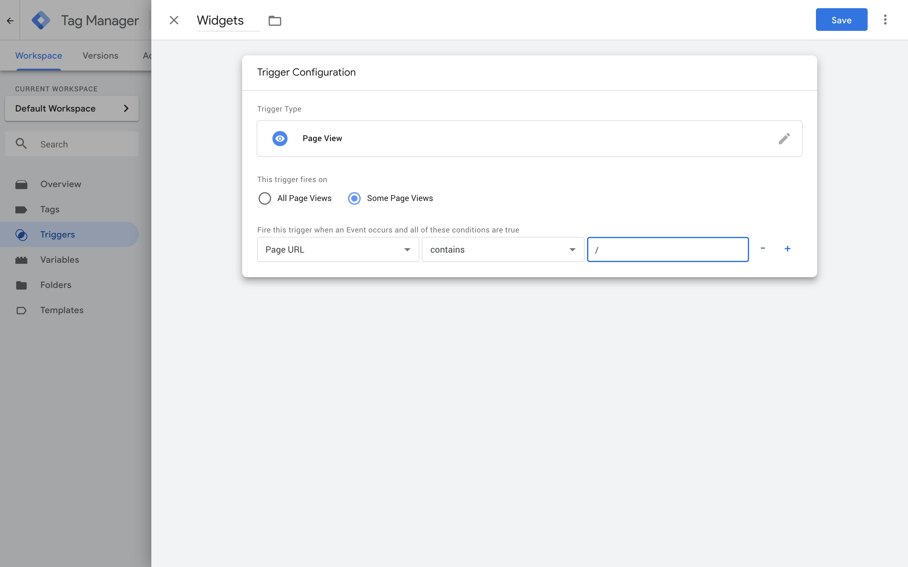
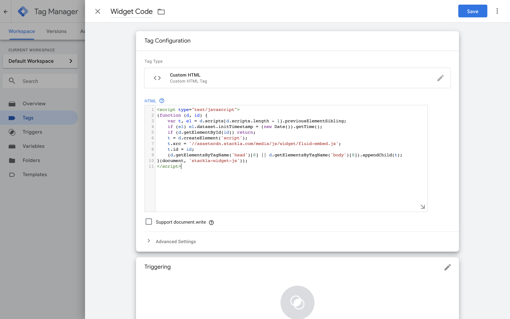
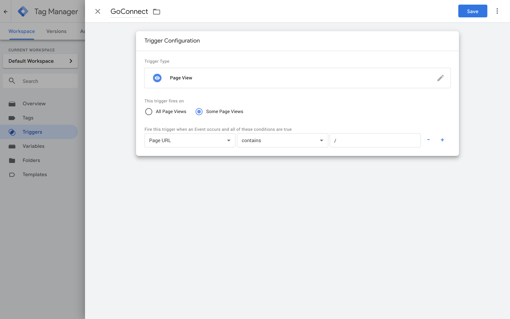
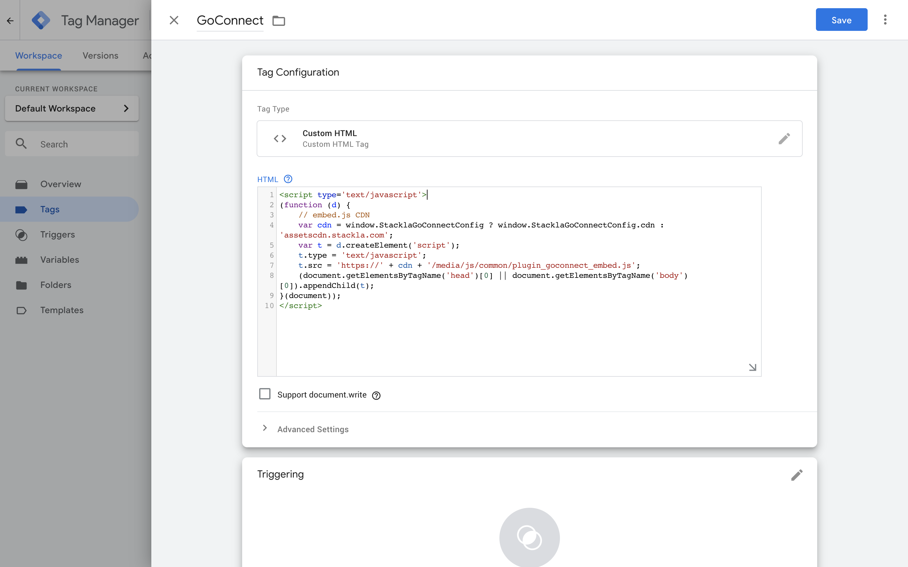

# Google Tag Manager

* [Overview](google-tag-manager.md#overview)
* [Widgets](google-tag-manager.md#widget)
* [Direct Uploader](broken-reference)

## Overview

The Google Tag Manager (GTM) is one of the most popular Tag Management systems on the internet and is used to manage Javascript and HTML tag, primarily for the purposes of tracking or collecting analytics for a website.

Google Tag Manager can be used by clients as a way of implementing UGC Widgets and Direct Uploader Forms in Content Management Systems' (CMS) that limit users from injecting Javascript.

Detailed below are the step by step ways in which GTM can be used on your website.

## Widgets

Leveraging Google Tag Manager (GTM) can be an effective way for brands to deploy Visual UGC Widgets across their digital properties, especially in Content Management Systems' (CMS) that limit users from injecting Javascript.

Outlined in this guide are the steps which can be taken to add the Javascript component of the Widget Embed code to your GTM container.

### Embed Code

The Visual UGC Widget Embed code can be broken into two components, the first component (included below) is the DIV container which defines where the Visual UGC Widget should be rendered on a webpage, as well includes the various parameters which defines what Widget and what Content is loaded.

```
<div class="stackla-widget" data-ct="" data-hash="{{widget-hash}}" data-id="{{widget-id}}" data-title="{{widget-title}}" data-ttl="60" style="width: 100%; overflow: hidden;"></div>
```

The second component is the Widget Javascript. This is the part of the Embed code which is consistent for every Widgets and can be added to your GTM container.

```javascript
<script type="text/javascript">
(function (d, id) {
    var t, el = d.scripts[d.scripts.length - 1].previousElementSibling;
    if (el) el.dataset.initTimestamp = (new Date()).getTime();
    if (d.getElementById(id)) return;
    t = d.createElement('script');
    t.src = '//assetscdn.stackla.com/media/js/widget/fluid-embed.js';
    t.id = id;
    (d.getElementsByTagName('head')[0] || d.getElementsByTagName('body')[0]).appendChild(t);
}(document, 'stackla-widget-js'));
</script>
```

### Trigger Setup

The first step in the setup is to define our Trigger(s). Triggers are used by GTM to define when **Tags** are run.

To create a Trigger, select **Triggers** from the GTM menu and create a **New** Trigger. Next we name the Trigger and select **Page View** from the **Trigger Configuration** options.



From here we can define when we want to make the Widget Javascript available on a page.

If you plan on having a Visual UGC Widget on all Pages, you should pick **All Page Views** for when the trigger fires, otherwise you should define what Page(s) the Javascript loads.

### Tag Setup

Final step in the process is to define our Tag. Tags is where we will store the Widget Javascript we identified earlier.

To create a Tag, select **Tags** from the GTM menu and create a **New** Tag.

We can now give it a name, and select **Custom HTML** from the **Tag Configuration** options.



From here we can add the Widget Javascript.

```javascript
<script type="text/javascript">
(function (d, id) {
    var t, el = d.scripts[d.scripts.length - 1].previousElementSibling;
    if (el) el.dataset.initTimestamp = (new Date()).getTime();
    if (d.getElementById(id)) return;
    t = d.createElement('script');
    t.src = '//assetscdn.stackla.com/media/js/widget/fluid-embed.js';
    t.id = id;
    (d.getElementsByTagName('head')[0] || d.getElementsByTagName('body')[0]).appendChild(t);
}(document, 'stackla-widget-js'));
</script>
```

Final step is associating the Tag with the Trigger we created before.

Once created and Saved you can then Publish.

[Return to Top](google-tag-manager.md#top)

## Direct Uploader

Leveraging Google Tag Manager (GTM) can be an effective way for brands to deploy GoConnect across their digital properties, especially in Content Management Systems' (CMS) that limit users from injecting Javascript.

Outlined in this guide are the steps which can be taken to add the Javascript component of the GoConnect Embed code to your GTM container.

### Embed Code

The Visual UGC GoConnect Embed code can be broken into two components, the first component (included below) is the DIV container which defines where the Visual UGC GoConnect Form should be rendered on a webpage, as well includes the various parameters which defines what GoConnect Form is loaded.

```
<div id='stackla-goconnect-widget' data-widget-id="{{widget-id}}"></div>
```

The second component is the GoConnect Javascript. This is the part of the Embed code which is consistent for every GoConnect Form and can be added to your GTM container.

```javascript
<script type='text/javascript'>
(function (d) {
    // embed.js CDN
    var cdn = window.StacklaGoConnectConfig ? window.StacklaGoConnectConfig.cdn : 'assetscdn.stackla.com';
    var t = d.createElement('script');
    t.type = 'text/javascript';
    t.src = 'https://' + cdn + '/media/js/common/plugin_goconnect_embed.js';
    (document.getElementsByTagName('head')[0] || document.getElementsByTagName('body')[0]).appendChild(t);
}(document));
</script>
```

### Trigger Setup

The first step in the setup is to define our Trigger(s). Triggers are used by GTM to define when **Tags** are run.

To create a Trigger, select **Triggers** from the GTM menu and create a **New** Trigger. Next we name the Trigger and select **Page View** from the **Trigger Configuration** options.



From here we can define when we want to make the GoConnect Javascript available on a page.

If you plan on having a Visual UGC GoConnect Form on all Pages, you should pick **All Page Views** for when the trigger fires, otherwise you should define what Page(s) the Javascript loads.

### Tag Setup

Final step in the process is to define our Tag. Tags is where we will store the Widget Javascript we identified earlier.

To create a Tag, select **Tags** from the GTM menu and create a **New** Tag.

We can now give it a name, and select **Custom HTML** from the **Tag Configuration** options.



From here we can add the GoConnect Javascript.

```javascript
<script type='text/javascript'>
(function (d) {
    // embed.js CDN
    var cdn = window.StacklaGoConnectConfig ? window.StacklaGoConnectConfig.cdn : 'assetscdn.stackla.com';
    var t = d.createElement('script');
    t.type = 'text/javascript';
    t.src = 'https://' + cdn + '/media/js/common/plugin_goconnect_embed.js';
    (document.getElementsByTagName('head')[0] || document.getElementsByTagName('body')[0]).appendChild(t);
}(document));
</script>
```

Final step is associating the Tag with the Trigger we created before.

Once created and Saved you can then Publish.

[Return to Top](google-tag-manager.md#top)
