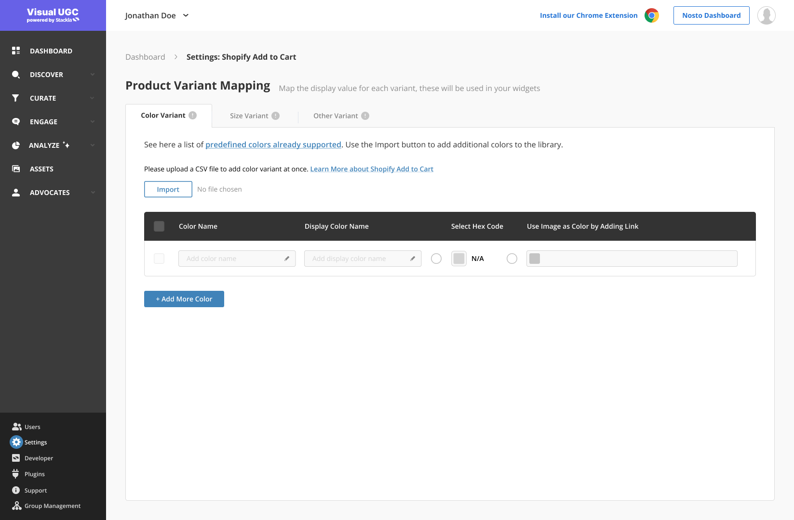

# Global Variant Mapping for Add to Cart

## Overview

If your products have variants, you will need to ensure your variants are mapped in Nosto's UGC before enabling the Shopify Add to Cart feature in your widgets.

<figure><figcaption></figcaption></figure>

## Predefined Mappings

Nosto's UGC supports a library of predefined mappings for colors and sizes. If our defaults cover your variants, you don't need to do any additional mapping. Widgets will automatically use those defaults. You can find the library of default values by going to:

* Settings > Shopify Add to Cart
* Under the Color or Sizes tab, click on the default library link.

<figure><figcaption></figcaption></figure>

## Default Experience

We recommend making sure that your variants are mapped in Nosto's UGC. However, we provide some default experience in case some mappings are missing to ensure end-users can still add your products to the cart.

**Default Experience for missing color mappings**

Colors are shown in widgets using color swatches based on the HEX, RGB, or icon values configured in the global mappings. In case a product is loaded in the widget with a color that is not mapped in Nosto's UGC, the widget will default to showing just the color name and a '.' for that color. The user will still be able to select that variant. See example below:

<figure><figcaption></figcaption></figure>

**Default Experience for missing size mappings**

Size is shown in widgets based on the display name configured in the global mappings. In case a product is loaded in the widget with a size that is not mapped in Nosto's UGC, the widget will default to show the value for the same exactly as provided by the Shopify API. For example, if the Shopify API returns 's' for a small size and in Nosto's UGC we have a display value mapping for 's' to be shown as 'Small', the widget will show the value 'Small'; otherwise, will just show 's'. The user will still be able to select that variant.

**Default Experience for missing custom variant mappings**

If your products have a variant type other than size and color, you can configure mappings for them in the global mapping section. See details here.

In case a product is loaded in the widget with a variant value that is not mapped in Nosto's UGC, the widget will default to show the value for the same exactly as provided by the Shopify API. For example, if the Shopify API returns 'cotton-material' for a material variant and in Nosto's UGC we have a display value mapping for 'cotton-material' to be shown as 'Cotton', the widget will show the value 'Cotton'; otherwise, will just show 'cotton-material.' The user will still be able to select that variant.

## Add Custom Mappings

If you have additional color or size variant values that are not covered by our default library or have other variant types, you can choose to import and configure your custom mappings.

**Custom Mappings for Color**

Before you can import custom mapping for colors, you need to prepare your CSV file to include the following columns:

| Column Name | Description                                                       | Column Type |
| ----------- | ----------------------------------------------------------------- | ----------- |
| name        | Variant option name as provided in the Shopify API                | text        |
| value       | Variant option HEX, RGB or icon link to be used in color swatches | text        |
| displayName | Variant option display name to be shown in the widget             | text        |

To start adding custom mappings for colors go to:

* Settings > Shopify Add to cart
* Select the Color Variant Tab
* Click Import
* Select the CSV file to import&#x20;
* Click Save

<figure><figcaption></figcaption></figure>

The imported colors will be displayed in the table. If any colors couldn't be imported you will see an error and you can see which colors were not imported.

**Custom Mappings for Size**

Before you can import custom mapping for sizes, you need to prepare your CSV file to include the following columns:

| Column Name | Description                                           | Column Type |
| ----------- | ----------------------------------------------------- | ----------- |
| name        | Variant option name as provided in the Shopify API    | text        |
| displayName | Variant option display name to be shown in the widget | text        |

To start adding custom mappings for colors go to:

* Settings > Shopify Add to cart
* Select the Size Variant Tab
* Click Import
* Select the CSV file to import&#x20;
* Click Save

The imported size will be displayed in the table. If any of the sizes couldn't be imported you will see an error and you can see which size were not imported.

<figure><figcaption></figcaption></figure>

**Custom Variant Types**

There are 2 steps to configure custom variant types:

Step 1: Configure the custom variant type

* The Variant Name needs to match the name of the variant in the Shopify API e.g. chain-type
* The Variant Display Name is the name you want to show in the widget when the variant is presented e.g. Chain Type

Step 2: Import the custom variant options

Before you can import the variant option, you need to configure the following your CSV file to include the following columns:

| Column Name | Description                                           | Column Type |
| ----------- | ----------------------------------------------------- | ----------- |
| name        | Variant option name as provided in the Shopify API    | text        |
| displayName | Variant option display name to be shown in the widget | text        |

To start adding mappings for your custom variant options go to:

* Settings > Shopify Add to cart
* Select the Other Variant Tab
* Click Import
* Select the CSV file to import&#x20;
* Click Save

The imported variant options will be displayed in the table. If any of the options couldn't be imported you will see an error and you can see which options were not imported.

