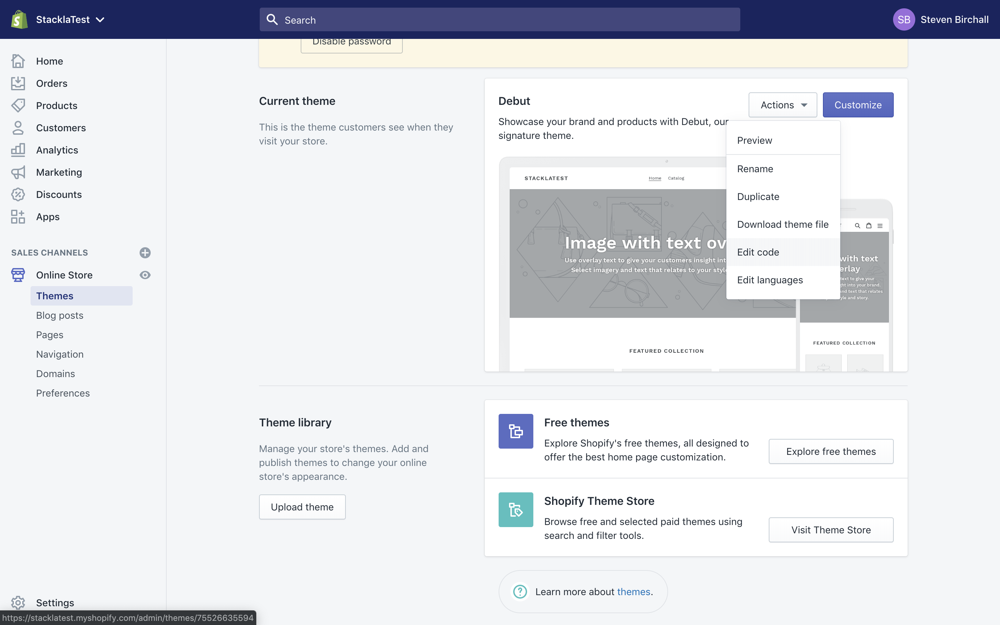
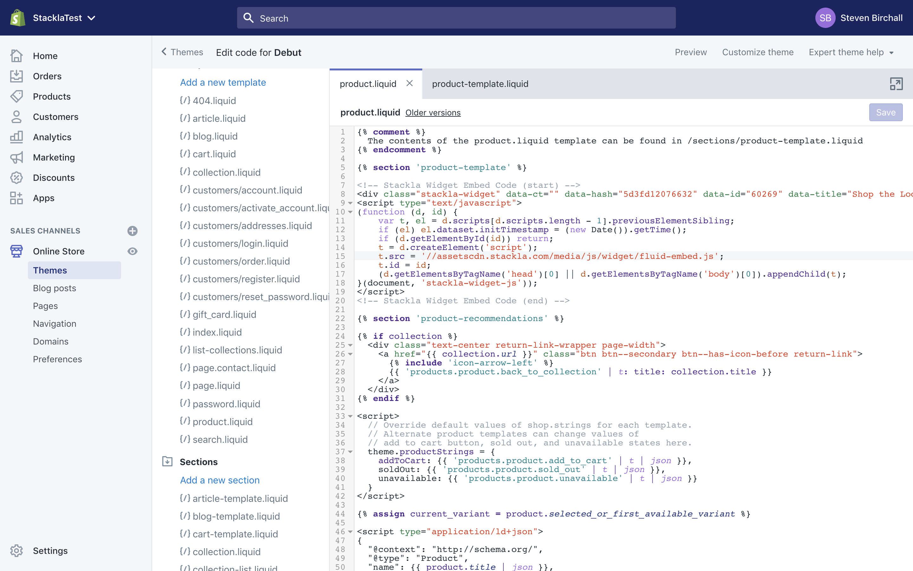

# Shopify

* [Product Page Widgets](shopify.md#widget)

## Product Page Widgets

All Nosto's UGC Widgets are designed to support Dynamic Filtering by Product Tags, meaning a brand can create a single Widget for their Shopify Product Pages and dynamically change the content that is displayed based on the relevant Product being displayed.

As such, to start the process of adding Widgets to your respective Shopify Product Pages, you can either create a new Widget or select one that already exists within your Stack. In either scenario, once you are happy with the Widget you wish to use on your Shopify Store, select Embed Code and copy the provided Embed Code.

Now before we add this to your Shopify Store, we will need to make an addition to the code. To ensure the Widget shows the correct Product we will want to pass the **Product ID** from Shopify to the Widget and thus will want to add the following code: `data-tags="ext:{{ product.id }}"` to the DIV part of the code so it looks similar to the below:

```javascript
<div id='stackla-goconnect-widget' data-widget-id="{{widget-id}}" data-tags="ext:{{ product.id }}" ></div>
<script type='text/javascript'>
(function (d) {
    // embed.js CDN
    var cdn = window.StacklaGoConnectConfig ? window.StacklaGoConnectConfig.cdn : 'assetscdn.stackla.com';
    var t = d.createElement('script');
    t.type = 'text/javascript';
    t.src = 'https://' + cdn + '/media/js/common/plugin_goconnect_embed.js';
    (document.getElementsByTagName('head')[0] || document.getElementsByTagName('body')[0]).appendChild(t);
}(document));
</script>
```

Note, if instead of using the **Product ID** to link your Shopify Products with your UGC Product Tags, you are using the Product SKU, you will need to add the following code before your Widget loads, `<div data-gb-custom-block data-tag="assign"></div>` and add the following into the Widget Embed code: `data-tags="ext:{{ current_variant.sku }}"`. This will update the Widget Embed code to look similar to the below:

```javascript
<div id='stackla-goconnect-widget' data-widget-id="{{widget-id}}" data-tags="ext:{{ current_variant.sku }} " ></div>
<script type='text/javascript'>
(function (d) {
    // embed.js CDN
    var cdn = window.StacklaGoConnectConfig ? window.StacklaGoConnectConfig.cdn : 'assetscdn.stackla.com';
    var t = d.createElement('script');
    t.type = 'text/javascript';
    t.src = 'https://' + cdn + '/media/js/common/plugin_goconnect_embed.js';
    (document.getElementsByTagName('head')[0] || document.getElementsByTagName('body')[0]).appendChild(t);
}(document));
</script>
```

Next, you will want to log into your Shopify Store and within the Admin section, select **Online Store > Themes**.

From the resulting page, select the Actions dropdown under the Current Theme section and click **Edit Code** from the dropdown.



This will load the respective code editor for your theme. Navigate to find the template for your Product Page, which should be called **product.liquid**. Select this option and then insert your Widget Embed code.



Once done, you can hit save and your Widget will now dynamically update each time someone goes to a Product Page to only show content relating to that Product.

[Return to Top](shopify.md#top)
