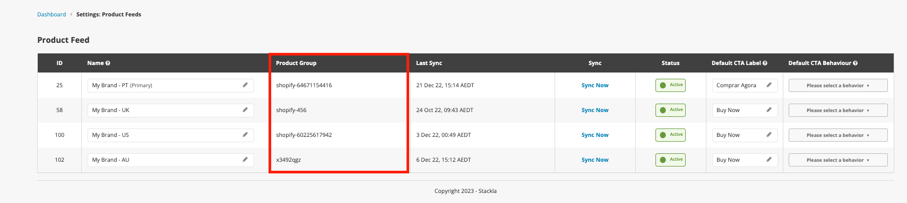

# Product Feeds

* [Product Feed Settings](product-feeds.md#settings)
* [Locales / Markets Configuration](product-feeds.md#locales)
* [Setting up your Product Feed](product-feeds.md#settingup)


This article is for Nosto UGC-only accounts, if you have a Nosto CXP account please refer to this [article](https://help.nosto.com/en/articles/5041939-getting-started-with-catalog-explorer).


Nosto's UGC offers the ability for Customers to create and update Product Tags within their Stack in an automated manner with our Social Commerce feature.

The feature can poll an XML Product Feed periodically, updating values such as Price, Description, Availability, and even supporting variances in Language or Locale.

To find out more about Configuring your Product Feed and UGC requirements, please read the guide below:

## Product Feed Settings

### Feed Format

Nosto's UGC Product Feed feature works with XML feeds which are based on Google's Product Merchant Feed type and Facebook's Product Catalogue Feed type.

### Providing Product Feed

Nosto's UGC currently only supports providing a Product Feed from a publicly accessible URL.

### Required Elements

The following elements are required to be included in your Product Feed for Nosto's UGC to be able to successfully synchronize the two systems:

```
<id> - String: Between 1 - 50 Characters. 
<title> - String: Between 1 - 150 Characters 
<description> - String: Between 1 - 1250 Characters 
<link> - URL: Between 1 - 250 Characters 
<image_link> - URL: Between 1 - 250 Characters 
<availability> - Options: 'in stock', 'out of stock', 'preorder' 
<price> - String: Between 3 - 20 Characters
```

### Optional Elements

Nosto's UGC can accept a range of additional fields in your Product Feed and append this to the Product Tag within your Stack. For the most common additional Fields, Nosto's UGC expects them to be in the following format:

```
<condition> - Options: 'new', 'refurbished', 'used' 
<shipping> - SubElements: 'country', 'service', 'price' 
<expiration_date> - dateTime 
<brand> - String: Between 1 - 70 Characters 
<gtin> - String: Between 1 - 50 Characters 
<mpn> - String: Between 1 - 50 Characters 
<product_category> - String  Between 1 - 250 Characters 
<product_type> - String: Between 1 - 250 Characters 
<additional_image_type> - String: Between 1 - 250 Characters 
<gender> - Options: 'Male', 'Female', 'Unisex' 
<age_group> - Options: 'Newborn', 'Infant', 'Toddler', 'Kids', 'Adult' 
<color> - String: Between 1 - 25 Characters 
<size> - String: Between 1 - 25 Characters 
<item_group_id> - String: Between 1 - 50 Characters 
<sale_price> - String: Between 3 - 20 Characters 
<sale_price_start_date> - dateTime 
<sale_price_end_date> - dateTime
```

### Validating a Feed

Nosto's UGC offers an XSD which Customers can use to Validate their Feed Structure or Build their Feed. This XSD is available [**here**](https://stackla-storage.s3-ap-southeast-2.amazonaws.com/product/product_feed_schema.xsd).

### Update Frequency

Nosto's UGC offers the ability to Update / Synchronise your Product Feeds based on the following schedules:

* Daily
* Weekly
* Manual

## Locales / Markets Configuration

### Grouping Products across Locales

Nosto's UGC offers the ability to store variance information for different locales (ie. USA / CAN-FR / CAN-EN) within a single Product Tag, allowing customers to show different information (ie. Name, Description, Price, URL) via UGC Widgets.

For Nosto's UGC to group/link these variances from different feeds, the same external product ID must be used across each of the connected feeds.

To configure widgets to show the correct variance information the field `<data-tag-group> - String: Between 1 - 50 Characters` should be added to the Embed code of the Widget. The field needs to be populated with the relevant Product Group configured in Settings > Product Feeds.



Find below an example Embed Code used to deploy a widget that should display product information for a feed with Product Group Name = CAN-FR:

```html
<!-- Nosto's UGC Widget Embed Code (start) --> 
<script> 
    var stackWidgetAssetPath = '//widgetapp.stackla.com/'; 
    var stackWidgetDomain = 'widgetapp.stackla.com'; var stackWidgetCustomData = {}; 
</script> 
<div class="stackla-widget" 
     data-ct="" 
     data-hash="xxxxxxx" 
     data-id="81494" 
     data-title="Carousel MMS Test" data-ttl="60" 
     data-tag-group="CAN-FR" 
     style="width: 100%; overflow: hidden;"
></div> 
<script type="text/javascript"> (function (d, id) { var t, el = d.scripts[d.scripts.length - 1].previousElementSibling; if (el) el.dataset.initTimestamp = (new Date()).getTime(); if (d.getElementById(id)) return; t = d.createElement('script'); t.src = '//widgetapp.stackla.com/media/js/widget/fluid-embed.js'; t.id = id; (d.getElementsByTagName('head')[0] || d.getElementsByTagName('body')[0]).appendChild(t); }(document, 'stackla-widget-js')); 
</script> <!-- Nosto's UGC Widget Embed Code (end) -->
```

If the field `<data-tag-group>` is not included in the Embed code the product will default to its primary variance information.

### Locale Limits

Nosto's UGC does not enforce any limits around the number of different locale variances that can be stored on a single Product Tag.

## Setting up your Feed

To set up your Feed, you will need to go to **UGC Settings > Product Feed** and select **Add Product Feed**.

<figure><figcaption></figcaption></figure>

Here, you will be presented with the opportunity to define:

* **Product Group Name:** This is where you define the ID you wish to use for your various locales/markets (ie. USA, CAN-FR, CAN-EN)
* **Connection Type:** URL or SFTP
* **SFTP Details:** Host, Port, Username, Password
* **Product Feed URL / Path:** URL / Path for specific Feed
* **Excluded Product Behaviour:** This is where you define how UGC should handle products that exist in UGC but are excluded from the product feed.
  * Skip Status Update (default option): When this option is selected, the status of all the products that are in UGC but are not in the product feed at any given point is not updated.
  * Mark as Out-of-Stock: When this option is selected, the status of all the products that are in UGC but are not in the product feed at any given point is updated to Out-of-Stock.
* **Update Frequency:** How often UGC should poll the feed to look for changes.

[Back to Top](product-feeds.md#top)
