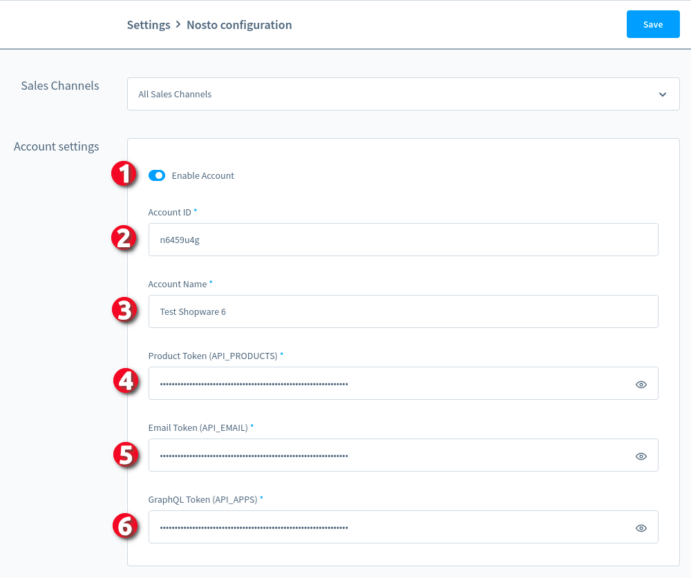
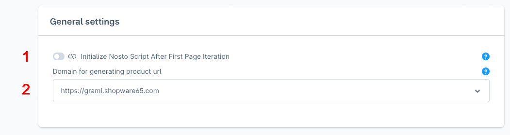
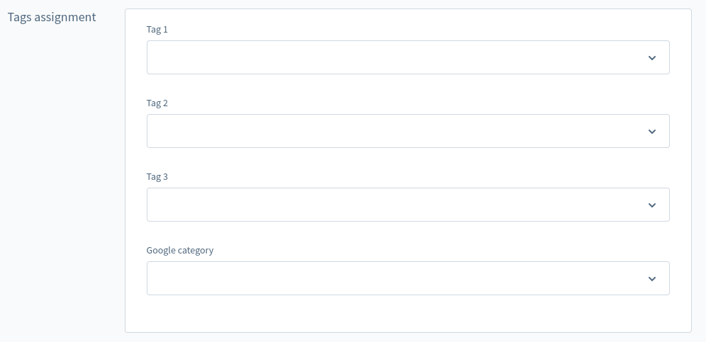
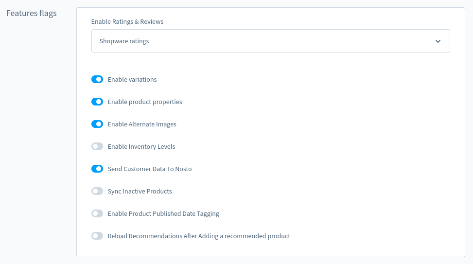

# Configuring

## Nosto Account Setup

There are basic configuration fields and control buttons which are located in plugin configuration page (marked with digits on the screenshot):

**Note:** Plugin requires to setup global Nosto account credentials. If you need to disable plugin functionality on specific sales channels, you can disable account on specific channel by toggling off “Enable Account“ switch.

1. Field which indicates if configured account is enabled for merchandising/product sync. 
2. Required Field with account id. It can be retrieved in Nosto account (in account settings).
3. Required Field with Product Token API key (_API_PRODUCTS_). It is used to synchronize products between Shopware and Nosto . The key must be requested from Nosto Technical Support, after which it will appear in authentication tokens section in the admin.
4. Required Field with Email Token API key, (_API_EMAIL_). It is used to synchronize emails between Shopware and Nosto. The key must be requested from Nosto Technical Support, after which it will appear in authentication tokens section in the admin.
5. Required Field with GraphQL Token API key, (_API_APPS_). It is used to synchronize orders, recommendations, segments, category merchandising products between Shopware and Nosto . The key must be requested from Nosto Technical Support, after which it will appear in authentication tokens section in the admin.

Follow [this link](https://help.nosto.com/en/articles/613616-settings-authentication-tokens) for additional guide.

## General Settings Overview

1. By enabling this setting, Nosto tracking JS scripts will be initialized and loaded directly after guest’s very first interaction with storefront page. It can be used for prevent storefront performance issues during page loading. 
2. By enabling this setting, Nosto Merchandising feature will be activated. Please make sure you have setup all necessary product merchandising rules before enabling this feature.
**Note:** To prevent empty PLP displaying because of network issues or Nosto API unavailability, plugin will follow the fallback to native Shopware 6 search engine.

## Tags Assignment Overview

All fields displayed in the “Tags assignment“ card are used to transfer product’s custom fields values to the associated Nosto product entity.

## Feature Flags Overview

This configuration card contains multiple feature toggles which enable/disable what information to send to Nosto with product data. Also there is possibility to enabling/disable ratings and reviews. Nosto supports tagging the rating and review metadata. The rating value and review count metadata can be used for creating advanced recommendation rules to promote products that are well reviewed.