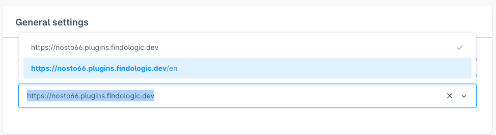

# Configuring

The extension can be configured by navigating to Stores &gt; Configuration &gt; Services &gt; Nosto.

## Image Options

This option determines which of the Magento image types is to be used for the product images in Nosto. By default, it is the "Base Image".

This panel has tree image version to choose from:

* **Base Image**: The base image is the image version used as the main image on the product detail page.
* **Small Image**: The small image is the image version used as in the product listings such as category pages and search results.
* **Thumbnail**: The thumbnail is the image version used as the small image in shopping carts such the cart page or sidebar cart implementations

#### Remove `/pub/` from product images URLs 

Set this to yes if you have configured the docroot to point to "pub/" directory.

## URL Options

This option removes the trailing `___store` parameter from the product URLs. If you have only a single-store view or would like to enable clean URLs, this can be toggled on.

## Other Options

The other-attributes section can be used to map custom attributes to the certain Nosto fields. Magento does not have predefined fields for the brand, the GTIN or the supplier cost fields and these can be customised by the retailer.

From version `5.0.0` Nosto extension also supports tagging Google category attribute. Similarly to GTIN attribute described above, select the attribute you wish to map using the selector and confirm on the product tagging using the debug toolbar.  
  
**Note:** A full [reindex of your store](features/indexer/) is required after this configuration is changed.

## Feature Flags

The feature-flags section can be used to toggle on/off different features. Certain features have a noticeable performance impact and you may need to toggle them off if you aren't leveraging the feature.

#### Indexer Memory

If you are running into issues with the indexer not finishing due to out of memory erros, in this flag you can configure the amount of memory that the Nosto Indexer is allowed to use.

#### Send Customer Data To Nosto

This option allow the merchant to enable/disable the sending of customer data to Nosto. If this option is disabled no customer tagging is done by Nosto.

#### Reload recs after reloading cart

This option allows reloading recommendations after updating the cart. If you are using cart based recs, it is advised to enable this flag

#### Add product published date to tagging

Set this to `Yes` if you want to send the date a product has been added to Magento's catalog to Nosto.

#### Enable custom fields

This option comes enabled by default. In case the merchant wants to completely hide, including from the page source code, he can disable using this feature flag.

## Attributes To Tags

The `attributes to tags` section can be used to add certain product attributes into the tags field of the product tagging. Doing so, will allow those properties to be used when building a recommendation template.   
 You can select multiple attributes holding control key.

These attributes will be also sent as custom fields to Nosto.

## Currency Setup

If you store view make use of Magento's exchange rates, you may select `Exchange rates` option on the dropdown menu.   
 In case the store view uses only one currency, you may set this value to `Single currency`.   
 The `Disabled` option will prevent Nosto to do any currency conversion. This option should be used if you have a custom pricing handling setup.

## Account Details and Tokens

After version `3.1.0` is now possible to retrieve all tokens and account id's used by Nosto via Magento admin panel.

