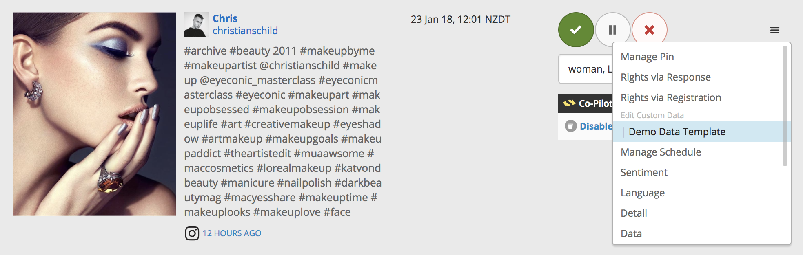
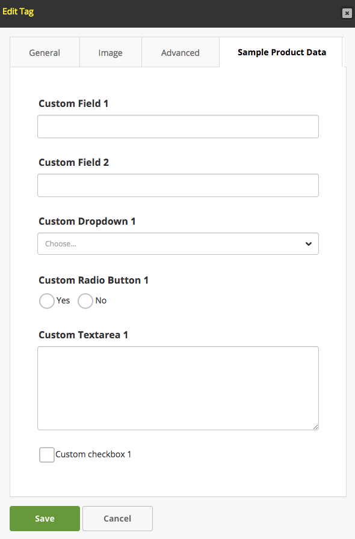

# Data Templates

## Overview

Nosto's UGC offers the ability for clients to append their own Custom Data to any Tile or Tag on the Platform, allowing clients to enrich the content on their Stack with additional data.

This custom data is appended to the Tile or Tag data and is available to be rendered through any UGC output, plus Nosto's UGC API.

The ability to append Custom Data to a Tile or Tag may be useful for clients who may be aggregating from bespoke sources that have unique data points, or to add additional values to a Product Tag.

Data Templates allow clients to take Custom Data one step further, by defining the data structure for these custom values, as well as making it accessible via the NostoAdmin Portal.

[Back to top](datatemplates.md#section-overview)

## Limitations

Custom Data and Data Templates within Nosto's UGC have the following limitations:

* Property Values in any single field must not exceed 1024 bytes
* Custom Data must match regexp a-zA-Z0-9\_,
* Custom Data stored in Nosto's UGC is not indexed and thus not searchable
* Input names are shared between Data Templates

[Back to top](datatemplates.md#section-limitations)

## Defining a Data Template

Data Templates allow developers to define a structure for the Custom Data within their Stack.

There is currently no limit as to how many Data Templates can be created for an individual Stack, however, Developers should note that Input Names are shared between Templates on either Tiles or Tags.

To create a Data Template within Nosto's UGC the following values must be provided:

* Data Template Name (name)
* Data Template Title (title)
* Scope of Template (scope)
* Webhook Visibility (webhooks)
* Data Template Schema (schema)
* Data Template Options (options)

### Name & Title

Your Data Template Name and Title are used as an Identifier for your respective template and will be what is displayed if users access these templates via the Nosto Admin Portal.

It is recommended that they have a unique name and that they describe what 'custom data' is associated with that template.

### Scope

Your Data Template Scope defines where this specific Data Template is accessible. Within the Scope builder, clients will be presented with the option of selecting whether or not this template relates to **Tiles** or **Tags**.

From here, the client can elect to add additional conditions to the scope. For Tiles, the additional scope refinement options available are:

* Media
* Network

As such, it is possible for a client to make a specific Data Template for only Instagram (Network) Video (Media) Tiles, or for all Video (Media) Tiles except for YouTube (Network).

The only refinement option available for Tags is **Tag Type**.

### Schema & Options

Your Data Template Schema defines the input type (ie. string, boolean), any default values, and any validation for your Data Template, whilst your Data Template Options defines values relating to the presentation of the form, including the presentation type (ie. text, radio, select), and label.

Both the Data Template Schema and Options need to be built using [Alpaca](http://www.alpacajs.org).

Alpaca leverages JSON Schema and simple handlebar templates to easily define the structure of your template and the values that are presented within Nosto's UGC as a form for your users.

To assist with the definition process, Nosto's UGC has included below some of the more common input types.

#### Text Field

**Schema**

```
        "custom_field_1": {
            "type":"string"
        },
```

**Option**

```
        "custom_field_1": {
            "type":"text",
            "label": "Custom Field 1"
        },
```

#### Pick List

**Schema**

```
        "custom_dropdown_1": {
            "type":"string",
            "enum": [
                "1",
                "2",
                "3"
            ]
        },
```

**Option**

```
        "custom_dropdown_1": {
            "type":"select",
            "label": "Custom Dropdown 1",
            "optionLabels": [
                "Option 1",
                "Option 2",
                "Option 3"
            ]
        },
```

#### Radio Button

**Schema**

```
       "custom_radio_button_1": {
            "type": "boolean",
            "enum": [true, false],
            "default": false
        },
```

**Option**

```
        "custom_radio_button_1": {
            "type": "radio",
            "label": "Custom Radio Button 1",
            "optionLabels": ["Yes", "No"]
        },
```

#### Textarea

**Schema**

```
        "custom_textarea_1": {
            "type":"string"
        },
```

**Option**

```
         "custom_textarea_1": {
            "type":"textarea",
            "label": "Custom Textarea 1"
        },
```

#### Checkbox

**Schema**

```
        "custom_checkbox_1": {
            "type": "boolean"
        }
```

**Option**

```
        "custom_checkbox_1": {
            "rightLabel": "Custom checkbox 1"
        }
```

[Back to top](datatemplates.md#section-defining)

## Accessing Custom Data

The Custom Data stored in the Data Templates can be accessed/updated through several methods, including both the Admin User Interface and via various Developer tools offered by Stackla.

Details on the respective Scopes and where this data can be accessed are outlined below.

### Tile

#### Admin User Interface

Data Templates are available in the overflow menu on the Curate Content section of the Nosto Admin Portal.



#### REST API

Custom Data is stored as a JSON String Data Type on the Tile record. As such, this data is available through all respective Tile and Content Feed endpoints available on the Platform.

A sample of how this data is stored on the Tile is available below:

```
custom_fields :{"custom_field_1":"Sample Data","custom_dropdown_1":"2","custom_textarea_1":"An Example of Sample Textarea Data","custom_checkbox_1":"true"} 
```

These values can be added, updated, and removed via the relevant Tile API endpoints.

#### Webhooks

Custom Data, associated with a Data Template, can be made accessible in Nosto's UGC Webhook Notification Setup.

Assuming that a client has enabled a specific Data Template to be available in Webhooks, this data will be presented in the following Notifications.

* [TILE\_CLAIM](../api-docs/webhooks.md#webhook-tile-claim)
* [TILE\_STATUS\_UPDATE](../api-docs/webhooks.md#webhook-tile-status-update)
* [TILE\_TAGS\_UPDATE](../api-docs/webhooks.md#webhook-tile-tags-update)
* [TILE\_LIKE\_DISLIKE](../api-docs/webhooks.md#webhook-tile-like-dislike)
* [TILE\_INGESTED](../api-docs/webhooks.md#webhook-tile-ingested)
* [TILE\_VOTES\_UPDATE](../api-docs/webhooks.md#webhook-tile-votes-update)

Custom Data in Webhooks is Read Only and cannot be updated.

#### Zapier

Nosto's UGC Zapier Plugin supports both sending and receiving Custom Data.

Custom Data that has been associated in a Tile can be passed via Zapier to one of the 1,000 pieces of Marketing Technology the Middleware tool connects with based upon one of the following Triggers.

**Trigger**

* New Tile Tag
* New Tile Published
* New Tile Claimed

In addition, Custom Data can be passed into Nosto's UGC when performing one of the following Actions.

**Action**

* Create Image Tile
* Create Video Tile
* Create Text Tile
* Create HTML Tile

### Tags

#### Admin User Interface

Data Templates for Tags are available within the Tag Editor. To access it, simply go to Curate > Manage Tags and select the respective Tag you wish to edit. The Custom Data should be available as a Tab on the Tag Editor screen.



#### REST API

Custom Data is stored as a JSON String Data Type on the Tag record. As such, this data is available through all respective Tag endpoints, plus any Tile & Filter endpoints where Tag details have been rolled out on the Platform.

A sample of how this data is stored on the Tag is available below:

```
custom_fields :{\"custom_field_1\":\"Custom Value #1\",\"custom_field_2\":\"Custom Value #2\",\"custom_checkbox_1\":true} 
```

These values can be added, updated, and removed via the relevant Tag API endpoints.

[Back to top](datatemplates.md#section-defining)

## Guides

Data Template Guides:

* [Creating a Data Template](../guides/data-templates/creating-data-template.md)
* [Create a Q\&A Widget with Data Templates](../guides/onsite-widgets/create-qa-widget-using-data-templates.md)
