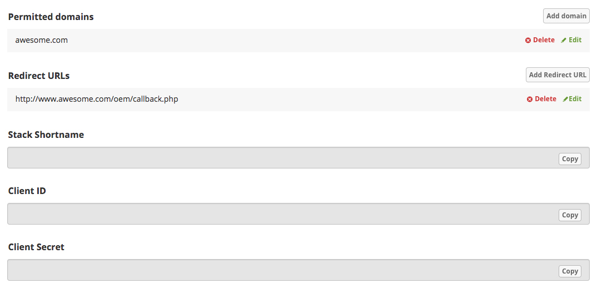
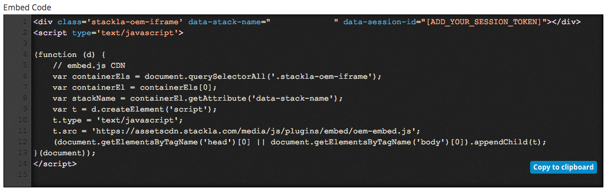

# Enterprise Admin User Interface (EAUI)

## Overview

The Nosto's UGC Embeddable Admin User Interface (EAUI) enables Nosto's UGC OEM partners to embed components of the Visual UGC Admin User Interface into whitelisted systems.

Key features of the EAUI include:

* Ability to embed a frameless version of the Nosto Admin Portal into Whitelisted domains.
* Ability to manage user sessions within the EAUI iFrame, and perform SSO.
* Ability to apply custom ACL rules to the EAUI iFrame
* Ability to navigate to pages from outside of the EAUI iFrame

[Back to top](eaui.md#section-overview)

## Installation

### Configuration

Nosto's UGC EAUI offerings are available as a Plugin for OEM Partners. This plugin can be enabled for partners on their Development Stacks for testing and building integrations.

After a developer has installed the plugin, they will be able to retrieve the OAuth information from Nosto's UGC to reveal the OAuth Access Token.

Before the integration, ensure that you've added the parent page domain to the permitted domain section in the configuration only and use the domain name without the protocol. e.g. awesome.com or stackla.awesome.com (Please do not add the https:// value).



**Note:** The permitted domain will only be valid for a domain with an SSL certificate (HTTPS)

### Embed the Embeddable Admin UI

To embed Nosto's UGC into an existing web portal, please copy the embed code from the configuration page, and add it to the section of your portal where you would like to render the Nosto's UGC page.

An example of the Embed Code is available below:



### Generate Session Token

For the Nosto's UGC EAUI to work, it requires an active Session Token. This token is tied to a specific user and should be generated using OAuth.

As per the standard OAuth process, the steps involved in generating a session token are:

* Generate a Short-term Token
* Generate Access Token
* Generate a Session Token

The steps required are listed below.

#### Generate Short-term Token

Generate the Short Term token by calling the Visual UGC Authenticate API Endpoint and providing the `clientId`, `redirectUrl,` and a relevant `state`

```
// POST Request
https://api.stackla.com/api/oauth2/authenticate?response_type=code&client_id={:clientId}&redirect_uri={:redirectUrl}&state={:anyState}
```

Once the OAuth request has been made, a short-term token will be provided in a format similar to below.

```
// Response
{:providedRedirecUrl}?code=0123456789xxxxxxxx9876543210&state={:anyState}
```

#### Generate Access Token

Taking the Short-Term Token, a second request can be made to generate an Access Token. The Short Term token should be added to the `code` parameter.

```
// POST Request
https://api.stackla.com/api/oauth2/token?grant_type=authorization_code&code={:code}&client_id={:clientId}&client_secret={:clientSecret}&redirect_uri={:providedRedirectUrl}
```

Assuming the Exchange is successful, the provided response will contain the following attributes:

```
// Response
{
    "access_token": "0123456789xxxxxxxxxxx9876543210",
    "refresh_token": "9876543210xxxxxxxxxxx0123456789",
    "token_type": "Bearer",
    "expires_in": 31536000
}
```

Access Tokens will, by default, expire every 365 days.

#### Generate Session Token

The final step in the process is now to generate the Session Token. This is done via the Access Token, by making a call to the OEM Session endpoint as per below.

```
// POST request
https://api.stackla.com/api/oemsession?stack={:stackShortName}&grant_type=exchange_token&client_id={:oauthClientId}&access_token={:accessToken}
```

If the exchange Session Token is a success the response will contain the valid session token as data (see example below):

```
// Response
{
    "data": "123456789xxx0987654321",
    "errors": []
}
```

After obtaining the valid Session Token, a developer will need to add it to the embed code `data-session-id` (replace `[ADD_YOUR_SESSION_TOKEN]` with a valid Session Token).

Session tokens are only valid for one use and have a lifespan of 60 seconds.

**Note:** If there is a requirement to have a different landing page, you can provide the valid URL page in the embed code as the data attribute `data-url-redirect`.

[Back to top](eaui.md#section-install)

## Custom Interaction for Embeddable Admin UI

Visual UGC's EAUI has a Javascript API allowing for Developers to calls from a menu system or links on the parent page, respective pages within the Visual UGC User Interface.

The Javascript API calls for Navigation are listed below.

**Term Management**

```
window.Stackla.EmbeddedAdminUI.navigateTo("/terms");
```

**Curate Content**

```
window.Stackla.EmbeddedAdminUI.navigateTo("/moderation");
```

**Manage Tags**

```
window.Stackla.EmbeddedAdminUI.navigateTo("/tags");
```

**Manage Filters**

```
window.Stackla.EmbeddedAdminUI.navigateTo("/filters");
```

**Manage Widgets**

```
window.Stackla.EmbeddedAdminUI.navigateTo("/widgets");
```

**Manage Event Screens**

```
window.Stackla.EmbeddedAdminUI.navigateTo("/events");
```

**Manage Emails**

```
window.Stackla.EmbeddedAdminUI.navigateTo("/emails");
```

**Asset Manager**

```
window.Stackla.EmbeddedAdminUI.navigateTo("/assets");
```

[Back to top](eaui.md#section-interactions)
