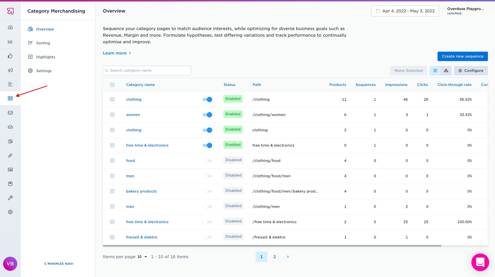
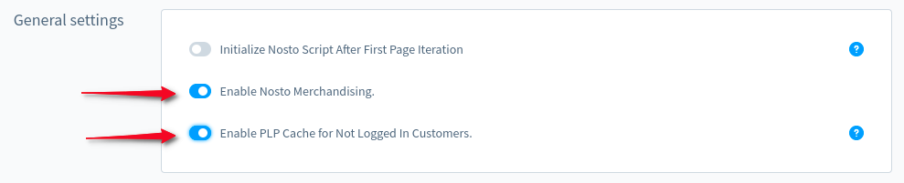

# Nosto Plugin Category Merchandising

Our plugin also introduced the logic of displaying products in Shopware according to the ratings specified in Nosto`s Category Merchandising.

The overview page is the mission control of Category Merchandising, allowing you to see a full list of categories, create individual sequences, mass apply merchandising rules and see an overview of category performance.

You need to configure individual sequences for categories and activate them - then the Shopware will display products in the sequence configured in Nosto.

How to set up Category Merchandising in Nosto, please follow the link below

[Get started with Category Merchandising](https://help.nosto.com/en/articles/3648242-get-started-with-category-merchandising).

The following product display logic has now been implemented on the PLP page:
* PLP products will always be displayed according to how they are configured in Nosto.
* If there are no products configured for the Nosto category, or there are no products in Nosto - the products will be displayed in the standard order defined in the Shopware.

## Side effects

While Category Merchandising is enabled in plugin settings, all PLP pages become non-cacheable to deliver personalized PLP pages for all guests/customers.

There is a possibility to enable PLP cache for non-logged in storefront guests via plugin configuration:

