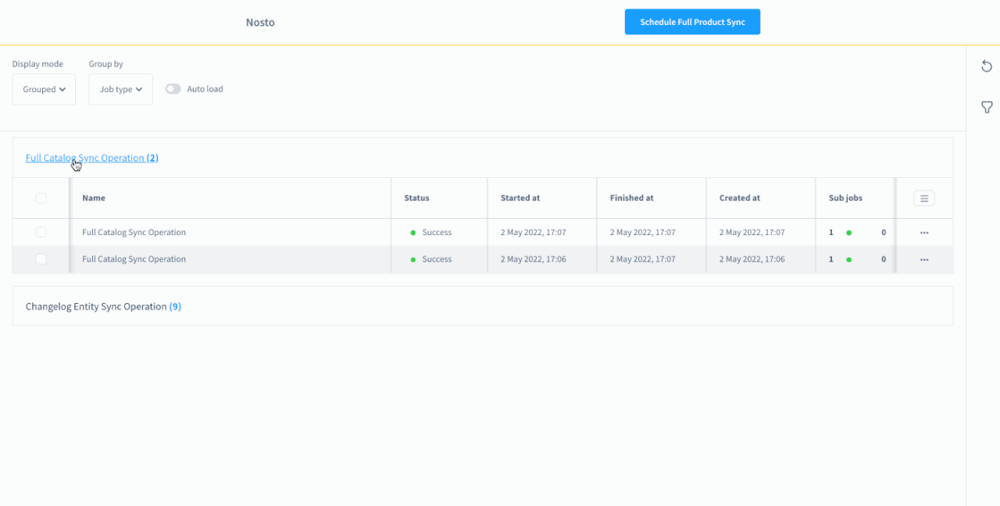

# Job Scheduling Overview

### **Accessing the Dashboard**

* **Location:** Find the Nosto plugin dashboard under the Marketing tab in Shopware 6 administration.
* **Path:** Marketing → Nosto Jobs Listing

<figure><figcaption></figcaption></figure>

### **Dashboard Features**

* **Job Scheduling Dashboard:** View and manage scheduled jobs.
* **Job Listing:** Access complete job information and sync products with Nosto.

<figure><figcaption></figcaption></figure>

### **Job Listing Details**

*   **Columns Explained:**

    * **Name:** Job identifier.
    * **Status:** Job status (Success, Failed, Running, Pending).
    * **Timings:** Job creation, start, and finish times.
    * **Child Jobs:** Status indicators (Green for success, Gray for pending, Red for failed).
    * **Messages:** Log messages categorized by type (Info, Warning, Error).

    

### **Dashboard View Modes**

* **List View:** Default view with filter support.
* **Grouped View:** Organize jobs by status or type.
* **Chart View:** Visualize job data over selected time frames (30 Days, 14 Days, etc.).

<figure><figcaption>
List View
</figcaption></figure>

<figure><figcaption>
Grouped View
</figcaption></figure>

<figure><figcaption>
Chart View
</figcaption></figure>


Enabling **Auto Load** will refresh the listed data automatically once per minute.



### **Jobs Handled**

* Changelog Entity Sync Operation
  * Marketing Permission Sync Operation (newsletter),
  * Order Sync Operation (New Order, Updated Order events)
  * Product Sync Operation
* Full Catalog Sync Operation: Synchronize all products to Nosto
