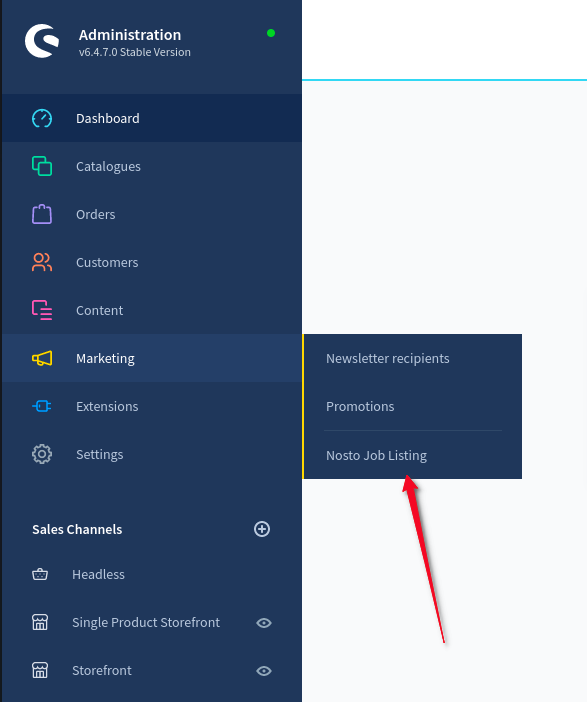
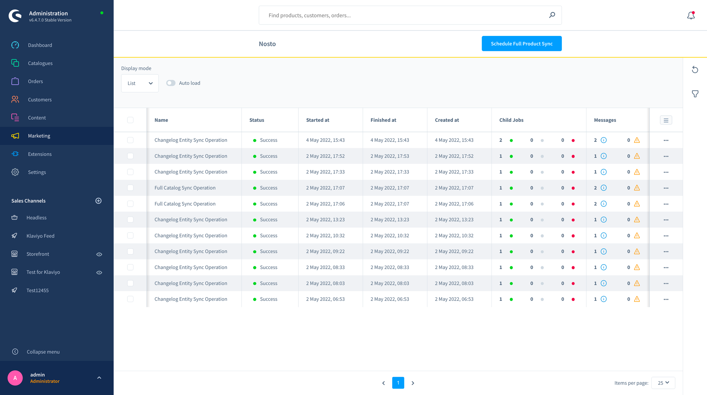
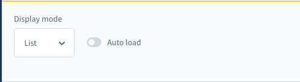
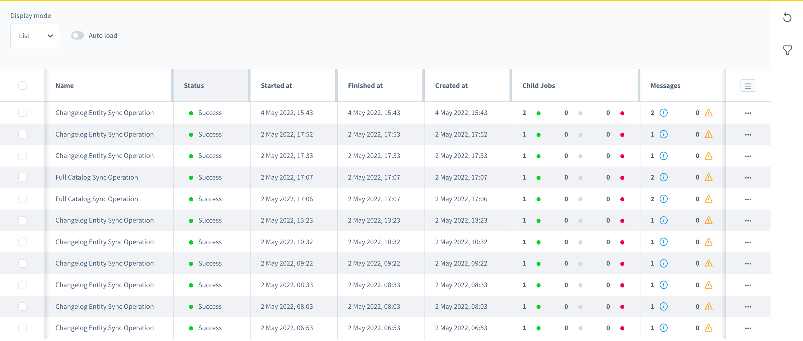
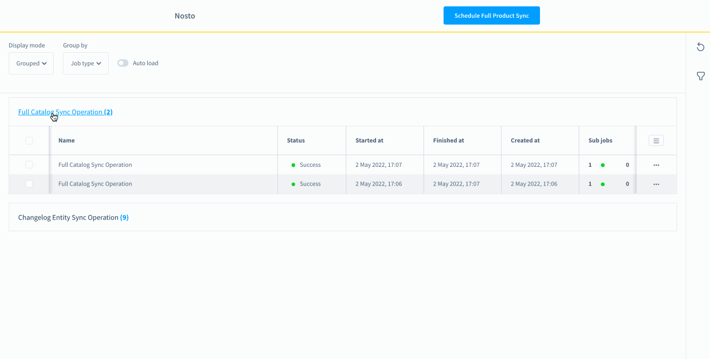
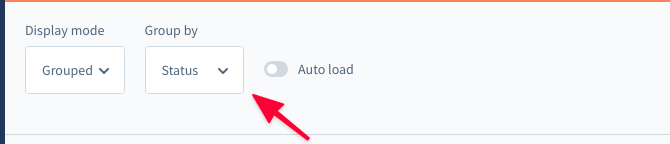
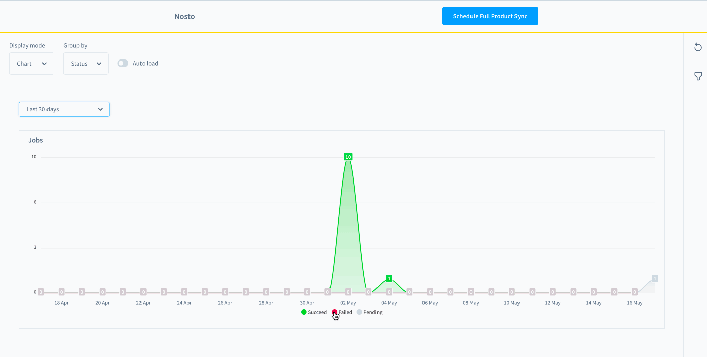
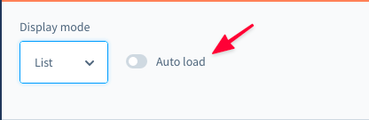

# Nosto Plugin Job Scheduling Overview

Once the plugin is installed and activated, in Shopware 6 administration you should be able to see the menu item under the Marketing tab which will take us to the Nosto plugin dashboard.

> Marketing → Nosto Jobs Listing

## Features of Nosto plugin dashboard

Once you are on the Nosto job listing page, you should be able to see the scheduled jobs list.

On the job listing page we are able to reach out to the complete job information.

After plugin installation all products can be synced with Nosto via scheduling associated jobs by clicking over the control button “**Schedule Full Product Sync**”.

### Table columns

We have 7 columns here with the proper information about the current job.

#### Name

Describes the job name

#### Status

Describes the status of a job. There are 4 types of statuses: `Success`, `Failed`, `Running` and `Pending`.

#### Started At, Created At, Finished At

Shows job’s creation, starting and finishing dates.

#### Child jobs

There are 3 types of colored badges in this column:
1. **Green** colored badge indicates how many successful child jobs the current job has.
2. **Gray** colored badge indicates how many pending child jobs the current job has.
3. **Red** colored badge indicates how many failed child jobs the current job has.

By clicking on the corresponding row of the current job in the child jobs column, pop-up will open with the detailed listed view of the child jobs in the current job.

#### Messages

In the "Messages" column, the colored icons are displayed with the numbers of messages.

* **Blue** indicates to us the quantity of the `INFO` type messages. 
* **Yellow** indicates to us the quantity of the `WARNING` type messages. 
* **Red** indicates to us the quantity of the `ERROR` type messages.

By clicking on the corresponding row of the current job in the messages column, pop-up will open with the messages of the current job.

___

## Nosto dashboard view modes

Nosto plugin has 3 different types of the dashboard view.
View modes can be switched from the dashboard action bar on top of the job listing.

### List view

List view is the default view of the dashboard with filtering support.

### Grouped view

The grouped view has 2 types of grouping:

1. Group by **status**
2. Group by **job type**

Grouping types can be switched from the action bar at the top.

### Chart view

Charts view allows to group the jobs by **type** or **status** and show them divided by dates.

At the top of the charts bar we have the dropdown selection where we can select the date range:
* 30 Days 
* 14 Days 
* 7 Days
* Last 24 hours 
* Yesterday

By clicking on the colored dot badge we can hide/show the chart line and info corresponding to the badge color and the **status/type** in front of it.

At the bottom of the charts we have colored dot badges with the chart line name (corresponding to the chart grouping mode **status/type**).

## Auto Load

In the `Actions` at the top of the Nosto dashboard we have the switch field named `Auto load`.

With this enabled you will not need to reload the page to check job’s execution statuses. Listing data refreshes automatically every 1 minute.

Listing page contains all Nosto plugin jobs:
1. Changelog Entity Sync Operation - parent backlog events processing operation over the child's - Marketing Permission Sync Operation (newsletter), Order Sync Operation (New Order, Updated Order events), and Product Sync Operation.
2. Full Catalog Sync Operation - synchronize products - parent of the Product Sync Operation.

 