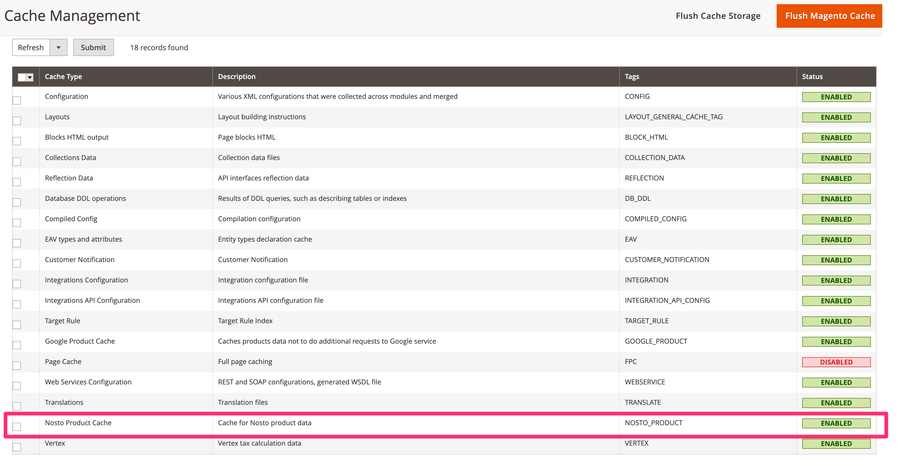

# Built-in caching


As of 5.0.0 Nosto module uses Magento's built-in caching mechanism to cache the product data needed for Nosto's product tagging. When enabled the product cache is automatically populated and used when generating the product tagging on product detail pages.

### Managing cache

You can manage \(enable, disable & flush\) Nosto product cache from Magento's cache management settings in the store admin like any other cache.  



### Command line usage

#### Enabling caching

You enable the product caching by using Magento's console command for managing caches. 

```bash
bin/magento cache:enable nosto_product_cache
```

#### Disabling caching

You disable the product caching by using Magento's console command for managing caches. 

```bash
bin/magento cache:disable nosto_product_cache
```

#### Flushing the cache

Run the following command in order to flush the cache from command line  

```bash
bin/magento cache:flush nosto_product_cache
```

