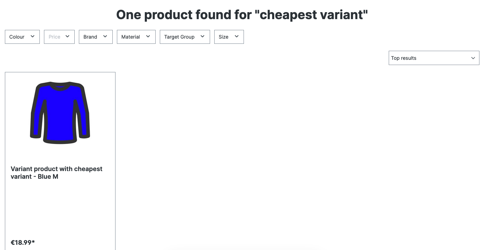

# Product Variant handling

### Overview

The plugin allows detailed configuration on how to send product data to Nosto, and based on that how it should show up in your Storefront.\
\
You can choose between following options:&#x20;

* **Main Product -** Will send your main/parent product to Nosto, having the variants/child product assigned to it
* **Variant Product -** Will send your variant/child products separately to Nosto.&#x20;
* **Cheapest Variant** - Automatically shows the cheapest option available

<figure><figcaption>
Settings Overview
</figcaption></figure>

<figure><figcaption>
Example: Main Product
</figcaption></figure>

<figure><figcaption>
Example: Variant Product
</figcaption></figure>

<figure><figcaption>
Example: Cheapest Product
</figcaption></figure>

