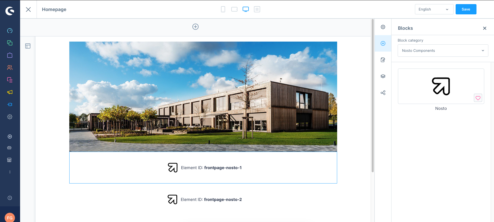

# Recommendations

Recommendations can be placed to your liking within the layouts of the Shopping Experiences. The plugin adds a component and only requires the configuration of the recommendation ID. The block can be added like this:\
[https://docs.shopware.com/en/shopware-6-en/content/ShoppingExperiences#blocks](https://docs.shopware.com/en/shopware-6-en/content/ShoppingExperiences#blocks)

<figure><figcaption></figcaption></figure>

For more information about the configuration of recommendations:\
[https://help.nosto.com/en/articles/643265-recommendation-creation-and-edit-workflow](https://help.nosto.com/en/articles/643265-recommendation-creation-and-edit-workflow)
