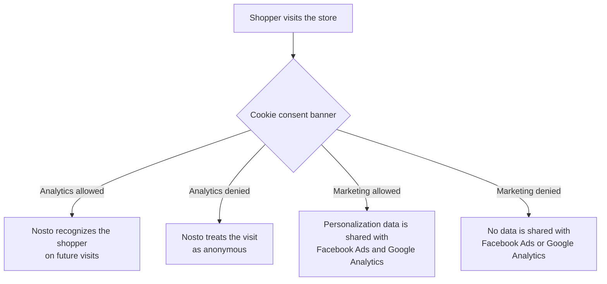
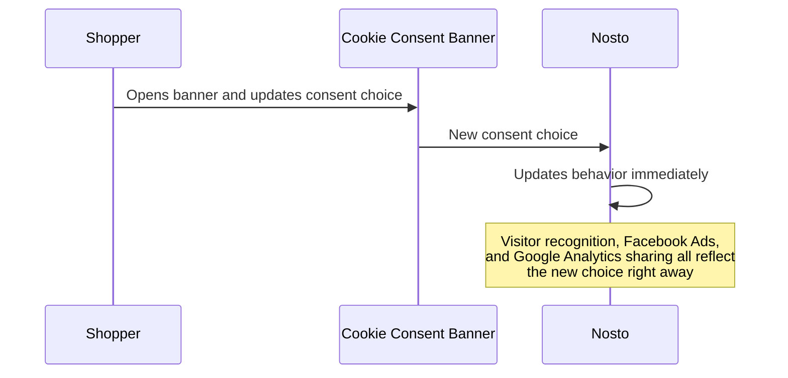

# Shopify Cookie-Consent Tracking

Shopify stores that use cookie consent banners (for example, to comply with GDPR or CCPA) let shoppers choose whether they allow **analytics** tracking and **marketing** tracking. Nosto reads these choices directly from Shopify and automatically adjusts its own behavior to match - no manual configuration is needed beyond turning the feature on.

This article explains what Nosto does with each type of consent, and what shoppers should expect to see (or not see) depending on their choice.

## The two types of consent

Shopify's consent banner asks shoppers to allow or deny two separate categories. Nosto treats them independently:

| Consent type  | What it controls in Nosto                                                                                            |
| ------------- | -------------------------------------------------------------------------------------------------------------------- |
| **Analytics** | Whether Nosto can recognize a returning shopper across visits                                                        |
| **Marketing** | Whether Nosto can share personalization data with advertising and analytics tools like Facebook and Google Analytics |

A shopper can allow one and deny the other - Nosto respects each choice on its own.

## What happens when analytics consent is allowed

Nosto stores a small identifier so it can recognize the shopper if they come back later. This is what allows features like "recently viewed products" or continuity in personalized recommendations to work across visits.

## What happens when analytics consent is denied

Nosto does not store or use that identifier. Each visit is treated independently, as if it were a new shopper. Personalization within the current visit still works - Nosto simply won't remember the shopper afterward.

## What happens when marketing consent is allowed

Nosto shares relevant personalization signals (such as audience segments) with the store's connected marketing tools:

* **Facebook Ads** - Nosto's pixel activity is allowed to fire, supporting retargeting and ad measurement.
* **Google Analytics** - Segment information is sent to the store's Google Analytics or Google Tag Manager setup.

## What happens when marketing consent is denied

None of the above happens. No data is sent to Facebook or Google Analytics, and Nosto pauses the background process that would otherwise deliver that data, so nothing is queued up to send later either.

## When a shopper changes their mind

If a shopper updates their consent choice mid-visit (for example, by reopening the cookie banner and changing an answer), Nosto picks up the change immediately and adjusts its behavior right away - there's no need to reload the page.

## Stores without a consent banner, or on older themes

If a store hasn't set up Shopify's consent tracking, or is running an older theme that doesn't support it, Nosto assumes tracking is allowed by default. This preserves existing behavior for stores that haven't adopted Shopify's consent tools, so nothing changes or breaks for them.

## Summary

| Shopper's choice                     | Visitor recognition | Facebook Ads | Google Analytics |
| ------------------------------------ | :-----------------: | :----------: | :--------------: |
| Analytics allowed, Marketing allowed |          ✅          |       ✅      |         ✅        |
| Analytics allowed, Marketing denied  |          ✅          |       ❌      |         ❌        |
| Analytics denied, Marketing allowed  |          ❌          |       ✅      |         ✅        |
| Analytics denied, Marketing denied   |          ❌          |       ❌      |         ❌        |
