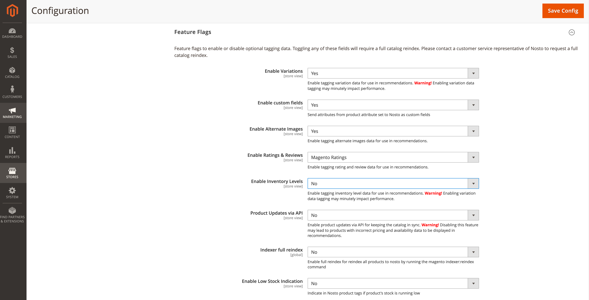

# Supplier Cost & Inventory Level

Nosto supports supplier costs and inventory level. The supplier-cost and inventory-level metadata can be used for creating advanced recommendation rules to promote products with a high margin or low-stock products.

The supplier-cost and inventory-level of a product are considered sensitive information and therefore does not exist in the page tagging, and instead, are sent over a secure API.

### Why is the inventory-level always zero or entirely missing?

If you are using the Magento's Multi-Source Inventory (MSI), you must [install Nosto's MSI extension for Magento 2](https://docs.nosto.com/magento-2/addons/msi) as well. 

### Why don't all my products have the supplier-cost and inventory-level information?

The extension relies on observers to detect changes to the catalog and synchronize it with Nosto. If you are synchronizing products from your ERP/PIM system, observers may not be triggered.

## Enabling / Disabling Inventory-Level Metadata

The inventory-level metadata collection is disabled by default. You can toggle the inventory-level metadata collection by navigating to the configuration page and toggling **Enable Inventory Levels** under the **Feature Flags** section.

