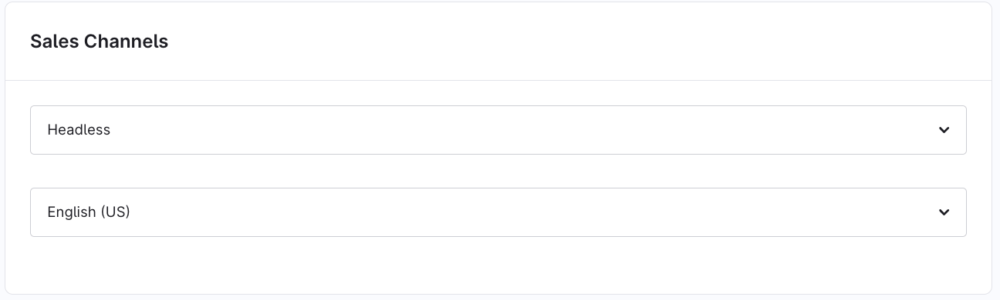
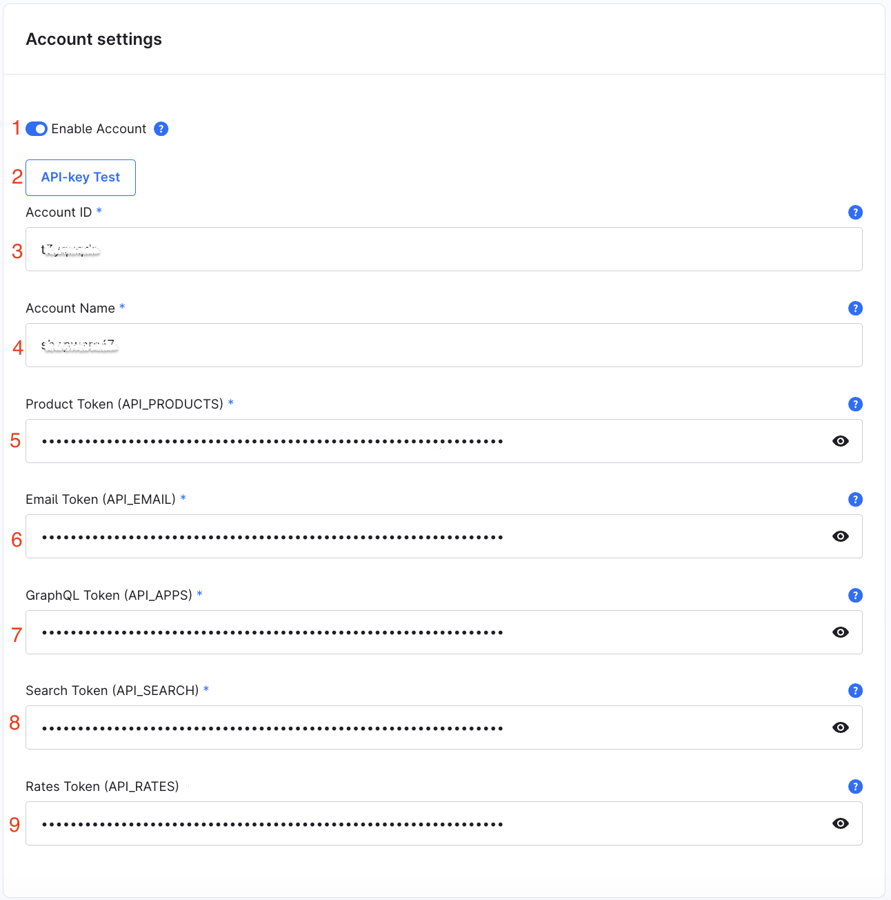
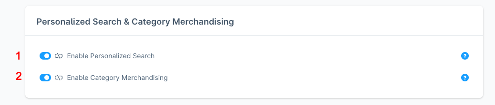
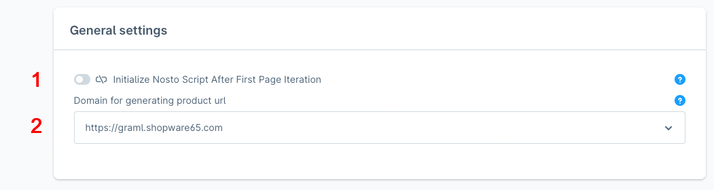
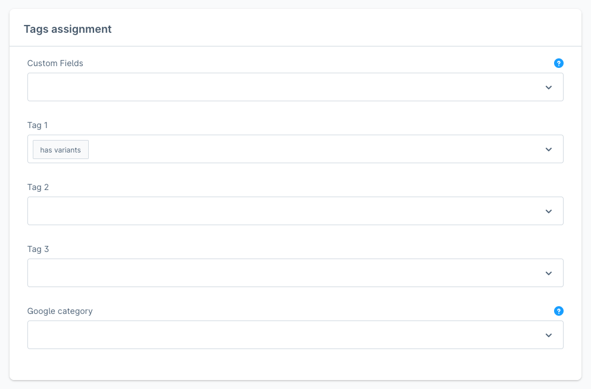
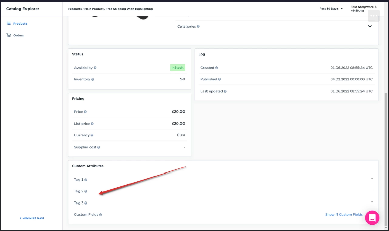
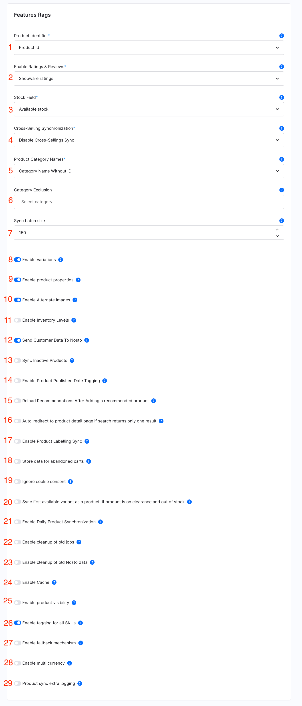

# Configuration

The Nosto plugin has a separate settings page. You can configure values for each sales channel and it's configured languages.

Settings → Extensions → Nosto

### Nosto Account Setup

There are basic configuration fields and control buttons which are located in plugin configuration page (marked with digits on the screenshot):


The account settings are only available for a specific sales channel and language. There are no global account settings.


<figure><figcaption></figcaption></figure>

<figure><figcaption></figcaption></figure>


All API Tokens mentioned in this section have to be created by Nosto, and are specifically for you. Please create your Nosto account(s) first, note your account ID(s), and reach out to your Technical Solutions Manager or to our Support Team.


1. Activates the account for the product sync.
2. Allows validation of API tokens given for this sales channel. Returns notification of API token status.
3. Required field - Nosto account ID. Links your sales channel to matching Nosto account. More info can be found [here](https://help.nosto.com/en/articles/613483-settings-account-settings).
4. Required field - Nosto account name. Validates your Nosto account added to given sales channel. More info can be found [here](https://help.nosto.com/en/articles/613483-settings-account-settings).
5. Required field - Product Token API key (API\_PRODUCTS). Is used to synchronize products between Shopware and Nosto .
6. Required field - Email Token API key, (API\_EMAIL). Is used to synchronize emails between Shopware and Nosto.&#x20;
7. Required field - GraphQL Token API key, (API\_APPS). Is used to synchronize orders between Shopware and Nosto.&#x20;
8. Required Field with Search Token API key, (API\_SEARCH). Is used for all the search requests, when using the plug-and-play solution.&#x20;
9. A token for accessing the Rates API. You can request an API token (API\_RATES) by getting in touch with Nosto support personnel. Once the token has been granted, you will be able to find it listed in the authentication tokens section in the admin.

### Personalized Search & Category Merchandising

<figure><figcaption></figcaption></figure>

1. Activate this to integrate Nosto's personalized search functionality into your Shopware theme. This will apply your custom search and filter settings from Nosto Admin directly to your store's search experience.
2. Activate this to integrate Nosto's Category Merchandising functionality into your Shopware theme. This will apply your custom merchandising and filter settings from Nosto Admin directly to your store's Category navigation experience.

### General Settings Overview

<figure><figcaption></figcaption></figure>

1. By enabling this setting, Nosto tracking JS scripts will be initialized and loaded directly after guest’s very first interaction with storefront page. It can be used for prevent storefront performance issues during page loading.
2. <mark style="color:red;">**Channel specific -**</mark> <mark style="color:red;"></mark><mark style="color:red;">The selected domain will be used for the product URLs during the product sync. Please make sure that the domain is set accordingly, as whenever you choose a different sales channel the domain for generating product URL's is</mark> <mark style="color:red;"></mark><mark style="color:red;">**NOT**</mark> <mark style="color:red;"></mark><mark style="color:red;">automatically updated and is populated with with the domain from the previous selected sales channel.</mark>&#x20;

<figure><figcaption></figcaption></figure>

### Tags Assignment Overview

Allows you to define what Custom Fields and Tags are transfered to Nosto. Screenshot 1 shows you the view in Shopware, screenshot 2 refers to your products in Nosto.

<figure><figcaption></figcaption></figure>

<figure><figcaption></figcaption></figure>

### Features Flags Overview

This configuration card contains multiple feature toggles which enable/disable what information to send to Nosto with product data. Also, there is possibility to enabling/disable ratings and reviews. Nosto supports tagging the rating and review metadata. The rating value and review count metadata can be used for creating advanced recommendation rules to promote products that are well reviewed.

<figure><figcaption></figcaption></figure>

1. The selected field of the product will be synced as Nosto product id
2. The selection enables ratings & reviews.
3. The selection for stock field.
4. Product Cross-Selling Synchronization Options
5. Product category names will contain the category ID or not
6. Products in selected categories are excluded from the export to Nosto
7. Number of entities processed per synchronization batch. This can only be configured globally for all sales channels.
8. Enables variations tagging.
9. Enables product properties tagging.
10. Enables alternate images tagging.
11. Enables inventory levels tagging.
12. If the checkbox is checked, customer data is tagged during the order.
13. If the checkbox is checked, variants of an inactive main product will be synchronized depending on what is selected in the storefront presentation configuration.
14. If the checkbox is checked, product publishing date will be tagged as well.
15. If the checkbox is checked, the recommendations will be reloaded after adding a recommended product
16. When enabled, customers will be automatically redirected to the product detail page if a search query returns only one matching product.
17. If the checkbox is checked, product labels will be sent to Nosto
18. This configuration option controls whether data for abandoned carts should be stored in the relevant table. When this option is enabled, the system will fetch and create new rows in the table for each abandoned cart. If disabled, no new rows will be added, potentially preventing performance issues.
19. Cookie consent may be turned off if you determine it is not required for legal compliance.
20. If the checkbox is checked, sync first available variant as a product, if product is on clearance and out of stock.
21. If the field is enabled products will be synchronized at the mentioned time each day
    1. If enabled you should specify at which time to sync daily product synchronization
22. Enables cleaning up old jobs in the Nosto job listing
    1. If enabled you can specify after how many days you would like jobs to be cleaned
23. Enable cleaning up of old Nosto data that stores cart link information for all unique visitors
    1. If enabled you can specify after how many days you would like data to be cleaned
24. Set the cache time to live for Search and Category pages. To get the most of the Nosto personalisation disable the caching
    1. If enabled you can set cache time
    2. When enabled, Nosto only returns products that are actually visible in Shopware for Search and Category pages. It works using the synced showSearch and showCategory fields, so results match your storefront visibility rules. Please perform a full product sync and index the fields "showCategory" and "showSearch" on the Nosto account before enabling this
25. Product and SKU tagging helps Nosto determine which product is viewed, it’s also used for a crawler to keep your product date up to date on Nosto. If you can notice a slow performance of your Product pages, please disable this feature and make sure crawler is disabled on Nosto Admin.
26. If this checkbox is selected, the system will use the default Shopware search or category when Nosto returns no results.
27. When enabled, exchange-rate sync and currency-specific search requests are processed. Make sure you have exchange rates enabled on Nosto, and exchange rates have been synced at least once to Nosto.
28. Emit detailed timing information for each product sync step to the `nosto_integration` log channel. This option is intended **only for debugging**, as it can significantly increase log size. Enable it temporarily when troubleshooting slow catalog synchronizations.

