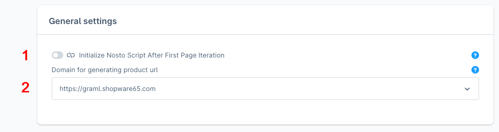

# Configuration

The Nosto plugin has a separate settings page. You can configure values for each sales channel and it's configured languages.

Settings → Extensions → Nosto

### Nosto Account Setup

There are basic configuration fields and control buttons which are located in plugin configuration page (marked with digits on the screenshot):


The account settings are only available for a specific sales channel and language. There are no global account settings.


<figure><figcaption></figcaption></figure>


All API Tokens mentioned in this section have to be created by Nosto, and are specifically for you. Please create your Nosto account(s) first, note your account ID(s), and reach out to your Technical Solutions Manager or to our Support Team.


1. Activates the account for the product sync.
2. Allows validation of API tokens given for this sales channel. Returns notification of API token status.
3. Required field - Nosto account ID. Links your sales channel to matching Nosto account. More info can be found [here](https://help.nosto.com/en/articles/613483-settings-account-settings).
4. Required field - Nosto account name. Validates your Nosto account added to given sales channel. More info can be found [here](https://help.nosto.com/en/articles/613483-settings-account-settings).
5. Required field - Product Token API key (API\_PRODUCTS). Is used to synchronize products between Shopware and Nosto .
6. Required field - Email Token API key, (API\_EMAIL). Is used to synchronize emails between Shopware and Nosto.&#x20;
7. Required field - GraphQL Token API key, (API\_APPS). Is used to synchronize orders between Shopware and Nosto.&#x20;
8. Required Field with Search Token API key, (API\_SEARCH). Is used for all the search requests, when using the plug-and-play solution.&#x20;

### Personalized Search & Category Merchandising

<figure><figcaption></figcaption></figure>

1. Activate this to integrate Nosto's personalized search functionality into your Shopware theme. This will apply your custom search and filter settings from Nosto Admin directly to your store's search experience.
2. Activate this to integrate Nosto's Category Merchandising functionality into your Shopware theme. This will apply your custom merchandising and filter settings from Nosto Admin directly to your store's Category navigation experience.

### General Settings Overview

<figure><figcaption></figcaption></figure>

1. By enabling this setting, Nosto tracking JS scripts will be initialized and loaded directly after guest’s very first interaction with storefront page. It can be used for prevent storefront performance issues during page loading.
2. <mark style="color:red;">**Channel specific -**</mark> <mark style="color:red;"></mark><mark style="color:red;">The selected domain will be used for the product URLs during the product sync. Please make sure that the domain is set accordingly, as whenever you choose a different sales channel the domain for generating product URL's is</mark> <mark style="color:red;"></mark><mark style="color:red;">**NOT**</mark> <mark style="color:red;"></mark><mark style="color:red;">automatically updated and is populated with with the domain from the previous selected sales channel.</mark>&#x20;

<figure><figcaption></figcaption></figure>

### Tags Assignment Overview

Allows you to define what Custom Fields and Tags are transfered to Nosto. Screenshot 1 shows you the view in Shopware, screenshot 2 refers to your products in Nosto.

<figure><figcaption></figcaption></figure>

<figure><figcaption></figcaption></figure>

### Features Flags Overview

This configuration card contains multiple feature toggles which enable/disable what information to send to Nosto with product data. Also, there is possibility to enabling/disable ratings and reviews. Nosto supports tagging the rating and review metadata. The rating value and review count metadata can be used for creating advanced recommendation rules to promote products that are well reviewed.

<figure><figcaption></figcaption></figure>
