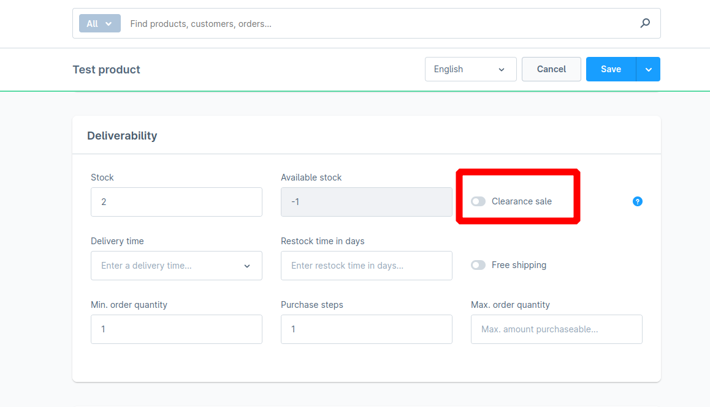
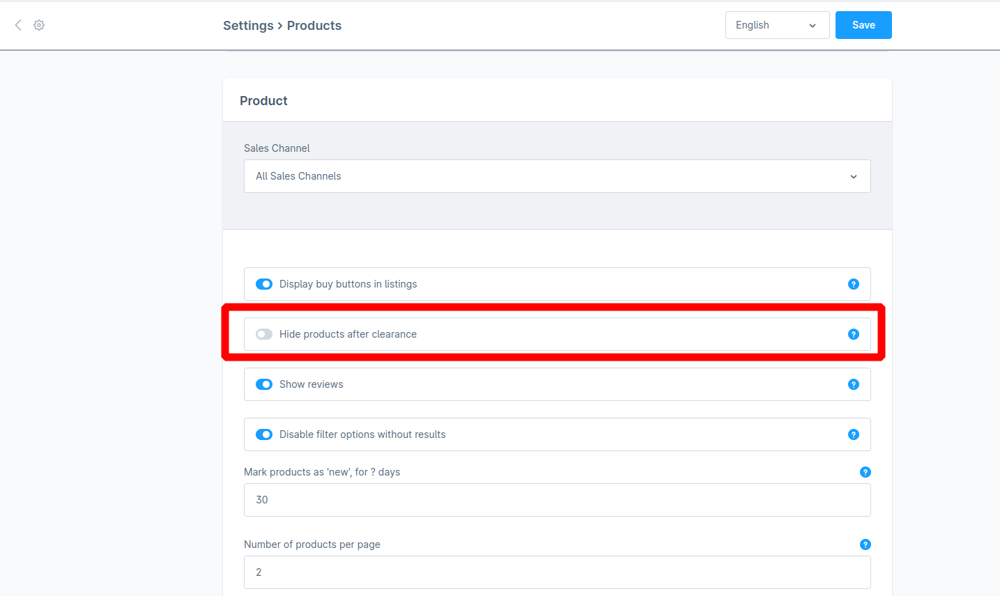

# Clearance Sale & Hide products after clearance

### 1 Where to find the settings

| Setting                           | Location                   | Screenshot                                           |
| --------------------------------- | -------------------------- | ---------------------------------------------------- |
| **Clearance sale**                | _Product → Deliverability_ |  |
| **Hide products after clearance** | _Settings → Products_      |  |

***

### 2 How the options interact

> **Key principle**\
> The two settings only matter **when the product is&#x20;**_**out of stock**_**&#x20;(Stock < 1)**.\
> If the product is in stock, it always synchronises to Nosto and appears as **InStock**.

#### Behaviour matrix (out-of-stock items)

| Clearance sale | Hide after clearance | Result in Nosto                                                   | Notes                                                                |
| -------------- | -------------------- | ----------------------------------------------------------------- | -------------------------------------------------------------------- |
| **Off**        | Off or On            | **InStock**                                                       | “Hide after clearance” is ignored unless _Clearance sale_ is **On**. |
| **On**         | **Off**              | **OutOfStock**                                                    | Item remains in Nosto but is flagged unavailable.                    |
| **On**         | **On**               | **Not sent** → previously synced items switch to **Discontinued** | Item is completely omitted from the feed.                            |

***

#### Practical effects

1. **In-stock products**\
   &#xNAN;_&#x4E;o impact_—synchronised as usual.
2. **Clearance sale On + Hide after clearance On + Stock 0**\
   &#xNAN;_&#x50;roduct disappears from the feed._\
   Previously synced items transition to **Discontinued**.
3. **Clearance sale On + Hide after clearance Off + Stock 0**\
   &#xNAN;_&#x50;roduct stays in the feed but is marked unavailable._\
   Status becomes **OutOfStock**.
4. **Clearance sale Off + Stock 0**\
   &#xNAN;_&#x50;roduct remains visible in Nosto as “InStock”._\
   Use this when you still want to promote wait-lists or pre-orders.

***

### 3 Recommended workflow

| Scenario                                                                   | Recommended setting                                                |
| -------------------------------------------------------------------------- | ------------------------------------------------------------------ |
| You want to **remove** sold-out clearance items entirely                   | Enable **Clearance sale** _and_ **Hide products after clearance**. |
| You want to **keep** sold-out items visible for SEO / back-in-stock alerts | Enable **Clearance sale** only.                                    |
| Product is simply out of stock but not on clearance                        | Leave **Clearance sale** _off_; ignore the “hide” option.          |

***

### 4 Status glossary

| Nosto status     | Meaning                                                                    |
| ---------------- | -------------------------------------------------------------------------- |
| **InStock**      | Product is fully available for sale.                                       |
| **OutOfStock**   | Product remains in catalogue but cannot be purchased.                      |
| **Discontinued** | Product is removed from the active feed; shown only in historical reports. |
