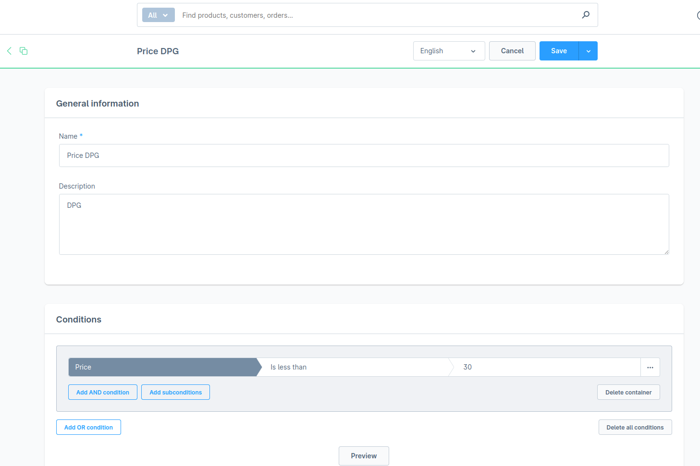
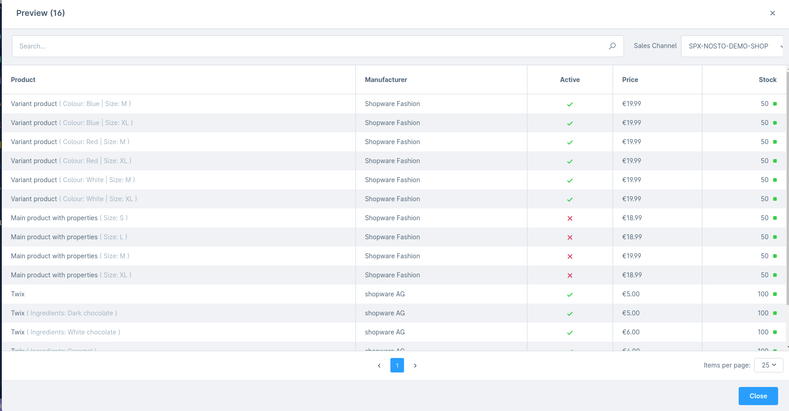
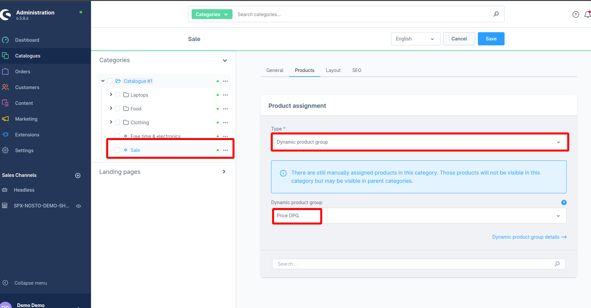
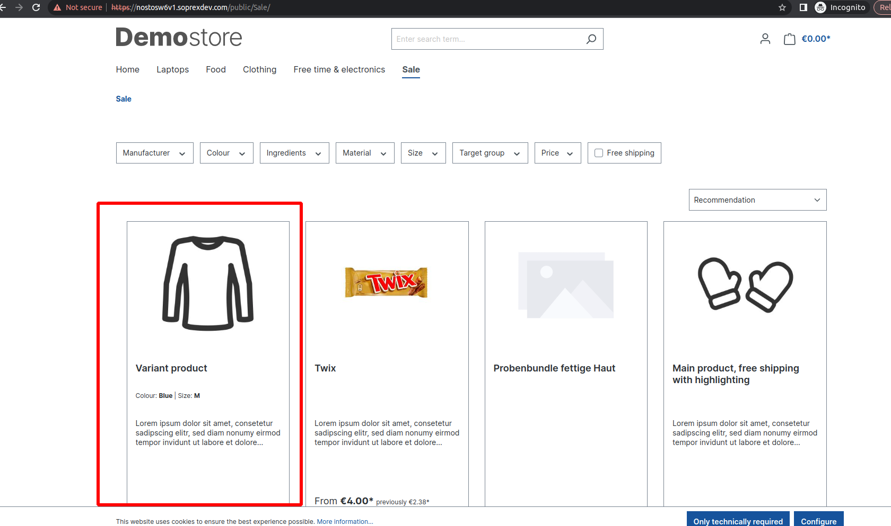
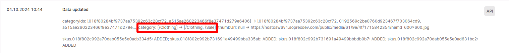

# Dynamic Product Grouping

### 1 Create a Dynamic Product Group

1.  **Shopware 6 Admin → Catalogues → Dynamic product groups** 

    <figure><figcaption></figcaption></figure>
2. Click **Add dynamic product group** (or open an existing one) and define your conditions.\
   &#xNAN;_&#x45;xample:_ _Price < 30 €_ returns all products under €30.
3.  Click **Preview**, choose the relevant **Sales Channel**, and verify the resulting product list. 

    <figure><figcaption></figcaption></figure>

#### Behaviour Notes

| Topic                    | Details                                                                                                                    |
| ------------------------ | -------------------------------------------------------------------------------------------------------------------------- |
| **Variants**             | The storefront shows the **main** product; variants appear as selectable options on the product-detail page.               |
| **Stock & Availability** | Products (or variants) with **Active = false** or **Stock ≤ 0** are **excluded** from the storefront and from Nosto feeds. |

***

### 2 Assign the DPG to a Category

1. Open **Catalogues → Categories**.
2. Select the target category (e.g. **/Sale**) and switch **Product assignment** to **Dynamic product group**.

<figure><figcaption></figcaption></figure>

> _Heads-up:_ Any previously **manual** product assignments are ignored once a DPG is linked.

***

### 3 Run a Nosto Catalogue Sync

After saving the category:

1. Trigger a **Full Product Sync** from the Nosto plugin (or wait for the next scheduled sync).
2. Shopware exports the updated catalogue: the DPG products now appear under the linked category.
3.  In your **Nosto Account**, you should see the additional category node on affected products:\
     

    <figure><figcaption></figcaption></figure>

    <figure><figcaption></figcaption></figure>

> **Result** Products inherit the **/Sale** category (via the DPG) in addition to their original categories, ensuring correct merchandising and filtering inside Nosto.

***

***

#### Troubleshooting

| Symptom                                       | Check                                                                                                                |
| --------------------------------------------- | -------------------------------------------------------------------------------------------------------------------- |
| Product missing in storefront                 | 
• Variant inactive or out of stock • Condition excludes the product
                                        |
| Product not tagged with new category in Nosto | 
• DPG correctly linked? • Full sync finished? • Category excluded in Nosto feed filters?
                |
| Variant appears as separate item              | **Presentation mode** of the product — ensure _Display parent in listings_ is enabled to show only the main product. |
