# Product Synchornization

### 1 Synchronisation Methods

Please make sure that&#x20;

| Method                    | Trigger                      | Scope                                             | Where to enable / run                                                       | Screenshot                                           |
| ------------------------- | ---------------------------- | ------------------------------------------------- | --------------------------------------------------------------------------- | ---------------------------------------------------- |
| **Changelog Entity Sync** | Every 10 minutes             | Only products that changed since the previous run | _Automatic_ — no configuration required                                     |                                                      |
| **Full Catalogue Sync**   | Daily, at the scheduled hour | Entire product catalogue                          | Enable **Daily Product Synchronisation** in _Settings → Extensions → Nosto_ | 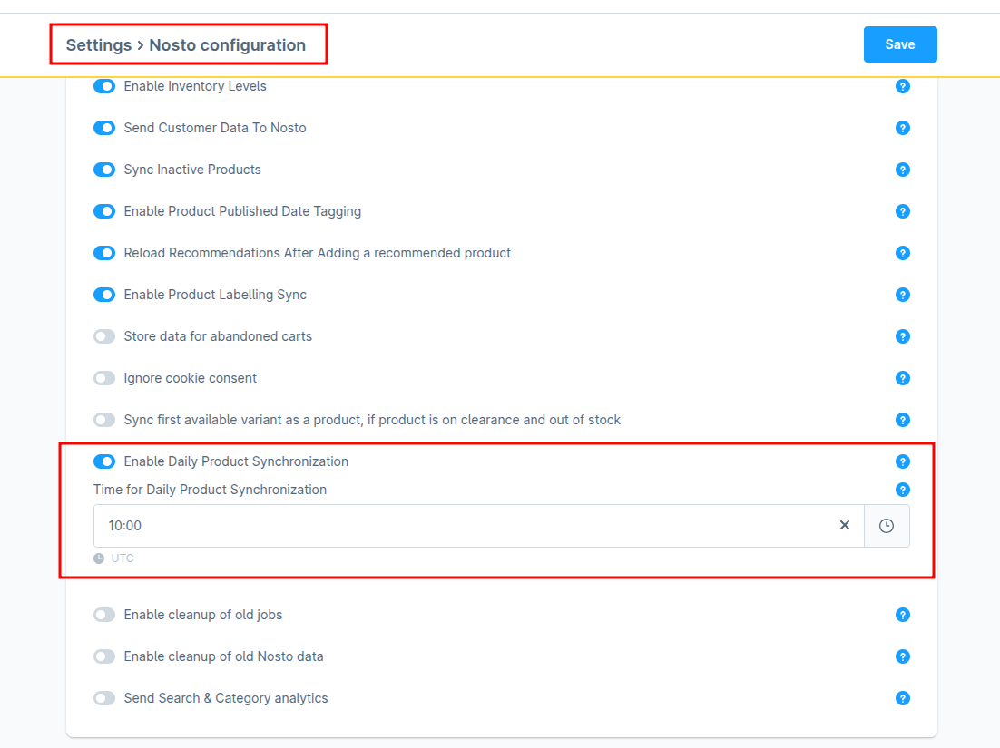 |
| **Manual Full Sync**      | On demand                    | Entire product catalogue                          | _Marketing → Nosto Job Listing → Schedule Full Product Sync_                | 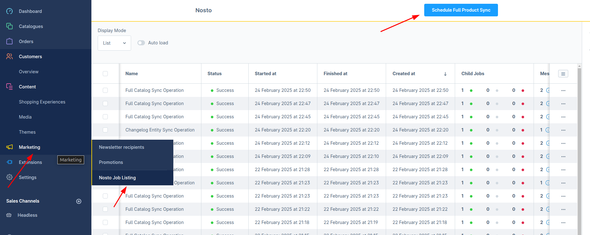 |

***

<figure>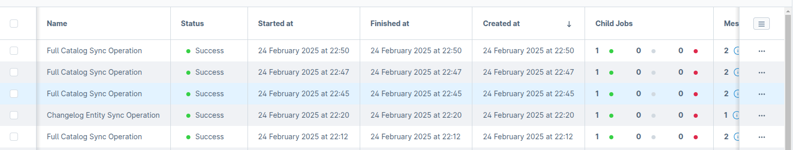<figcaption></figcaption></figure>

### 2 Required Fields

Synchronisation will **fail** unless every product contains the seven mandatory attributes below.

| Field                 | Message if missing                                   |
| --------------------- | ---------------------------------------------------- |
| `product_id`          | 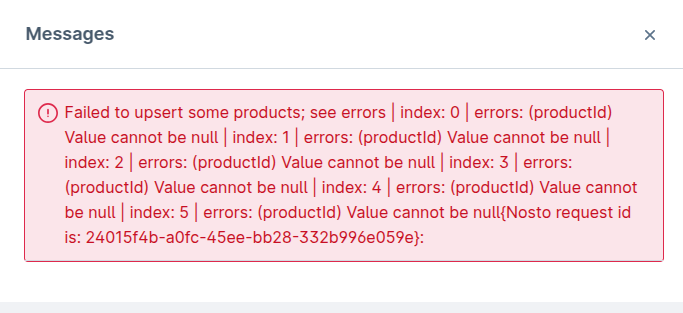 |
| `name`                | 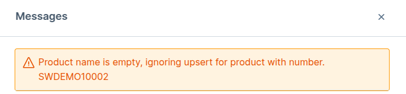 |
| `url`                 | 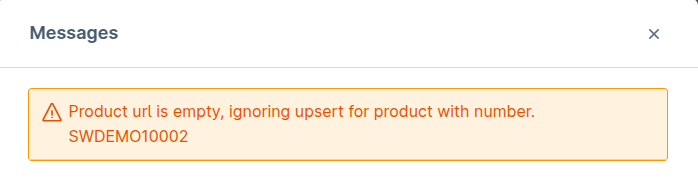 |
| `image_url`           | 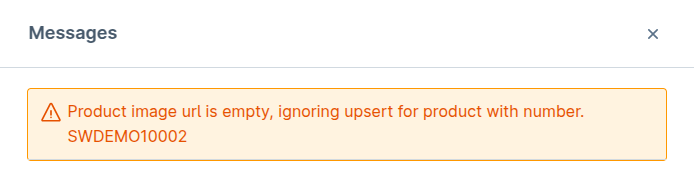 |
| `availability`        | 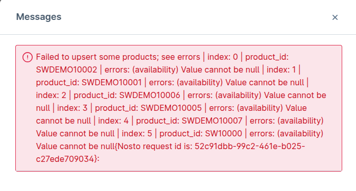 |
| `price`               | (null values default to **0**; no warning)           |
| `price_currency_code` | 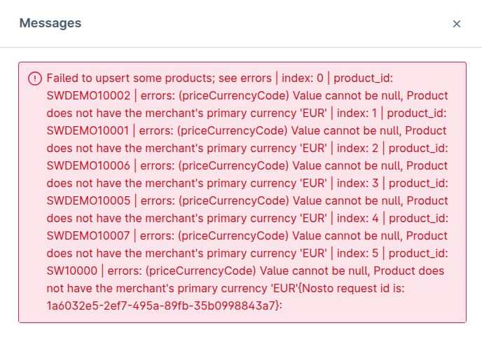 |

> **Tip — placeholder images**\
> **Shopware allows products without images. From Nosto v3.3.9 / v4.2.9 onward, such items receive `image_url = /bundles/storefront/assets/icon/default/placeholder.svg`. Ensure that file exists or the product will sync but remain Not promotable.**

***

### 3 Shopware Defaults vs. Nosto

* **Name, Product Number, Price (gross/net)** are mandatory UI fields in Shopware.
* `product_id` and `url` are generated on save.
* **Stock** defaults to **0** if left blank.
* A product saved without images displays fine in Shopware but **requires** the placeholder rule above to stay promotable in Nosto.

***

### 4 Impact of _Clearance sale_ & _Hide products after clearance_

| Stock   | Clearance sale | Hide after clearance | Behaviour on storefront     | Status in Nosto                         |
| ------- | -------------- | -------------------- | --------------------------- | --------------------------------------- |
| **≥ 1** | —              | —                    | Always visible, purchasable | **InStock**                             |
| 0       | **Off**        | Off or On            | Visible (can’t buy)         | **InStock**                             |
| 0       | **On**         | **Off**              | Visible (can’t buy)         | **OutOfStock**                          |
| 0       | **On**         | **On**               | Hidden                      | **Discontinued** (if previously synced) |

Please familiarise yourself with [clearance-sale-and-hide-products-after-clearance.md](clearance-sale-and-hide-products-after-clearance.md "mention")

***

### 5 Key Nosto Plugin Options

| Option                           | Effect                                                                                           |
| -------------------------------- | ------------------------------------------------------------------------------------------------ |
| **Sync inactive products**       | Mirrors Shopware logic for inactive items (needed if you rely on variant fall-backs).            |
| **Sync first available variant** | Keeps a product promotable when the parent is on clearance & out of stock.                       |
| **Category exclusion**           | Any product in the selected category is **omitted** from the feed (or becomes **Discontinued**). |

<figure>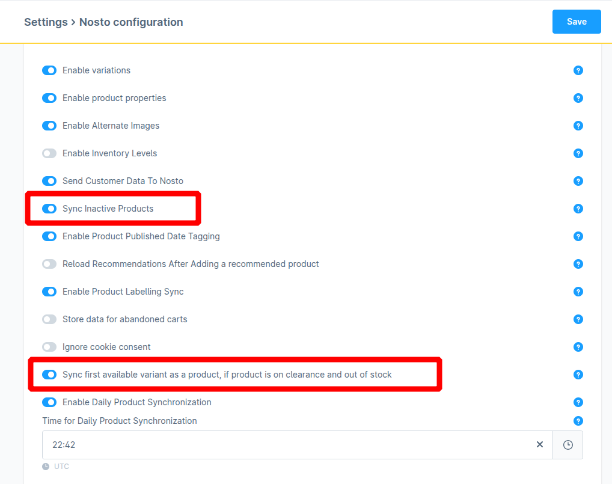<figcaption></figcaption></figure>

> Enable both sync options above to make Nosto match the default Shopware storefront behaviour.

<figure>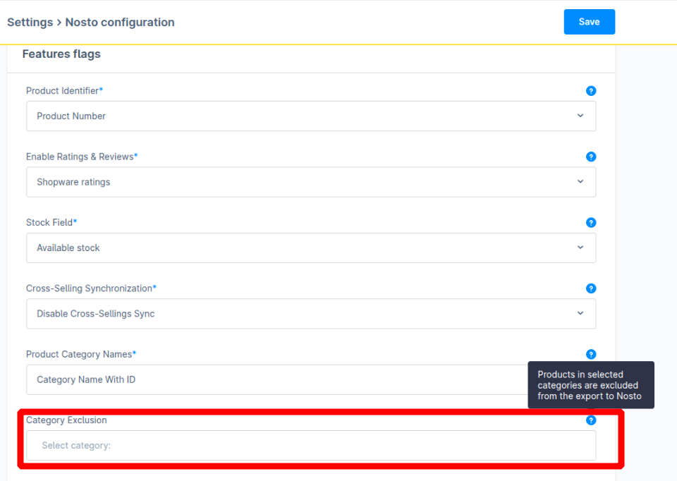<figcaption></figcaption></figure>

***

### 6 Display Scenarios & Resulting Nosto Status

#### 6.1 Simple Product (no variants)

| Condition                                                               | Storefront           | Nosto status     |
| ----------------------------------------------------------------------- | -------------------- | ---------------- |
| Stock 0 & both clearance sale and hide after clearance flags are **On** | Hidden               | **Discontinued** |
| Stock 0 & _Clearance sale_ **On** only                                  | Visible, can’t buy   | **OutOfStock**   |
| Stock ≥ 1                                                               | Visible, purchasable | **InStock**      |

***

#### 6.2 Variant Product — _Display parent_ mode

| Condition                                                             | Storefront outcome            | Nosto status (parent / variant)                            |
| --------------------------------------------------------------------- | ----------------------------- | ---------------------------------------------------------- |
| Parent OOS, both clearance sale and hide after clearance flags **On** | First available variant shown | Variant **InStock**                                        |
| Parent OOS, _Clearance sale_ flag **On**                              | Parent shown (can’t buy)      | Parent **OutOfStock**                                      |
| Parent inactive, variant active                                       | Variant shown                 | Variant **InStock/OutOfStock** (depending on availability) |

<figure>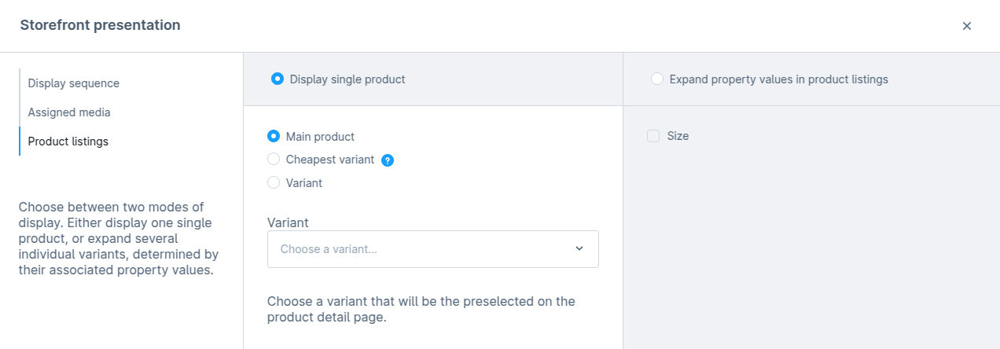<figcaption></figcaption></figure>

***

#### 6.3 Variant Product — _Display cheapest_ mode

| Condition                                                       | Nosto status for cheapest variant                   |
| --------------------------------------------------------------- | --------------------------------------------------- |
| OOS + both clearance sale and hide after clearance flags **On** | **Discontinued**                                    |
| OOS + _Clearance sale_ **On**                                   | **OutOfStock**                                      |
| Cheapest inactive                                               | Next active variant syncs (status depends on stock) |

<figure>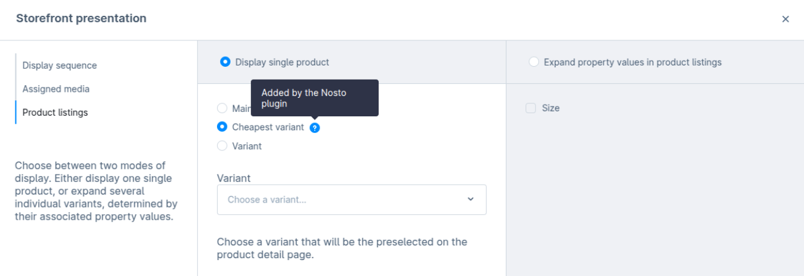<figcaption></figcaption></figure>

***

#### 6.4 Variant Product — _Choose a variant_ mode

| Condition                                                                        | Storefront                    | Nosto status                                       |
| -------------------------------------------------------------------------------- | ----------------------------- | -------------------------------------------------- |
| Selected variant OOS + both clearance sale and hide after clearance flags **On** | First available variant shown | Variant **InStock**                                |
| Selected variant OOS + _Clearance sale_ **On**                                   | Variant shown (can’t buy)     | **OutOfStock**                                     |
| Selected variant inactive                                                        | First active variant shows    | **InStock/OutOfStock** (depending on availability) |

<figure>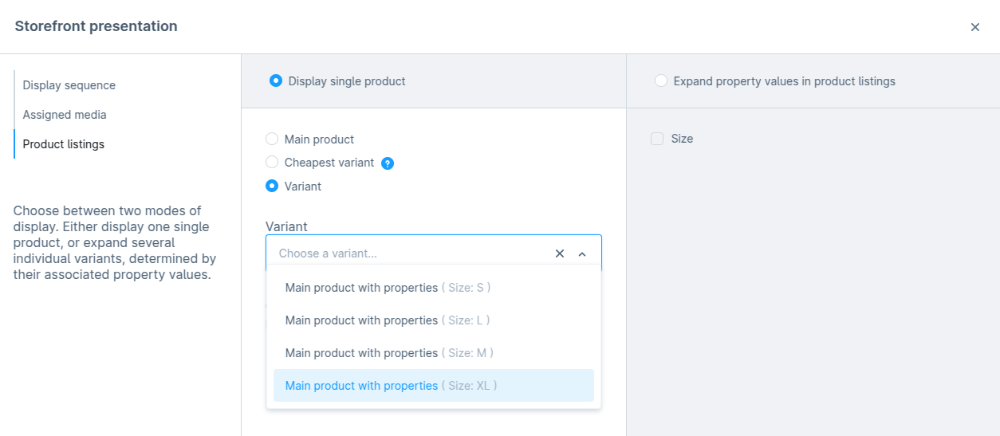<figcaption></figcaption></figure>

***

#### 6.5 Expanded Property Listings

**No property selected**

| Flags                                                     | Storefront                       | Nosto status                                       |
| --------------------------------------------------------- | -------------------------------- | -------------------------------------------------- |
| _Clearance sale_ **On** only                              | First active variant per product | **InStock/OutOfStock** (depending on availability) |
| Both clearance sale and hide after clearance flags **On** | First available variant          | **InStock**                                        |

<figure>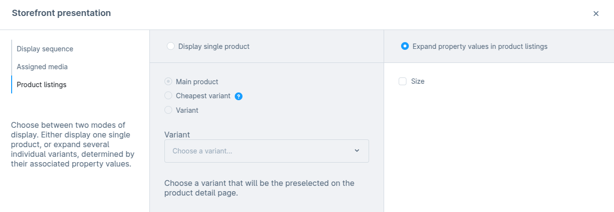<figcaption></figcaption></figure>

**All properties selected**

* Every active variant is listed; Nosto mirrors availability per variant.
* With Both clearance sale and hide after clearance flags **On**, only available variants appear and sync as **InStock**.

<figure><figcaption></figcaption></figure>

**Sub-set of properties**

* One variant per selected property value.
* With Both clearance sale and hide after clearance flags **On**, only available variants appear and sync as **InStock**.

<figure>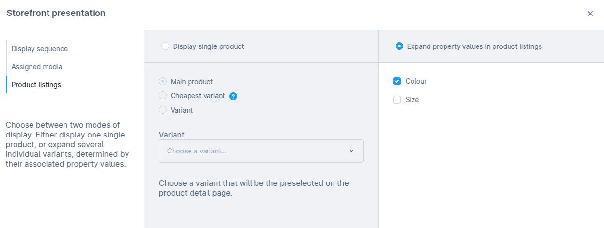<figcaption></figcaption></figure>

***

