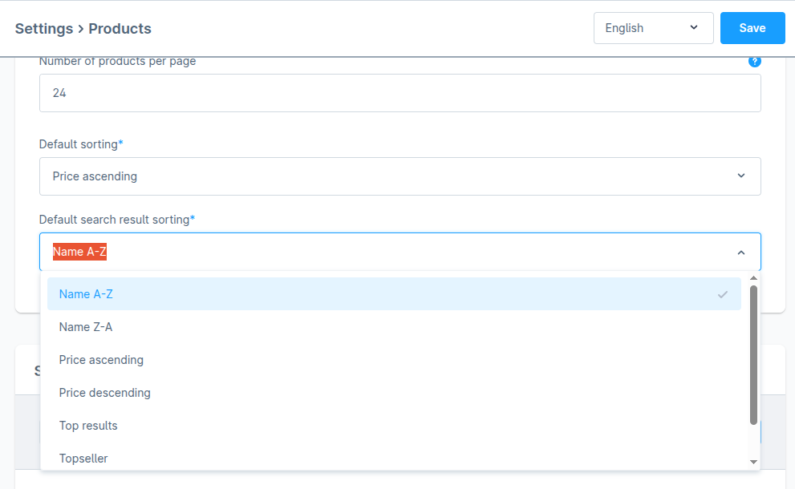
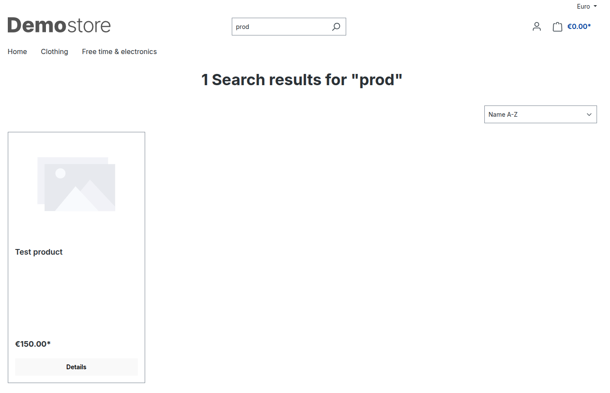

# Sorting

### 1. Core Sorting Behaviour by Shopware Version

#### ≤ Shopware 6.6.9

| Area            | Behaviour                                                                                                                                                                                                      |
| --------------- | -------------------------------------------------------------------------------------------------------------------------------------------------------------------------------------------------------------- |
| **Admin panel** | 
• One unified sorting configuration covers both category listings <em>and</em> search results. • The <em>Top Results</em> (<code>score</code>) option is <strong>not</strong> visible/selectable.
    |
| **Storefront**  | 
<strong>Category pages</strong> – <em>Top Results</em> is absent from the dropdown. <strong>Search results</strong> – <em>Top Results</em> is hard-coded as the default and visible in the dropdown.
 |

<figure><figcaption></figcaption></figure>

<figure><figcaption></figcaption></figure>

***

#### ≥ Shopware 6.6.10

| Area            | Behaviour                                                                                                                                                                                                                                                                                |
| --------------- | ---------------------------------------------------------------------------------------------------------------------------------------------------------------------------------------------------------------------------------------------------------------------------------------- |
| **Admin panel** | 
• Sorting settings are split: one for <strong>categories</strong>, one for <strong>search</strong>. • <em>Top Results</em> appears <strong>only</strong> in <strong>Search</strong> sorting. • <em>Top Results</em> is still absent from <strong>Category</strong> sorting.
 |
| **Storefront**  | 
<strong>Category pages</strong> – <em>Top Results</em> still not shown. <strong>Search results</strong> – <em>Top Results</em> remains hard-coded as default.
                                                                                                                  |

<figure><figcaption></figcaption></figure>

<figure><figcaption></figcaption></figure>

 

***

### 2. What the Nosto Plugin Adds

| Property  | Value                                                       | Purpose                           |
| --------- | ----------------------------------------------------------- | --------------------------------- |
| **Label** | _Recommendation_                                            | Human-readable name               |
| **Key**   | `nosto-recommendation`                                      | Technical identifier              |
| **Usage** | May be set as default in **both** category and search pages | Personalised relevance-based sort |

***

### 3. Plugin Lifecycle & Fallback Logic

#### ✔️ Install

* Adds _Recommendation_ if it does not yet exist.

#### ❌ Uninstall

* Removes _Recommendation_.
* **Fallbacks** if _Recommendation_ was the default:

| Shopware Version | Area(s)        | Action                                                                           |
| ---------------- | -------------- | -------------------------------------------------------------------------------- |
| ≤ 6.6.9          | Unified config | Pick first active, unlocked option with highest priority                         |
| ≥ 6.6.10         | Category       | Same as above                                                                    |
|                  | Search         | Use _Top Results_ if present; otherwise first active, unlocked, highest-priority |

#### 🚫 Deactivate

* Marks _Recommendation_ as inactive (`active = 0`).
* Applies the same fallback rules as **Uninstall**.

#### ✔️ Activate

* Sets `active = 1` for _Recommendation_ without touching existing defaults.

***

### 4. Storefront Visibility Logic

“Why don’t I see both _Top Results_ and _Recommendation_?”

Only **one** relevance-based option is shown to avoid duplication.

| Condition                      | Visible in Dropdown    | Hidden                |
| ------------------------------ | ---------------------- | --------------------- |
| _Top Results_ is default       | _Top Results_          | Recommendation        |
| _Recommendation_ is default    | Recommendation         | Top Results           |
| Neither is default             | Higher-priority option | Lower-priority option |
| Same priority, neither default | Recommendation         | Top Results           |

> **Rule of thumb:** _Recommendation_ replaces _Top Results_ when its priority is **≥** the priority of _Top Results_.

***

#### If Nosto Services Are Inactive

_Recommendation_ is suppressed in the storefront—but still remains configured in Admin.\
Customers then see whichever active option has the highest priority instead.

***

### 5. Shopware Handling of Sortings Without Criteria

If a sorting option contains **no criteria**, Shopware runs the listing **without** an `ORDER BY` clause. MySQL then applies a nondeterministic order (effectively by ID). Shopware mitigates this by appending a fallback sort on product ID.

***

### 6. Managing Sorting Options in the Backend

#### Changing Priority

1. **Settings → Catalogue → Product Sorting**
2. Drag options or adjust the **Priority** column.

<figure><figcaption></figcaption></figure>

_Higher numbers = higher dropdown position._\
&#xNAN;_&#x41;void giving two options the exact same priority._

#### Creating a New Option

1.  Click **Add option**. 

    <figure><figcaption></figcaption></figure>
2.  Fill in **Name**, **Technical name**, set **Active**, and add criteria. 

    <figure><figcaption></figcaption></figure>
3.  For each criterion define **Order** _(ASC/DESC)_ and \*_Priority_. 

    <figure><figcaption></figcaption></figure>

***

### 7. Using a Custom Field as Sorting Criteria

1.  Create the custom field in **Shopware Backend → Settings → Custom fields** and attach it to products. 

    <figure><figcaption></figcaption></figure>
2.  Back in **Product Sorting**, pick the custom field from the **Name** dropdown. 

    <figure><figcaption></figcaption></figure>
3.  In **Settings → Extensions → Nosto**, add the same custom field. 

    <figure><figcaption></figcaption></figure>
4. Run a **Full Product Sync**.
5.  In the Nosto account:\
    **Product Experience Cloud → Search → Settings → Indexed fields → + Add attribute**. 

    <figure><figcaption></figcaption></figure>
6.  Save. Indexing runs every 6 hours—changes may take time to appear. 

    <figure><figcaption></figcaption></figure>
