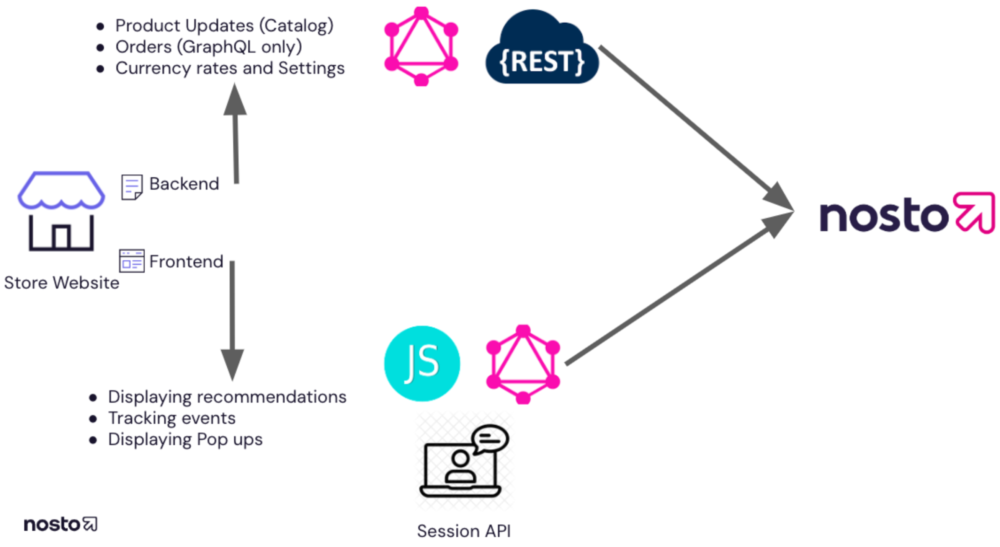

# What Nosto does and how it works

Nosto replicates an eCommerce site’s product catalog (one account per domain/language) as the foundation for all Nosto modules. You might need to adjust the product data structure, so please let us know about your parent/child relationships, customer groups (pricing and visibility) and how you handle translations and multiple currencies (fixed prices or exchange rates).

Nosto then does two basic things onsite:

1. **Profile creation:** Track what a user is doing on an eCommerce site (which pages (landing page, product page, category page, …) shoppers look at and what they buy).
    - This data is sent to the Nosto backend so we can understand and present insights to the client in our dashboard.
2. **Content personalization:** Change the content on an eCommerce site per user depending on the data we have collected and which campaigns have been set up by the client.
    - "Content" is a broad term and ranges:
        - from a hero/banner image on a home, landing, category or product page
        - to product recommendations ("You might also like") on any page type (or even in the mini-cart or search overlay)
        - to conversion rate optimized, personalized category pages and SERPs which replace the native platform functionality.

* [Watch video: Overview of Nosto by example of a custom implementation](https://youtu.be/kBz84G4TMgw)
* [Watch video: How Nosto injects personalized content](https://youtu.be/LWdrE4-CKMk)

Nosto has several apps/plugins for common platforms like Shopify, Shopware, Magento, ... that give you a head start. Please review the platform-specific documentation at the bottom of this page. The feature set (product and order sync, adding the script and page tagging, ...) can vary and might need to be extended for custom requirements.

