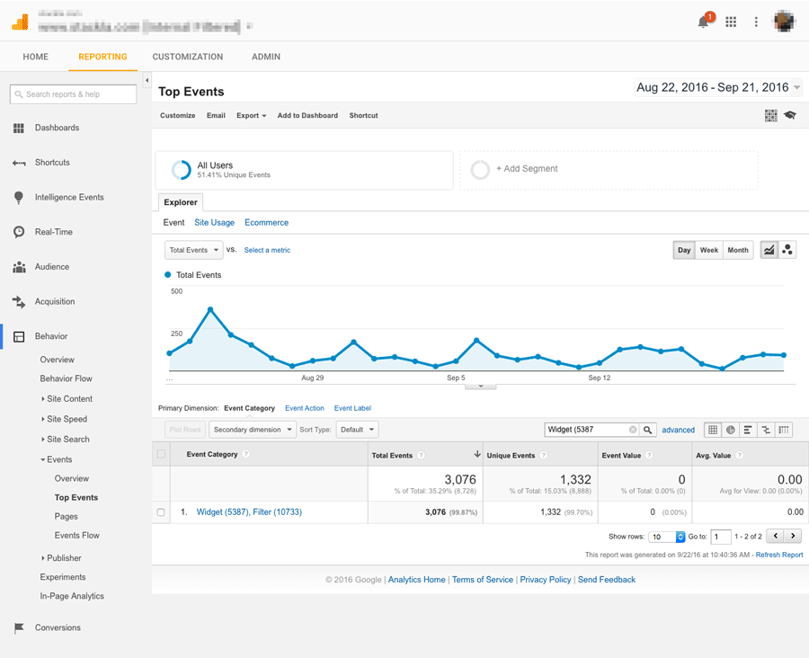
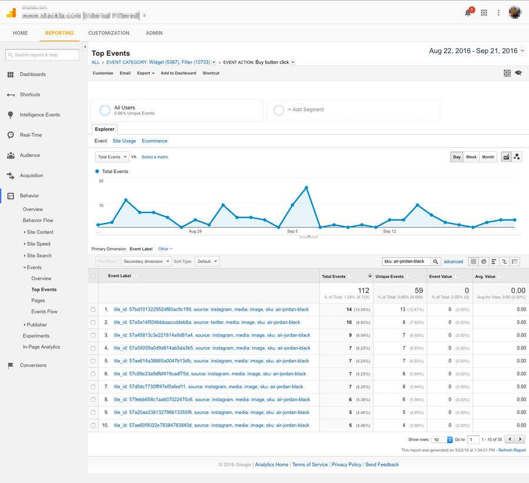

# Tracking Widget interactions with Google Analytics

* [Overview](tracking-widget-interactions-with-google-analytics.md#overview)
* [Key Concepts](tracking-widget-interactions-with-google-analytics.md#key-concepts)
* [The Fun Part](tracking-widget-interactions-with-google-analytics.md#the-fun-part)
  * [Getting Started](tracking-widget-interactions-with-google-analytics.md#getting-started)
  * [Getting to know the Global Widget Events API](tracking-widget-interactions-with-google-analytics.md#getting-to-know-the-global-widget-events-api)
  * [Sending data to Google Analytics](tracking-widget-interactions-with-google-analytics.md#sending-data-to-google-analytics)
* [Conclusion](tracking-widget-interactions-with-google-analytics.md#conclusion)

## Overview

Nosto's UGC provides a Google Analytics plugin that allows you to track common user interactions via Google Event tracking.

The data sent to Google Analytics is pre-set and configuration is limited to choosing which Widgets you want to track and the specific interactions you want to track on them.

In this guide we will use the Nosto's UGC [JavaScript API](../../api-docs/javascript/) to customise the data that is sent to Google Analytics for the events we choose to track.

[Back to Top](tracking-widget-interactions-with-google-analytics.md#top)

## Key Concepts

### Google Analytics Events

[Events](https://support.google.com/analytics/answer/1033068?hl=en) are user interactions with content that can be tracked independently from a web page or screen load.

Data related to these interactions can be sent to Google Analytics.

[Back to Top](tracking-widget-interactions-with-google-analytics.md#top)

## The Fun Part

### Getting Started

In this example we will need to do the following:

* Use the [Global Widget Events API](../../api-docs/javascript/widgets/reference.md#parent-page) to find out what data Nosto's UGC Widgets make available for the user interactions that we choose to track.
* Use Google Analytics event tracking methods to send some of this data to Google Analytics.

[Back to Top](tracking-widget-interactions-with-google-analytics.md#top)

### Getting to know the Global Widget Events API

Nosto's UGC’s [Global Widget Events API](../../api-docs/javascript/widgets/reference.md#parent-page) provides a number of events that you can subscribe to in order to track user interactions.

Today we’ll work with two:

1. tileExpand - triggered when a user clicks a Tile to view it in a lightbox
2. productActionClick - triggered when a user clicks a “Buy” button on a Tile (Social Commerce feature)

First we’ll look at what data these events makes available, then we’ll configure Google Analytics event tracking to send some of this data to Google Analytics when users trigger these events.

To start, we’ll crack open the Custom Code Editor on our Widget, switch to the Expanded Tile tab and add the following code.

Adding this code in the Expanded Tile JS editor instead of directly on the parent page means Nosto's UGC will load this code for us when Stackla.WidgetManager global variable is available, avoiding the need to check and re-check for this variable before executing our code.

```
Stackla.WidgetManager.on('tileExpand', function (e, data) {
    // Log all the available data to the console
    console.log(data);
});
```

With this, we’ll get a dump in the console of all the data associated with the `tileExpand` event that Nosto's UGC makes available.

This data is contained inside an aptly named `data` object. Let’s fetch some stuff from there and send it to Google Analytics via event tracking.

[Back to Top](tracking-widget-interactions-with-google-analytics.md#top)

### Sending data to Google Analytics

Before we look into this further, we'll need a way to establish how this data is being sent to GA. As the ga() calls do not use the current Nosto's UGC Google Analytics plugin Tracking ID or data, we'll need to include this in the Widget or the parent page with the tracking ID:

```
 (function(i, s, o, g, r, a, m) {
        i.GoogleAnalyticsObject = r;
        i[r] = i[r] || function() {
            (i[r].q = i[r].q || []).push(arguments);
        }, i[r].l = 1 * new Date();
        a = s.createElement(o),
            m = s.getElementsByTagName(o)[0];
        a.async = 1;
        a.src = g;
        m.parentNode.insertBefore(a, m);
    })(window, document, 'script', 'https://www.google-analytics.com/analytics.js', 'ga');

 ga('create', 'UA-XXXXXX-X', 'auto'); 
 //CHANGE THE X TO the Tracking ID
```

Once this is done we can replace the console log with a Google Analytics Event method which has [this format](https://developers.google.com/analytics/devguides/collection/analyticsjs/events#implementation):

```
ga('send', 'event', [eventCategory], [eventAction], [eventLabel], [eventValue], [fieldsObject])
```

The `eventCategory`, `eventAction` and `eventLabel` values correspond with columns in our Google Analytics Event reports and we’ll replace them with data from our data object.

We’ll leave `eventValue` blank as it is not required. We’ll also omit `fieldsObject` for now.

Here goes…

```
Stackla.WidgetManager.on('tileExpand', function (e, data) {
    ga('send', 'event', 'Widget (' + data.widgetId +') Filter (' + data.filterId + ')', 'Tile expand', 'tile_id: ' + data.tileData._id.$id + ', source: ' + data.tileData.source + ', media: ' + data.tileData.media);
});
```

Here’s a breakdown of the above:

For `eventCategory` we have included “Widget (Widget ID here), Filter (Filter ID here)”. That way we can report on each Widget/Filter combination on our website.

`eventAction` describes the user interaction that has taken place - ‘Tile expand’ seems an accurate label.

Our eventLabel is where most of our data will be sent. In this case we’ve included things like the Tile ID, the source (network) and the media type. This will allow us to answer questions like “which media type (image, video, text) attracts the most clicks?”.

When we log in to Google Analytics, hit the Reporting tab and go to Behaviour > Events > Top Events we’ll see something like this:



Let’s track another event…

```
Stackla.WidgetManager.on('productActionClick', function (e, data) {
    ga('send', 'event', 'Widget (' + data.widgetId +') Filter (' + data.filterId + ')', 'Buy button click', 'tile_id: ' + data.tileData._id.$id + ', source: ' + data.tileData.source + ', media: ' + data.tileData.media + ', sku: ' + data.productTag.ext_product_id);
});
```

This event will track clicks on a product buy button on a Nosto's UGC Tile (productActionClick).

We’ll send the same data that we did for the tileExpand event but we’ll also append the product sku to the eventLabel. Product sku is stored in the ext\_product\_id field on a Tile and made available in the data.productTag object for this specific event.

By drilling down on “Buy button click” events in GA, we can filter by product sku to see which Tiles are driving the most traffic to our purchase pages.



[Back to Top](tracking-widget-interactions-with-google-analytics.md#top)

## Conclusion

By leveraging the events and data made available by the [Global Widget Events API](../../api-docs/javascript/widgets/reference.md#parent-page) we can customise the data sent to Google Analytics.

[Back to Top](tracking-widget-interactions-with-google-analytics.md#top)
