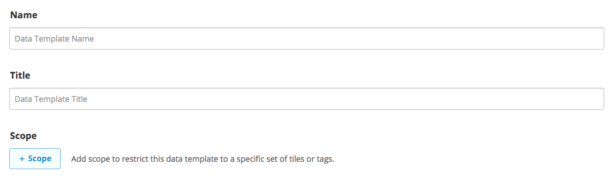
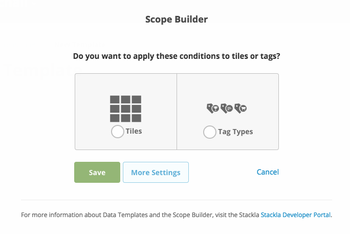
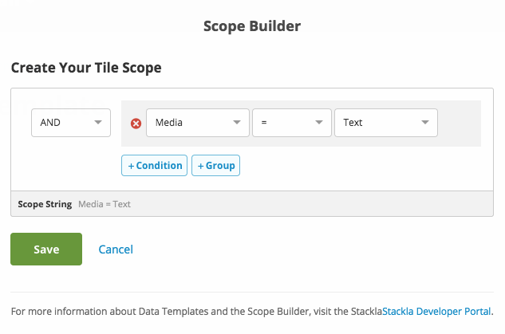
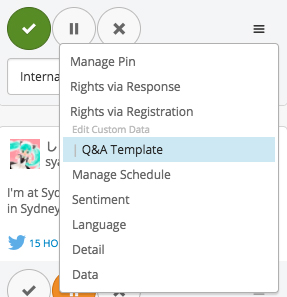
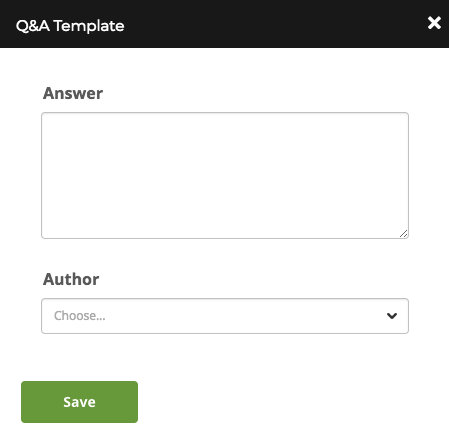
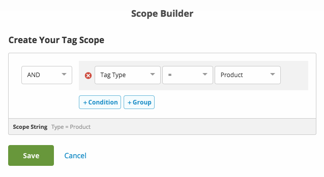
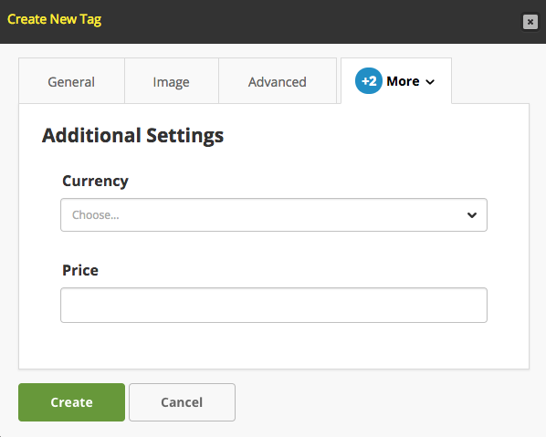

# Creating a Data Template

* [Overview](creating-data-template.md#overview)
* [Building the Templates](creating-data-template.md#the-fun-part)
* [Conclusion](creating-data-template.md#conclusion)

## Overview

Nosto's UGC offers the ability for clients to append their own Custom Data to any Tile or Tag on the Platform, allowing for clients to enrich the content on their Stack with additional data.

This custom data is appended to the Tile or Tag data and is available to be rendered through any Nosto's UGC output, plus the Nosto's UGC API.

In this guide we are going to build two Custom Data templates, one for Tiles, and one for Tags, which we can then leverage via the Nosto Admin Portal.

[Back to Top](creating-data-template.md#top)

## Building the Templates

### Getting Started

For the following guide we are going to create two simple Data Templates within our Stack. The use-cases for each are outlined below:

* Add a response to a Question on a Tile
* Add alternative Pricing to a Product Tile

### Data Templates for Tiles

First step is to define our template. As outlined on the [Data Templates](https://github.com/Stackla/docs/blob/master/enterprise/datatemplates/README.md) page, you will need to define a **Template Name**, **Title** and **Scope** before you can start building out the form.



For the purpose of this guide, we are going to give the Data Template form the **Name** and **Title** of 'Q\&A Template'. From here we are going to select **Scope**.



We will select the **Scope** 'Tiles', and click on the **More Settings** button to limit this only to **Text** tiles.



The **Scope** builder works very similar to **Advanced Tag Builder** on the Platform. We are going to enter a very simple query of `Media = Text`

From here we can define our **Schema** and **Options**. Nosto's UGC Data Templates use a framework called [Alpaca](http://www.alpacajs.org) to define these elements, with the JSON Schema defining how the data is stored in Nosto's UGC, and Options defining how it is rendered in the form.

For this guide, we want to store two attributes, the Answer to the question (Text Area) and the author of the response (Picklist). As such we will put the following code in:

**Schema:**

```
{
    "type":"object",
    "properties": {
        "response": {
            "type":"string"
        },
        "author": {
            "type":"string",
            "enum": [
                "Iestyn_Harris",
                "Lee_Briers",
                "Jonathan_Davies",
		"Ian_Watson",
		"Kerion_Cunningham"
            ]
        }
    }
}
```

**Options:**

```
{

    "fields": {
        "response": {
            "type":"textarea",
            "label": "Answer"
        },
        "author": {
            "type":"select",
            "label": "Author",
            "optionLabels": [
                "Iestyn Harris",
                "Lee Briers",
                "Jonathan Davies",
		"Ian Watson",
		"Kerion Cunningham"
            ]
        }
    }
}
```

We can now hit Save on our Data Template, and then go to **Curate Content** to access the Data Template form.



The option will be available via the overflow menu on the respective Tile. Once clicked on, the Data Template form will appear and can be edited by the User.



### Data Templates for Tags

The process for building a Data Template for Tags is very similar to Tiles. The only real difference is the Scope.

As per Data Templates for Tiles, we will start by defining our **Name** and **Title**.


For the purpose of this guide, we are going to give the Data Template form the **Name** and **Title** of 'Additional Settings'. From here we are going to select **Scope**.


We will select the **Scope** 'Tags', and click on the **More Settings** button to limit this only to **Product** tags.



The query we will enter here is simply `Tag Type = Product`

We can now our **Schema** and **Options**. For this guide, we will want to offer a series of sizes and colours

**Schema:**

```
{
    "type":"object",
    "properties": {
        "currency": {
            "type":"string",
            "enum": [
                "AUD",
                "GBP",
                "USD",
		"NZD",
		"Euro"
            ]
        },
		"price": {
            "type":"string"
        }
    }
}
```

**Options:**

```
{

    "fields": {
        "currency": {
            "type":"select",
            "label": "Currency",
            "optionLabels": [
                "Australian Dollars",
                "British Pounds",
                "US Dollars",
		"New Zealand Dollars",
		"Euros"
            ]
        },
        "price": {
            "type":"text",
            "label": "Price"
        }
    }
}
```

From here we can hit Save. To view the additional fields for our Tags, we simply go to **Manage Tags** under Curate and it will be available as Tab option.



[Back to Top](creating-data-template.md#top)

## Next Steps

Once we've built our Custom Data templates, we can start populating them, and rendering this information on our outputs.

[Back to Top](creating-data-template.md#top)
