# Customizing Carousel Event Screen

* [Overview](customizing-carousel-eventscreen.md#overview)
* [How It Works](customizing-carousel-eventscreen.md#how-it-works)
  * [Queue](customizing-carousel-eventscreen.md#queue)
  * [Themes](customizing-carousel-eventscreen.md#themes)
  * [Modes](customizing-carousel-eventscreen.md#modes)
  * [Queue and Slides](customizing-carousel-eventscreen.md#queue-and-slides)
* [Customizing CSS](customizing-carousel-eventscreen.md#customizing-css)
  * [Tile Structure](customizing-carousel-eventscreen.md#tile-structure)
* [Customizing JavaScript](customizing-carousel-eventscreen.md#customizing-js)
  * [Available Libraries](customizing-carousel-eventscreen.md#available-libraries)
* [Sample](customizing-carousel-eventscreen.md#sample)

## Overview

This section demonstrates how the Carousel Event Screen works. It will provide some assistance and clarity whilst troubleshooting specific tile display or missing issues.

[Back to Top](customizing-carousel-eventscreen.md#top)

## How It Works

### Queue

The queue is where our system holds tiles that will be displayed on the event screen. With the exception of pinned tiles, it's the amount of tiles that will be appended into the Carousel Event viewport.

.png>)

* By default the queue has a capacity of 30 tiles. You can change the capacity by using Custom Javascript. A smaller queue causes a higher frequency of seeing the same tiles.
* Whenever a new tile is received, the oldest tile will be removed from the queue.
* If you use a high velocity term for your filter in the Event Screen, it's possible that all of the current tiles could be replaced with new ones after each queue check.
* You can change the queue capacity by updating the **Amount of Tiles in Loop** option in **Display Options**.\
  .png>)

[Back to Top](customizing-carousel-eventscreen.md#top)

### Themes

Currently we have two theme options. One is **Less is More** and the other one is **Blocks**.

| Blocks (Default)                            | Less is More                                    |
| ------------------------------------------- | ----------------------------------------------- |
| 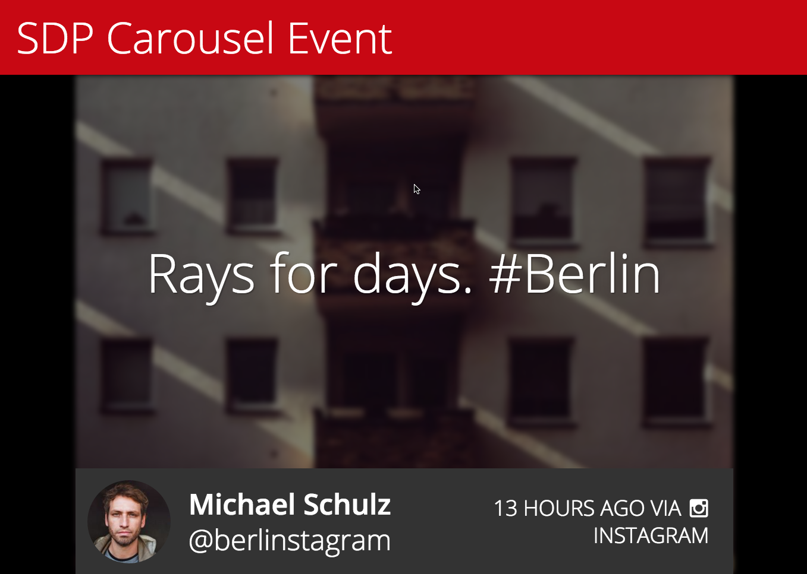 | 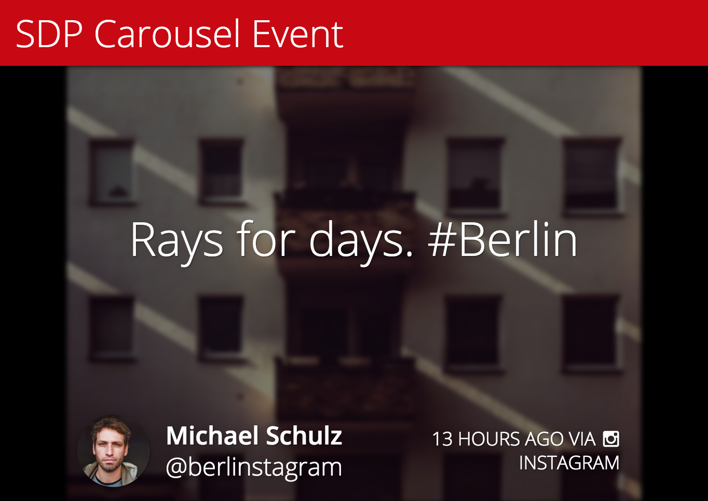 |

[Back to Top](customizing-carousel-eventscreen.md#top)

### Modes

Currently we have the following different modes. There is also a **Random** option which applies different modes for different tiles randomly.

| Text over image (Default)                         | Side-by-side                                   | Image only                                    |
| ------------------------------------------------- | ---------------------------------------------- | --------------------------------------------- |
| 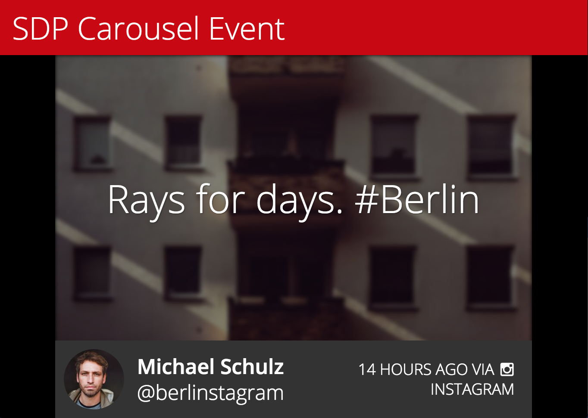 | 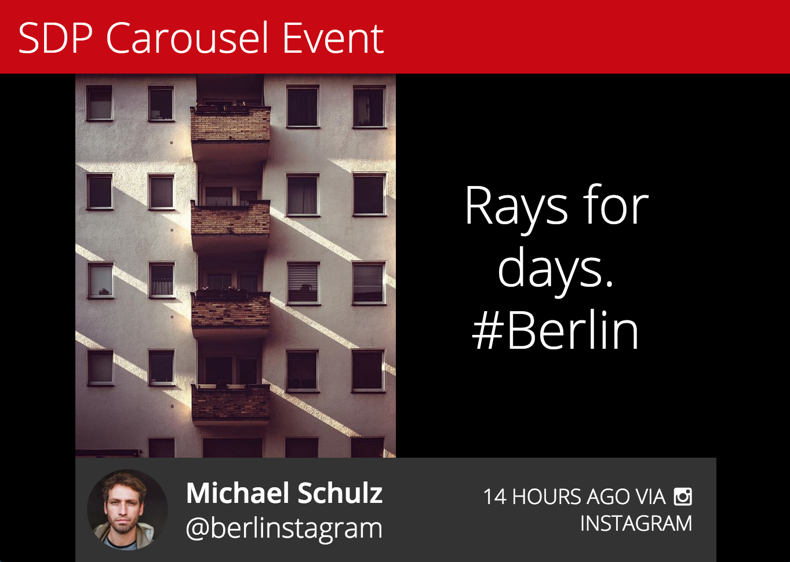 | 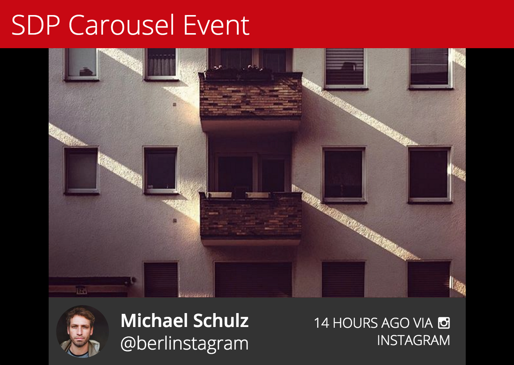 |

You can still configure the **Themes** option to have different visual presentation.

| Text over image with Less is Simple             | Side-by-side with Less is Simple                          | Image only with Less is Simple                           |
| ----------------------------------------------- | --------------------------------------------------------- | -------------------------------------------------------- |
|  | 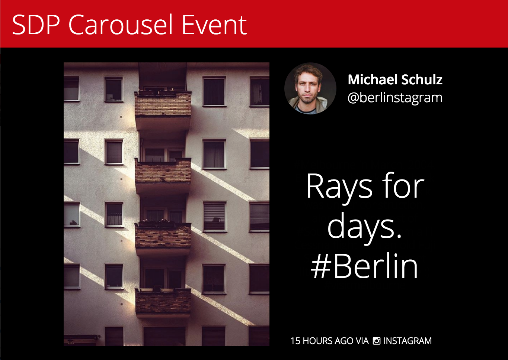 | 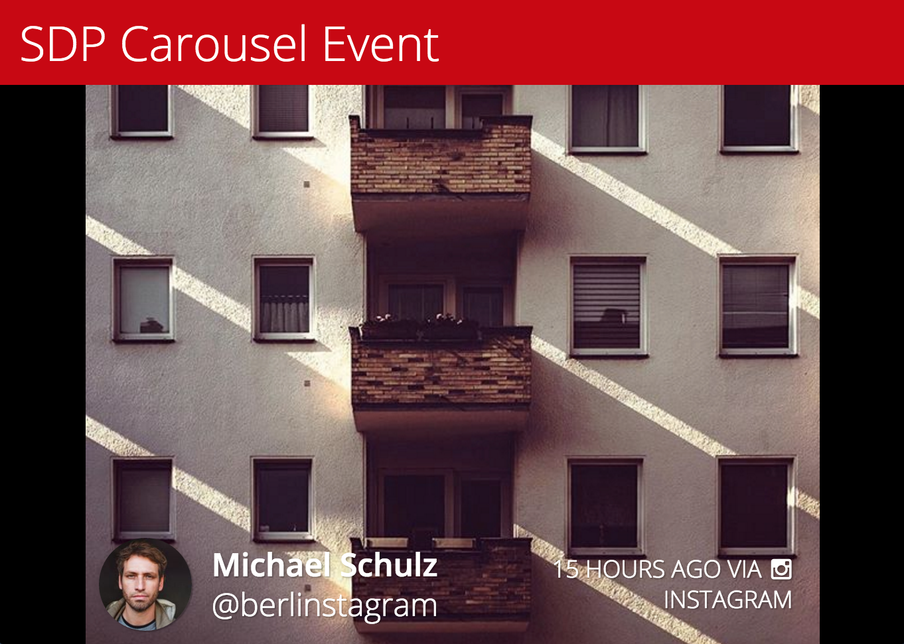 |

[Back to Top](customizing-carousel-eventscreen.md#top)

### Queue and Slides

The tiles in queue will be converted to slides in the Carousel Event.

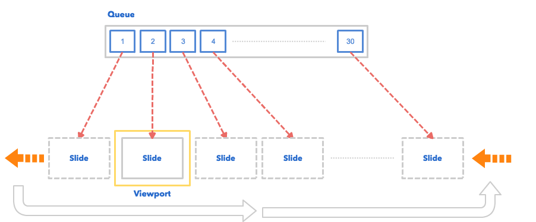

As illustrated, we have 30 items in the queue, and will get the exact same amount of slides in the carousel. Note that the pinned tile are not counted in the amount - this is something that you will need to consider. For example, if you set the **Amount of Tiles in Loop** to 30 tiles and you also have 2 pinned tiles. There will be 32 slides in the Carousel event.

[Back to Top](customizing-carousel-eventscreen.md#top)

## Customizing CSS

### Tile Structure

The Carousel Event Screen is mostly composed by tiles (slides), as such it's much easier to customize it when you are more familiar with its structure.

| <p><strong>Diagram</strong></p><p>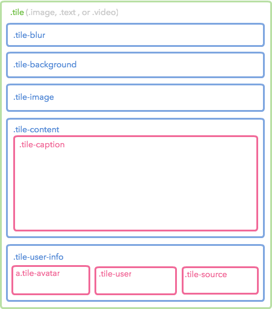</p> | <p><strong>Sample</strong></p><p>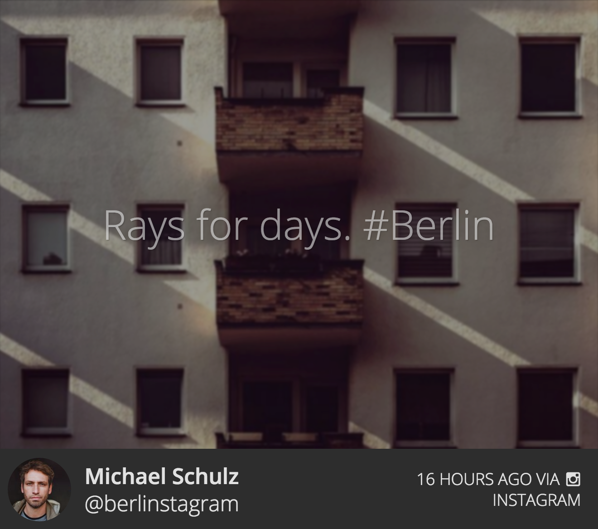</p> |
| ------------------------------------------------------------------------------------------------------------------------------------ | ----------------------------------------------------------------------------------------------------------------------------- |

### Code

The diagram above only shows until the 3rd level. Check the complete Tile structure by referencing the following code.

```
<div class="tile">
    <div class="tile-blur" style="background-color: rgba(0, 0, 0, 0.75)"></div>
    <div class="tile-background" style="background-color: rgba(0, 0, 0, 0.75)"></div>
    <div class="tile-image" style="background-image:url(http://xxx.png)"></div>
    <div class="tile-content">
        <div class="tile-caption">
            <p>...</p>
        </div>
    </div>
    <div class="tile-user-info">
        <div class="tile-avatar">
            
        </div>
        <div class="tile-user">
            <div class="tile-user-top">
                <span class="tile-user-name">...</span>
            </div>
            <div class="tile-user-bottom">
                <span class="tile-user-handle">...</span>
            </div>
        </div>
        <div class="tile-source">
            <div class="tile-source-icon social-source "></div>
            ...
        </div>
    </div>
</div>
```

[Back to Top](customizing-carousel-eventscreen.md#top)

## Customizing JavaScript

If you're looking to customize the Carousel Event Screen using our Javascript API - you can find the documentation [here](broken-reference).

### Available Libraries

The Carousel Event Screen currently has the following JavaScript libraries installed.

* **jQuery**: You can access it by using `$` global variable. The current version is **2.1.4**.
* **lodash**: You can access it by using `_` global variable. The current version is **3.10.1**.
* **Mustache.js**: You can access it by using `Mustache` global variable. The current version is **0.8.1**.
* **dotdotdot**: You can access it as a jQuery Plugin (`$.fn.dotdotdot`). The current version is **1.6.7**.
* **slick**: You can access it as a jQuery Plugin (`$.fn.slick`).

[Back to Top](customizing-carousel-eventscreen.md#top)

## Sample

The following is an example of the customized Carousel Event Screen. Click the following image to see the Event in your browser.

[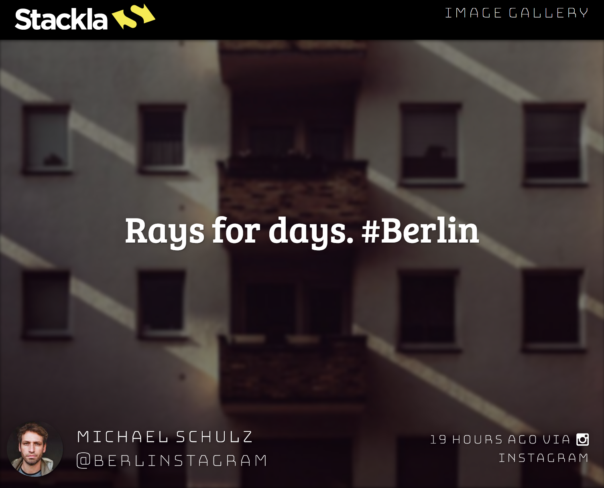](http://stacklapreview.stackla.com/eventscreen/show/2538)

### Custom Header

The default header which Nosto's UGC provides is very basic and only shows the name and the hashtag. In this example we've demonstrated a different HTML structure for the header. You can use the following code to achieve this:

```
<div class="logo">
    
</div>
<h2 class="title">Image Gallery</h2>
```

### Custom CSS

The above code will be wrapped by a

with the ID of **custom-header**. You have to apply the style to make it pretty.

```
@import url(https://fonts.googleapis.com/css?family=Bungee+Inline|Bungee+Hairline|Bree+Serif);

body {
    font-family: 'Bree Serif', serif;
}

/* Custom Header */
#custom-header {
    box-sizing: border-box;
    height: 100px;
    padding: 10px 40px;
    &:after {
        clear: both;
        content: '';
        display: block;
    }
    .logo {
        float: left;
    }
    .title {
        float: right;
        font-family: 'Bungee Hairline', cursive;
        font-size: 42px;
    }
}

/* Content */
#content {
    top: 100px !important; /* Fix for the custom header */
}

/* User Info */
.tile-user, .tile-source {
    font-family: 'Bungee Hairline', cursive;
}
```

[Back to Top](customizing-carousel-eventscreen.md#top)
