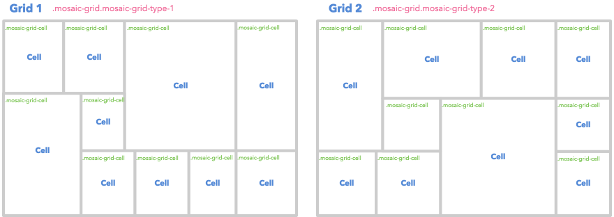
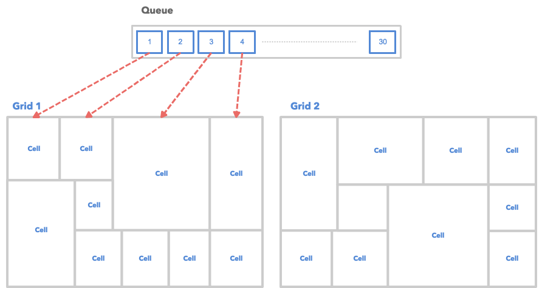
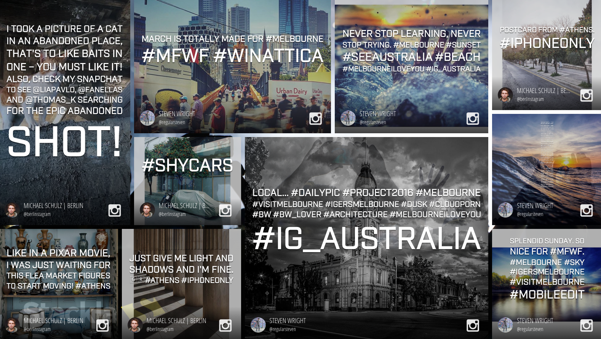

# Customizing Mosaic Event Screen

* [Overview](customizing-mosaic-eventscreen.md#overview)
* [How It Works](customizing-mosaic-eventscreen.md#how-it-works)
  * [Queue](customizing-mosaic-eventscreen.md#queue)
  * [Grids](customizing-mosaic-eventscreen.md#grids)
  * [Queue and Grids](customizing-mosaic-eventscreen.md#queue-and-grids)
* [Customizing CSS](customizing-mosaic-eventscreen.md#customizing-css)
  * [Grid Layout](customizing-mosaic-eventscreen.md#grid-layout)
  * [Transition Animation](customizing-mosaic-eventscreen.md#transition-animation)
  * [Tile Structure](customizing-mosaic-eventscreen.md#tile-structure)
* [Customizing JavaScript](customizing-mosaic-eventscreen.md#customizing-js)
  * [Available Libraries](customizing-mosaic-eventscreen.md#available-libraries)
* [Sample](customizing-mosaic-eventscreen.md#sample)

## How It Works

This section demonstrates how the Mosaic Event Screen works. It should help to provide some clarity when troubleshooting specific tile display or missing issues.

### Queue

The queue is where our system holds tiles that will be displayed on the event screen. It's invisible and operates in the background.

.png>)

* By default the queue has a capacity of 30 tiles. You can change the capacity by using Custom Javascript. A smaller queue causes a higher frequency of seeing the same tiles.
* Whenever a new tile is received, the oldest tile will be removed from the queue.
* If you use a high velocity term for your filter in the Event Screen, it's possible that all of the current tiles could be replaced with new ones after each queue check.
* You can change the queue capacity by updating the **Amount of Tiles in Loop** option in **Display Options**.\
  .png>)

[Back to Top](customizing-mosaic-eventscreen.md#top)

### Grids

Currently we have 2 different layouts. Each layout has 10 tiles.



The 2 grids take turns to display for 10 second each by default.

[Back to Top](customizing-mosaic-eventscreen.md#top)

### Queue and Grids

The tiles in queue will be cloned one by one to fill out all of the cells in each grid.



As illustrated, we have 30 tiles in the queue but only have 20 cell spaces. The left 10 tiles will be used in the next round. It's possible that user doesn't see these tiles if it is a high velocity event which causes tiles in queue being replaced very soon.

[Back to Top](customizing-mosaic-eventscreen.md#top)

## Customizing CSS

### Grid Layout

The Grid Layout is actually hard-coded, which makes it a little more difficult to customize. Each cell has a very specific position and dimension that should be considered.


|

```
/* Grid 1 /
.mosaic-grid-type-1 {
.mosaic-grid-cell-1 {
bottom: 0;
left: 0;
width: 26.75%;
height: 62.6%;
}
.mosaic-grid-cell-2 {
right: 0%;
top: 0;
width: 20.83%;
height: 66.69%;
}
.mosaic-grid-cell-3 {
right: 18.3125%;
bottom: 0%;
width: 18.3125%;
height: 33.31%;
}
.mosaic-grid-cell-4 {
top: 0%;
left: 20.83%;
width: 20.83%;
height: 37.4%;
}
.mosaic-grid-cell-5 {
left: 26.75%;
top: 37.4%;
width: 14.91%;
height: 29.29%;
}
.mosaic-grid-cell-6 {
left: 26.75%;
bottom: 0%;
width: 18.3125%;
height: 33.31%;
}
.mosaic-grid-cell-7 {
left: 41.66%;
top: 0;
width: 37.51%;
height: 66.69%;
}
.mosaic-grid-cell-8 {
left: 45.0625%;
bottom: 0;
width: 18.3125%;
height: 33.31%;
}
.mosaic-grid-cell-9 {
left: 0%;
top: 0;
width: 20.83%;
height: 37.4%;
}
.mosaic-grid-cell-10 {
right: 0;
bottom: 0;
width: 18.3125%;
height: 33.31%;
}
}
```

_|_

```
/ Grid 2 */
.mosaic-grid-type-2 {
.mosaic-grid-cell-1 {
top: 0;
left: 0;
width: 22.25%;
height: 66.666667%;
}
.mosaic-grid-cell-2 {
left: 40.5%;
bottom: 0;
width: 40.75%;
height: 60%;
}
.mosaic-grid-cell-3 {
left: 0%;
bottom: 0;
width: 20.25%;
height: 33.34%;
}
.mosaic-grid-cell-4 {
right: 0;
top: 33.33333%;
width: 18.75%;
height: 33.34%;
}
.mosaic-grid-cell-5 {
left: 22.25%;
top: 40%;
width: 18.25%;
height: 26.67%;
}
.mosaic-grid-cell-6 {
left: 20.25%;
bottom: 0%;
width: 20.25%;
height: 33.33%;
}
.mosaic-grid-cell-7 {
left: 55.35%;
top: 0;
width: 25.9%;
height: 40%;
}
.mosaic-grid-cell-8 {
right: 0;
top: 0;
width: 18.75%;
height: 33.33%;
}
.mosaic-grid-cell-9 {
top: 0%;
left: 22.25%;
width: 33.1%;
height: 40%;
}
.mosaic-grid-cell-10 {
right: 0;
bottom: 0;
width: 18.75%;
height: 33.33%;
}
}
```

\| | ------------------------------------------------------------------------------------------------------------------------------------------------------------------------------------------------------------------------------------------------------------------------------------------------------------------------------------------------------------------------------------------------------------------------------------------------------------------------------------------------------------------------------------------------------------------------------------------------------------------------------------------------------------------------------------------------------------------------------------------------------------------------------------------------------------------------------------------------------------------------------------------------------------------------------------------------------------------------------------------------------------------------------------------------------------------------------------------------------------------------------------------------------------------------------------------------------------------------------------------------------------------------------------------------ | --------------------------------------------------------------------------------------------------------------------------------------------------------------------------------------------------------------------------------------------------------------------------------------------------------------------------------------------------------------------------------------------------------------------------------------------------------------------------------------------------------------------------------------------------------------------------------------------------------------------------------------------------------------------------------------------------------------------------------------------------------------------------------------------------------------------------------------------------------------------------------------------------------------------------------------------------------------------------------------------------------------------------------------------------------------------------------------------------------------------------------------------------------------------------------------------------------------------------------------------------------------------------- |

To have your own customized grid layout, you can clone and modify the above code by pasting it into our Custom CSS Code Editor

[Back to Top](customizing-mosaic-eventscreen.md#top)

### Transition Animation

You can make use of the following CSS class names to have different transition animation.

* `mosaic-grid`: A grid always has this class name.
* `mosaic-grid-active`: The current showing grid.
* `mosaic-grid-switch`: The intermediate class before the current grid changes to active.

The following is our default CSS for transition animation. We make use of the `scale` method in CSS3 2D Transform.

```
.mosaic-grid {
    visibility: hidden; // All grids are hidden by default
}
.mosaic-grid-switch,
.mosaic-grid-active { // 2 states just for tile animation
    visibility: visible;
}
.mosaic-grid-cell > div { // Centerise tile with 0x0 in size
    height: 100%;
    left: 0;
    overflow: hidden;
    position: absolute;
    top: 0;
    transform: scale(0);
    transition: transform 0.5s;
    width: 100%;
}
.mosaic-grid-active .mosaic-grid-cell > div { // Animatin applies
    transform: scale(1);
}
```

[Back to Top](customizing-mosaic-eventscreen.md#top)

### Tile Structure

The Mosaic Event Screenis mostly composed by tiles - as such it is much easier to customize the Mosaic Event Screen when you feel familiar with it's structure.

| <p><strong>Diagram</strong></p><p></p> | <p><strong>Sample</strong></p><p></p> |
| ------------------------------------------------------------------------------------------------------------------------------------------ | ------------------------------------------------------------------------------------------------------------------------------- |

### Code

The diagram above only shows until the 4th level. Check the complete Tile structure by referencing the following code.

```
<div class="tile">
    <div class="tile-content">
        <div class="tile-user-info">
            <div class="tile-avatar">
                
            </div>
            <div class="tile-user">
                <div class="tile-user-top">
                    <span class="tile-user-name">...</span>
                </div>
                <div class="tile-user-bottom">
                    <span class="tile-user-handle">...</span>
                </div>
            </div>
        </div>
        <div class="tile-caption">
            <p>...</p>
        </div>
        <div class="tile-source">
            <div class="tile-source-icon social-source "></div>
            ...
        </div>
    </div>
    <div class="tile-image-wrapper">
        <div class="tile-image"></div>
    </div>
</div>
```

[Back to Top](customizing-mosaic-eventscreen.md#top)

## Customizing JavaScript

If you're looking to customize the Mosaic Event Screen using our Javascript API - you can find the documentation [here](broken-reference).

### Available Libraries

The Mosaic Event Screen currently has the following JavaScript libraries installed.

* **jQuery**: You can access it by using `$` global variable. The current version is **2.1.4**.
* **lodash**: You can access it by using `_` global variable. The current version is **3.10.1**.
* **Mustache.js**: You can access it by using `Mustache` global variable. The current version is **0.8.1**.
* **slabText**: You can access it as a jQuery Plugin (`$.fn.slabText`). The current version is **2.3**.
* **imagesLoaded**: You can use it as a jQuery Plugin (`$.fn.imagesLoaded`). The current version is **3.1.4**.
* **dotdotdot**: You can access it as a jQuery Plugin (`$.fn.dotdotdot`). The current version is **1.6.7**.

[Back to Top](customizing-mosaic-eventscreen.md#top)

## Sample

The following is an example of the customized Mosaic Event Screen. Click the following image to see the Event in your browser.

[](http://stacklapreview.stackla.com/eventscreen/show/2014)

### Custom CSS

We want to add a background image and change the transition animation by the Custom CSS.

```
body {
    background: url(https://stackla-ui-kit.s3.amazonaws.com/bg_concert.jpg) center center no-repeat;
    background-size: cover;
}
//============
// Layout
//============
.mosaic-grid-cell {
    border: 5px solid transparent;
}
//============
// Transition
//============
.mosaic-grid-cell > div {
    opacity: 0;
    transition: transform 2s,
                opacity 1.5s;
}
.mosaic-grid-active .mosaic-grid-cell > div { // Animation applies
    opacity: 1;
    transform: scale(1);
}
//============
// Tile
//============
.tile-image {
    opacity: 0.8;
}
.tile-caption {
    text-shadow: 1px 1px 5px rgba(0, 0, 0, 0.8);
}
.tile-user {
    font-family: 'Open Sans Condensed', sans-serif;
}
.tile-caption {
    font-family: 'industry', sans-serif;
}
```

### Custom JavaScript

We want to change the queue capacity to 10. However, the option is not available in the **Amount of Tiles in Loop** of Display Options. We can use JavaScript to achieve that.

Another goal is use both the Google Web Font and Typekit. It's easy to achieve with the Web Font Loader library.

```
window.StacklaEventscreens.options = {
    debug: true, // Enable debug mode
    queue_length: 10 // Change the queue from 30 to 10 which is not available in Display Options
};

//============
// Web Font
//============
WebFontConfig = {
    google: {
        families: [
            'Open+Sans+Condensed:300:latin'
        ]
    },
    typekit: {
        id: 'pjj3gpq'
    },
    active: function() {
        sessionStorage.font = true;
    }
};
(function() {
    var wf = document.createElement('script');
    wf.src = 'https://ajax.googleapis.com/ajax/libs/webfont/1/webfont.js';
    wf.type = 'text/javascript';
    wf.async = 'true';
    var s = document.getElementsByTagName('script')[0];
    s.parentNode.insertBefore(wf, s);
})();
```

[Back to Top](customizing-mosaic-eventscreen.md#top)
