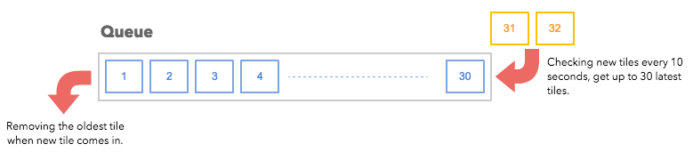
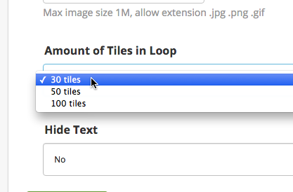
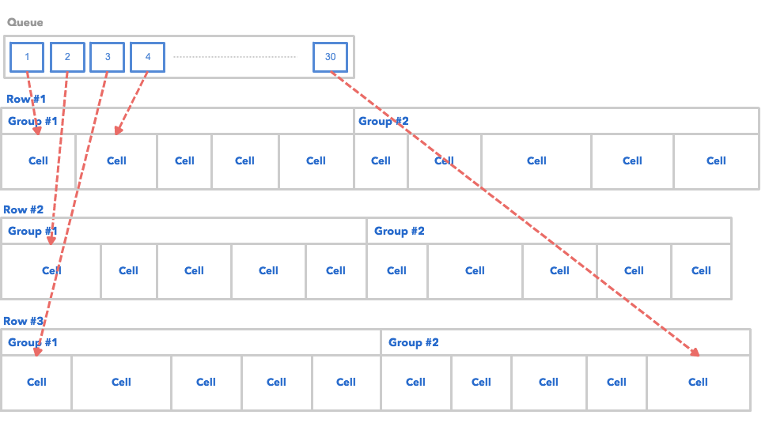
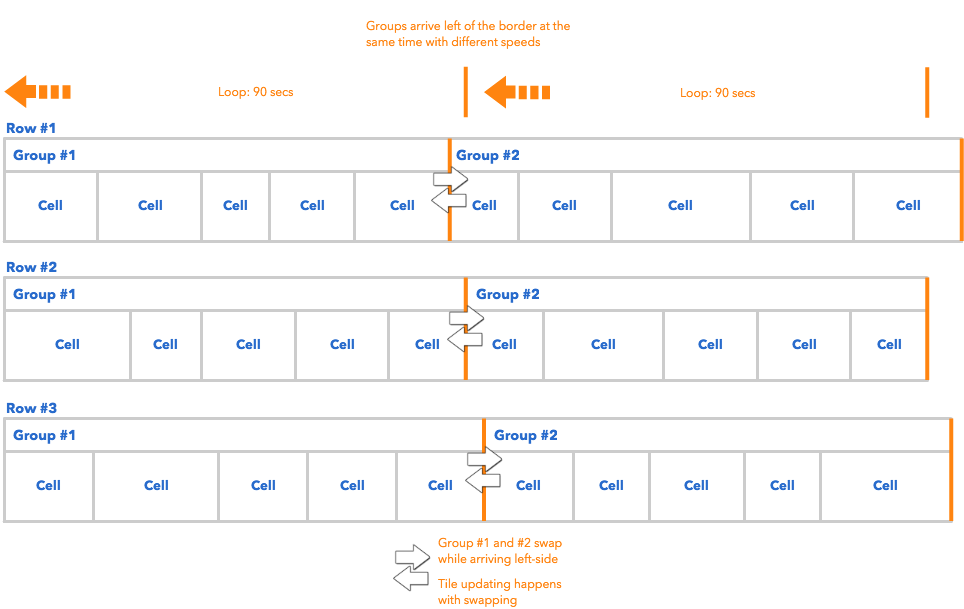
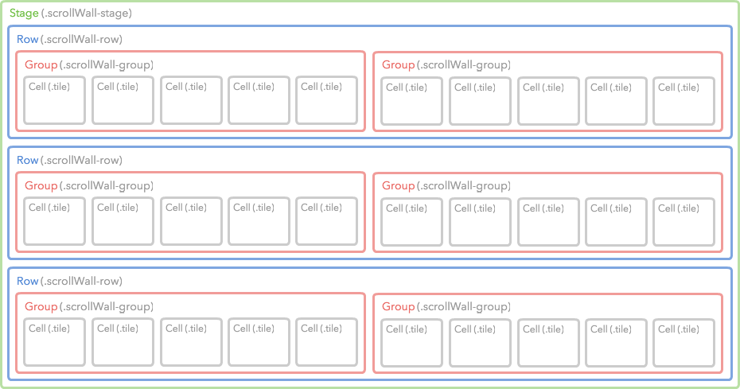
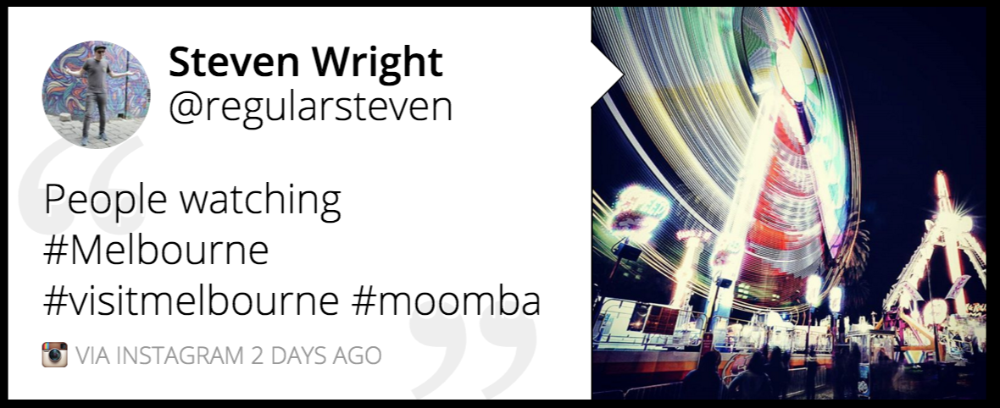
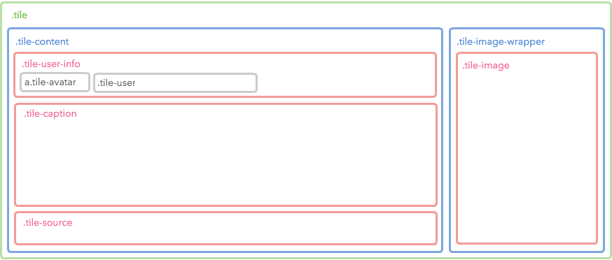
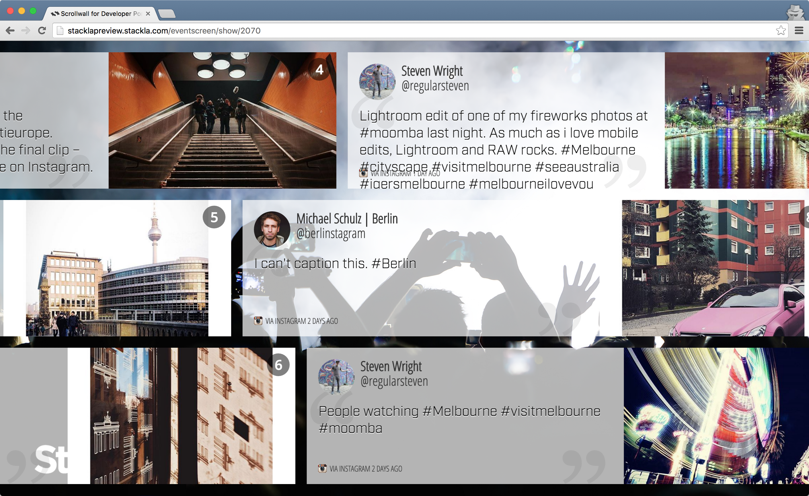

# Customizing Scrollwall Event Screen

* [Overview](customizing-scrollwall-eventscreen.md#overview)
* [How It Works](customizing-scrollwall-eventscreen.md#how-it-works)
  * [Queue](customizing-scrollwall-eventscreen.md#queue)
  * [Queue and Grids](customizing-scrollwall-eventscreen.md#queue-and-grids)
  * [Animation](customizing-scrollwall-eventscreen.md#animation)
* [Customizing the CSS](customizing-scrollwall-eventscreen.md#customizing-css)
  * [Layout](customizing-scrollwall-eventscreen.md#grid-layout)
  * [Animation](customizing-scrollwall-eventscreen.md#animation-css)
  * [Tile Structure](customizing-scrollwall-eventscreen.md#tile-structure)
* [Customizing the JavaScript](customizing-scrollwall-eventscreen.md#customizing-js)
  * [Available Libraries](customizing-scrollwall-eventscreen.md#available-libraries)
* [Sample](customizing-scrollwall-eventscreen.md#sample)

## Overview

This article will demonstrate to you how our Scrollwall Event Screens work and how you can customize them.

## How It Works

This section will demonstrate how the Scrollwall Event Screen works. It may help you understand how issues around specific tile displays or missing tiles could arise.

### Queue

The queue is where our system holds tiles that will be displayed on the event screen. It's invisible and operates in the background.



* By default, the queue has a capacity of 30 tiles. You can change the capacity by using either the **Custom JavaScript** or the **Amount of Tiles in Loop** option in the **Display Options**.\
  
  * A smaller queue causes a higher frequency of seeing the same tiles.
* Whenever a new tile is received, the oldest tile will be removed from the queue.
* If you use a high-velocity term for your filter in the Event Screen, it's possible that all of the current tiles could be replaced with new ones after each queue check.

[Back to Top](customizing-scrollwall-eventscreen.md#top)

### Queue and Grids

The tiles in the queue will be cloned one by one to fill out all of the cells in different rows.



You might be wondering why we need to create 2 groups in one row. That's all because of the scrolling animation. We will explain this in the following section.

[Back to Top](customizing-scrollwall-eventscreen.md#top)

### Animation

The following diagram illustrates how the Scrollwall animates.



* Each **tile** could have **different width** according to its content.
* Each **row** could have **different width** according to the total width of its belonging tiles.
* Each **row** is animated by the CSS Transform, which **loops to move it to -50% of the x-axis in 90 seconds**.
* Each **loop** must arrive the destination at the **same time**. Thus, **the different width of rows** results in the **different speed**.
* When a loop finishes, we will **swap the position of the 2 groups** and also **replace the new tiles** into the **previous showing group**.
  * The 2 groups swapping technique is required for showing an endless row.
  * It's difficult to replace new tiles anytime they arrive since it might affect the row width and cause a **jumpy animation**.
  * To avoid the above issue, we create **2 groups for swapping**. When the former group arrives the destination (x:-50%), it can be swapped and updated without the issue because it has been **invisible from the viewport**. All you can see right now is the later group.
  * At the swapping point, the later group won't be updated with new tiles since it's visible. Any visible content replacement will appear strange on the screen for the user. Thus, **only the invisible group will be updated**.
* Assuming that 30 new tiles arrive and are placed in the queue during the 1st and 2nd loops (The first 180 seconds). You can view the 15 new tiles from the 3rd loop.
  * Will you see another 15 new tiles in the 4th loop? Well, it depends on how many new tiles are being received during the 3rd loop.
* Note that there are **no new tiles being replaced in the first 180 seconds**. However, you can see the new tiles **every other 90 seconds from then on**.

[Back to Top](customizing-scrollwall-eventscreen.md#top)

## Customizing CSS

### Layout

Each layout class name has a **scrollWall-** prefix. (We use the [SUIT CSS](https://github.com/suitcss/suit/blob/master/doc/naming-conventions.md) naming convention for the Scrollwall Event Screen implementation.)



[Back to Top](customizing-scrollwall-eventscreen.md#top)

### Animation CSS

The following code snippet is our default animation CSS.

```
@keyframes scroll {
    0% {
        transform: translate3d(0, 0, 0);
    }
    100% {
        transform: translate3d(-50%, 0, 0);
    }
}
// Animation
.scrollWall-row {
    animation-name: none;
}
.scrollWall-row.is-animating {
    animation-name: scroll;
    animation-duration: 90s; // Will be overwritten by JS
    animation-iteration-count: infinite;
    animation-timing-function: linear;
}
```

You can define your own animation by Custom CSS. Note that the `animation-duration` will be overwritten by the JavaScript.

[Back to Top](customizing-scrollwall-eventscreen.md#top)

### Tile Structure

The Scrollwall Event Screens are mostly composed of tiles - as such it is much easier to customize the Scrollwall Event Screen when you feel familiar with its structure.

| <p><strong>Sample</strong></p><p></p>        |
| -------------------------------------------------------------------------------------------------------------------------------------- |
| <p><strong>Diagram</strong></p><p></p> |

### Code

The diagram above only shows until the 4th level. Check the complete Tile structure by referencing the following code.

```
<div class="tile">
    <div class="tile-content">
        <div class="tile-user-info clearfix">
            <div class="tile-avatar">
                
            </div>
            <div class="tile-user">
                <div class="tile-user-top">
                    <span class="tile-user-name"></span>
                </div>
                <div class="tile-user-bottom">
                    <span class="tile-user-handle"></span>
                </div>
            </div>
        </div>
        <div class="tile-caption">
            <p></p>
        </div>
        <div class="tile-source">
            <div class="tile-source-icon social-source instagram"></div>
            <span>
                <span class="tile-timestamp"></span>
           </span>
        </div>
    </div>
    <div class="tile-image-wrapper">
        <div class="tile-image" style="background-image: url(...)"></div>
    </div>
</div>
```

[Back to Top](customizing-scrollwall-eventscreen.md#top)

## Customizing the JavaScript

If you're looking to customize the Scrollwall Event Screen using our Javascript API - you can find the documentation [here](broken-reference).

### Available Libraries

The Scrollwall Event Screen currently has the following JavaScript libraries installed.

* **jQuery**: You can access it by using the `$` global variable. The current version is **2.1.4**.
* **lodash**: You can access it by using the `_` global variable. The current version is **3.10.1**.
* **Mustache.js**: You can access it by using the `Mustache` global variable. The current version is **0.8.1**.
* **dotdotdot**: You can access it as a jQuery Plugin (`$.fn.dotdotdot`). The current version is **1.6.7**.

[Back to Top](customizing-scrollwall-eventscreen.md#top)

## Sample

The following is an example of the customized Scrollwall Event Screen. Click the following image to see the Event in your browser.

[](http://stacklapreview.stackla.com/eventscreen/show/2070)

### Custom CSS

We want to add a background image and change the transition animation using Custom CSS.

```
body {
    background: #000 url(https://stackla-ui-kit.s3.amazonaws.com/bg_concert.jpg) center center no-repeat;
    background-size: cover;
}

//============
// Layout
//============
.scrollWall-group.is-debug:first-child {
    background: transparent;
}

//============
// Tile
//============
.tile {
    background-color: rgba(255, 255, 255, 0.7);
    &-image-wrapper,
    &-video-wrapper {
        &:before, &:after {
            border: none;
            display: none;
        }
    }
    &-image {
        border-left: none;
        opacity: 1 !important;
        min-width: 400px;
    }
    &-serial-number {
        background: rgba(0, 0, 0, 0.5);
        border-radius: 50%;
        width: 40px;
    }
    &-caption p {
        font-family: 'industry', sans-serif;
        text-shadow: 0 1px 0 rgba(255, 255, 255, 1);
    }
    &-source,
    &-user {
        color: #333;
        font-family: 'Open Sans Condensed', sans-serif;
    }
}
```

### Custom JavaScript

We want to change the queue capacity to 10. However, the option is not available in the **Amount of Tiles in Loop** of Display Options. We can use JavaScript to achieve that.

Another goal is to use both the Google Web Font and Typekit. It's easy to achieve with the Web Font Loader library.

```
window.StacklaEventscreens.options = {
    debug: true, // Enable debug mode
    queue_length: 10 // Change the queue from 30 to 10 which is not available in Display Options
};

//============
// Web Font
//============
WebFontConfig = {
    google: {
        families: [
            'Open+Sans+Condensed:300:latin'
        ]
    },
    typekit: {
        id: 'pjj3gpq'
    },
    active: function() {
        sessionStorage.font = true;
    }
};
(function() {
    var wf = document.createElement('script');
    wf.src = 'https://ajax.googleapis.com/ajax/libs/webfont/1/webfont.js';
    wf.type = 'text/javascript';
    wf.async = 'true';
    var s = document.getElementsByTagName('script')[0];
    s.parentNode.insertBefore(wf, s);
})();
```

[Back to Top](customizing-scrollwall-eventscreen.md#top)
