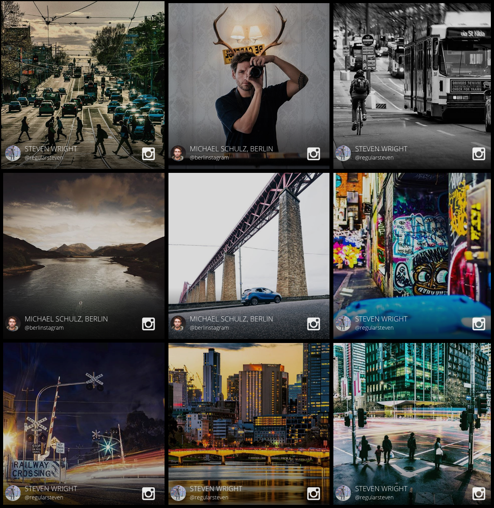
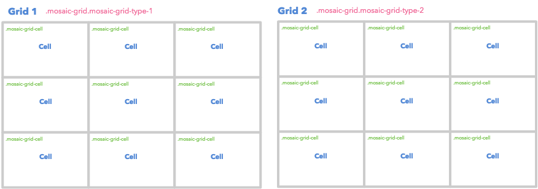

# Customizing the Mosaic Event Screen to Have 9 Even Tiles

* [Previously](customizing-the-mosaic-eventscreen-to-have-9-even-tiles-layout.md#previously)
* [Overview](customizing-the-mosaic-eventscreen-to-have-9-even-tiles-layout.md#overview)
* [How - Changing the Grid Layout](customizing-the-mosaic-eventscreen-to-have-9-even-tiles-layout.md#how)
  * [Previous Layout](customizing-the-mosaic-eventscreen-to-have-9-even-tiles-layout.md#prev-layout)
  * [New Layout](customizing-the-mosaic-eventscreen-to-have-9-even-tiles-layout.md#new-layout)
  * [Limitation](customizing-the-mosaic-eventscreen-to-have-9-even-tiles-layout.md#limitation)
* [Code](customizing-the-mosaic-eventscreen-to-have-9-even-tiles-layout.md#code)
  * [Basic Style](customizing-the-mosaic-eventscreen-to-have-9-even-tiles-layout.md#basic-style)
  * [Gap Style](customizing-the-mosaic-eventscreen-to-have-9-even-tiles-layout.md#gap-style)
* [Demo](customizing-the-mosaic-eventscreen-to-have-9-even-tiles-layout.md#demo)

## Previously

This is an extended guide for the [Customizing the Mosaic Event Screen](https://github.com/Stackla/docs/blob/master/docs/guides/customizing-the-mosaic-eventscreen/README.md) tutorial. If you are not familiar with our Mosaic Event Screens, we suggest you start there first as some of those details will come in handy.

[Back to Top](customizing-the-mosaic-eventscreen-to-have-9-even-tiles-layout.md#top)

## Overview

This section demonstrates how to create a layout of 9 even tiles for the Mosaic Event Screen. The following image is a snapshot of the result:\


[Back to Top](customizing-the-mosaic-eventscreen-to-have-9-even-tiles-layout.md#top)

## How - Changing the Grid Layout

In the previous tutorial, we mentioned the [Grid Layout](customizing-mosaic-eventscreen.md#grids), which details how an Event Screen can have a different visual effect after each transition.

[Back to Top](customizing-the-mosaic-eventscreen-to-have-9-even-tiles-layout.md#top)

### Previous Layout

The following is the default Grid Layout.

.png>)

[Back to Top](customizing-the-mosaic-eventscreen-to-have-9-even-tiles-layout.md#top)

### New Layout

To update the Grid Layout structure, we need to update the stylesheet. As you can see, all the cells should have 33.33% for both width and height.



[Back to Top](customizing-the-mosaic-eventscreen-to-have-9-even-tiles-layout.md#top)

### Limitation

Previously there are 10 cells. However, in the new layout, you can only have 9. The only way to achieve this is by hiding the 10th tile with `display: none;`. That's probably not so good if you want to display all tiles.

[Back to Top](customizing-the-mosaic-eventscreen-to-have-9-even-tiles-layout.md#top)

## Code

Let's implement the new layout!

### Basic Style

You need to overwrite the stylesheet for both the **cell dimension** and the **cell position**. Place the following stylesheet into your Custom CSS editor to display the new layout.

```
/* Width & Height */
.mosaic-grid-type-1,
.mosaic-grid-type-2 {
    .mosaic-grid-cell-1,
    .mosaic-grid-cell-2,
    .mosaic-grid-cell-3,
    .mosaic-grid-cell-4,
    .mosaic-grid-cell-5,
    .mosaic-grid-cell-6,
    .mosaic-grid-cell-7,
    .mosaic-grid-cell-8,
    .mosaic-grid-cell-9 {
        width: 33.33%;
        height: 33.33%;
    }
    .mosaic-grid-cell-2,
    .mosaic-grid-cell-5,
    .mosaic-grid-cell-8 {
        width: 33.34%;
        height: 33.33%;
    }
    .mosaic-grid-cell-4,
    .mosaic-grid-cell-5,
    .mosaic-grid-cell-6 {
        height: 33.34%;
    }
    .mosaic-grid-cell-10 {
        display: none;
    }
}
/* Position */
.mosaic-grid-type-1,
.mosaic-grid-type-2 {
    .mosaic-grid-cell-1 {
        top: 0;
        left: 0;
        right: auto;
    }
    .mosaic-grid-cell-2 {
        top: 0;
        left: 33.33%;
        right: auto;
    }
    .mosaic-grid-cell-3 {
        top: 0;
        left: auto;
        right: 0;
    }
    .mosaic-grid-cell-4 {
        top: 33.33%;
        left: 0;
    }
    .mosaic-grid-cell-5 {
        top: 33.33%;
        left: 33.33%;
        right: auto;
    }
    .mosaic-grid-cell-6 {
        top: 33.33%;
        left: auto;
        right: 0;
    }
    .mosaic-grid-cell-7 {
        top: 66.64%;
        left: 0;
        right: auto;
    }
    .mosaic-grid-cell-8 {
        top: 66.67%;
        left: 33.33%;
        right: auto;
    }
    .mosaic-grid-cell-9 {
        top: 66.67%;
        right: 0;
        left: auto;
    }
}
```

[Back to Top](customizing-the-mosaic-eventscreen-to-have-9-even-tiles-layout.md#top)

### Gap Style

To create gaps between tiles you can use the following CSS example.

```
@gap: 10px;
.tile {
    background: #000;
    // Gap Setting
    &-content {
        background: #333;
        box-sizing: content-box;
        margin: @gap 0 0 @gap;
        .mosaic-grid-cell-3 &,
        .mosaic-grid-cell-6 &,
        .mosaic-grid-cell-9 & {
            margin-right: @gap;
        }
        .mosaic-grid-cell-7 &,
        .mosaic-grid-cell-8 &,
        .mosaic-grid-cell-9 & {
            margin-bottom: @gap;
        }
    }
}
```

[Back to Top](customizing-the-mosaic-eventscreen-to-have-9-even-tiles-layout.md#top)

## Demo

Click the following image to see the Event in your browser.

[](https://stacklapreview.stackla.com/eventscreen/show/2724)

[Back to Top](customizing-the-mosaic-eventscreen-to-have-9-even-tiles-layout.md#top)
