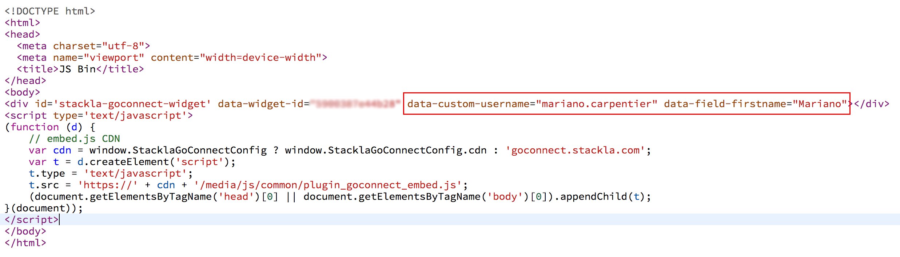
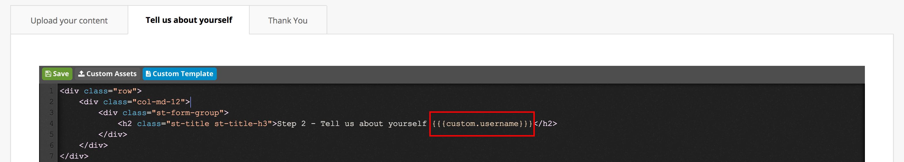
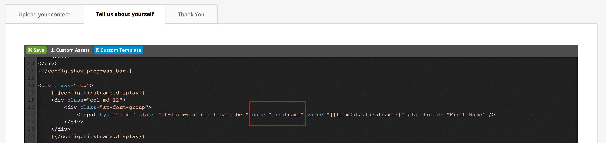
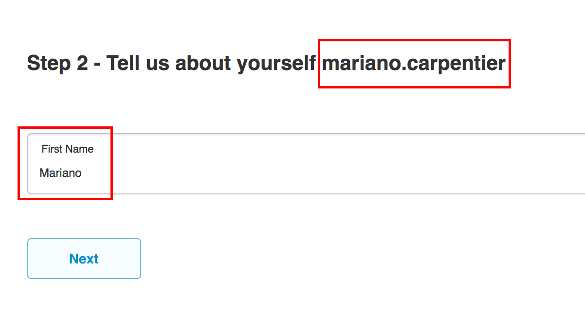
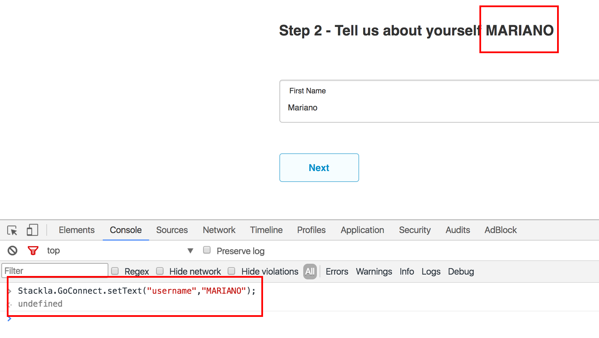
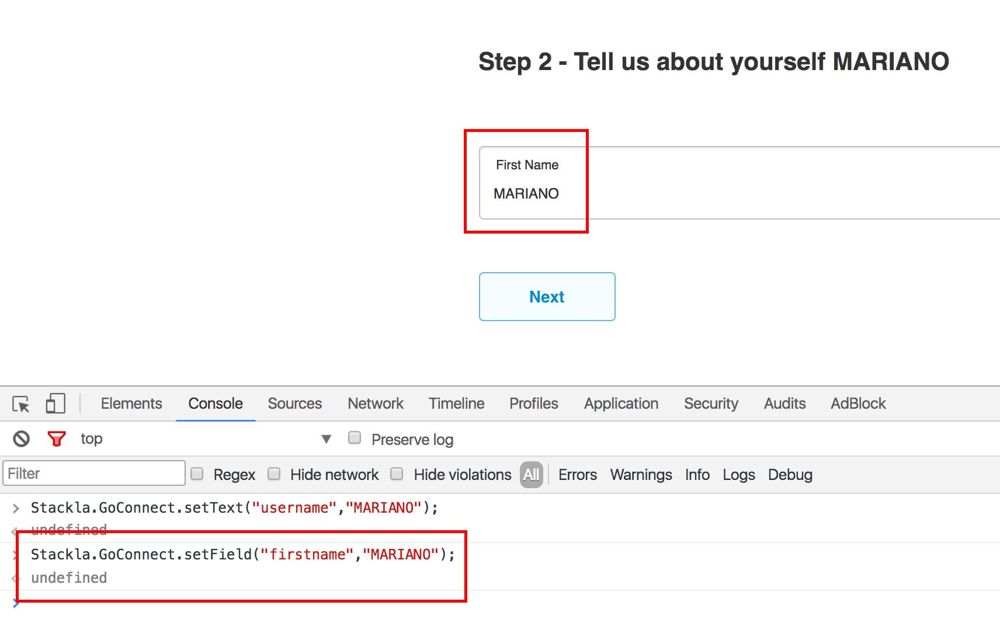
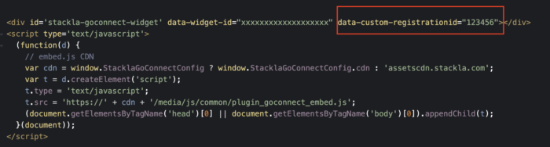
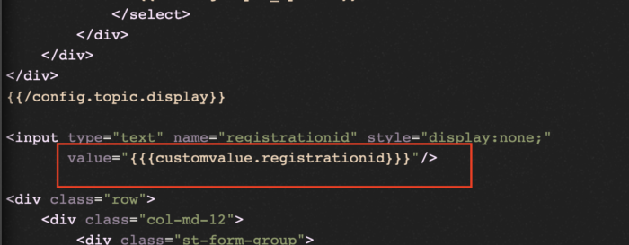
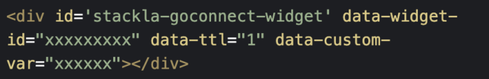
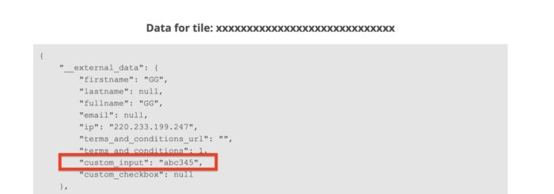

# How to add Custom Data to Direct Uploader

* [Overview](custom-data-to-goconnect.md#overview)
* [Available options](custom-data-to-goconnect.md#steps)

## Overview

Out of the box, Nosto's UGC Direct Uploader form offers a great solution for clients who wish to collect media (Image / Video) submissions, whilst also collecting key pieces of data (ie. Name, Email Address). This works great when the contributor is unknown prior to them contributing or when you want to force the user to re-provide this information.

Sometimes however you may already have information about this user, and rather than requiring them to populate these field, you wish to pass information from the parent page directly into this GoConnect form.

This guide outlines the two approaches which can be taken to achieve this. The first is to provide the passed data into the GoConnect embed code. This works well when this information is known at the point of load, however it does limit us if we wish to update this information on the fly. This is where the second approach can overcome this, leveraging Nosto's UGC Javascript API to pass in these values on an as needs basis.

[Back to Top](custom-data-to-goconnect.md#top)

## Available options

### Approach 1: Append custom data to the Embed Code

1. There are two places within the GoConnect form where custom data can be appended. The first is as plain text which is rendered in any part of the GoConnect HTML, the second is as a pre-populated value within one of the fields. As such, to help the form know where this data should live, Nosto's UGC has two custom data prefix types which need to be included in order for the GoConnect form to know where the custom data will go.Plain text values should have the prefix "data-custom-" (ie. data-custom-username) whilst values for the fields should have the prefix "data-field-" (ie. data-field-firstname"). It is important for the field data that the unique parameter (ie. firstname) is consistent with the field names specified in your templates. Both these values should be appended to the DIV class part of the GoConnect embed code as per the screenshot below.



2. Once we have defined the custom data within the embed code the next step is to tell Nosto's UGC where to inject this data. We do this within the GoConnect templates. To find the template section, simply open the GoConnect Form you are customising, select Configure and press 'Custom Template' on the relevant tab you wish to inject these values.From here we can inject into the Template where we would like this code to render.



3. Now to render the custom plain text values, we need to enclose the custom data with three braces on either side and include the value _custom._. Parameter is the unique identifier we have defined in the embed code. For example, using are example of data-custom-username, we would want to add the following code \_{custom.username}\_As defined earlier, the custom field text defined in the embed code is the same as the parameter used in the template. Using the screenshot below, the parameter in the template is "firstname" which is consistent with the code we put in the embed code - "data-field-firstname".



4. Once we are happy with our template structure, we can now render the embed code. Using the example provided above, on the second tab of our GoConnect form, we would see something similar to the below:

### Approach 2: Append Custom Data via the Javascript API

The above approach works great if we have a scenario when we are able to predefine those custom data values for our GoConnect Widget. Where it struggles though is when we need / want to dynamically change these values. Using the first approach, we would have to refresh the entire GoConnect form, however that is a less than desirable user experience, as such, this is where Nosto's UGC Javascript API can help.

Now if we want to update the custom data text displayed in the HTML of the GoConnect form, the call we wish to use is below:

```

        Stackla.GoConnect.setText(placeholderName, newPlaceholderValue)
    
```

Taking the example we created in the first approach, we can take the above and change the data-custom-username we defined earlier from mariano.carpenter to MARIANO using the JS Console in Google Chome



Now if its the field data we want to change, the call we make is slightly different with us looking to change the FieldValue versus the PlaceholderValue.

```

Stackla.GoConnect.setField(fieldName, newFieldValue)
    
```

Again, taking the example we created in the first approach, we can take the above and change the data-field-firstname we defined earlier from Mariano to MARIANO using the JS Console in Google Chome



### Approach 3: Using Custom Data for Input Fields

If we have a scenario where we need to inject or pass values from GoConnect Widget to the form's text field or hidden field.

We can opt this approach to pass dynamic or static data to the form's text fields, or hidden fields. Using this approach, just the value gets changed and either is displayed to the user or you can create a hidden field or make an text field hidden to make sure the values never be seen to the user, this approach is pretty handy and can be used in conjunction with the above 2 approaches.

First of all, you need to inject the dynamic or static property the same way as defined in above approaches,



Secondly, to add this variable into the text field or hidden field, you can use the variable - \{{{customvalue.registrationid\}}}, as shown in the image below



This way, we can add the value to text fields

### Widget Expiration : TTL Option (optional)

* The Default expiry time of widget elements is 60 seconds, and in most of the cases you do not need to adjust the TTL,
* There are some specific scenarios where you must specify the TTL option,

**TTL Scenario**

* If you are passing a dynamic custom variable as suggested in Approach 1st & 3rd, then you can use TTL option, as shown in the image below



* `data-ttl` option is in seconds and this is optional and if not provided will default to 60 seconds

### Widget Custom Uploaded Data

* The data punched-in will gets to the Curate -> Content section, and can be seen by clicking three dots - ... -> Tile Details -> Data as shown in image
* custom\_input holds the data passed via the custom variable using Approach 1 & 3



[Back to Top](custom-data-to-goconnect.md#top)
