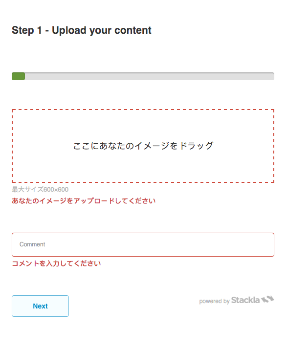

# How to Customize error messages on Direct Uploader

## Overview

When submitting data to the GoConnect widget, all the error messages returned from the server can be customized. This is achieved by defining a mapping object **window.Stackla.GoConnectCustomMessages**, and add it to the **Custom Javascript** Tab on the GoConnect widget configuration page.

The following code provides a mapping between the server response messages and your customized messages. paste below javascript code on your Custom Javascript Tab.

```
`window.Stackla.GoConnectCustomMessages = {
fileUpload: {
    prompt: 'ここにあなたのイメージをドラッグ',
    tip: '最大サイズ600×600',
    uploading: '上傳',
    uploaded: '完成上傳',
    cancel_upload: '取消上傳',
    remove_file: '刪除文件'
},
responseMessages: {
    video: {
        not_empty: '視頻不能為空',
        length_too_long: '視頻長度過長',
        size_too_small: '視頻大小太小',
        size_too_large: '視頻大小過大',
        invalid_extension: '視頻擴展名無效',
        invalid_mime_type: '視頻mime類型不支持',
        upload_incomplete: '上傳不完整',
        transcoder_rejected: '代碼轉換器拒絕'
    },
    image: {
        please_wait: 'お待ちください',
        not_empty: 'あなたのイメージをアップロードしてください',
        wait_a_short_time: '短い時間を待ちます',
        success: '成功',
        invalid_image_file: '無効なイメージファイル',
        invalid_image_type: '無効なイメージタイプ',
        exceed_max_size: '最大サイズを超えます',
        exceed_max_dimension: '最大サイズを超えました',
        below_min_dimension: '分寸法以下',
        error_process_image: 'エラー処理イメージ'
    },
    comment: {
        not_empty: 'コメントを入力してください',
        max_length: '最大の長さ',
        html_not_allow: '許可しないHTML'
    },
    firstname: {
        not_empty: 'コメントを入力してください',
        max_length: '最大の長さ',
        html_not_allow: '許可しないHTML'
    },
    lastname: {
        not_empty: 'コメントを入力してください',
        max_length: '最大の長さ',
        html_not_allow: '許可しないHTML'
    },

    email: {
        not_empty: 'コメントを入力してください',
        max_length: '最大の長さ',
        html_not_allow: '許可しないHTML',
        invalid_email: '無効なEメール'
    },
    terms_and_conditions: {
        not_empty: 'コメントを入力してください'
    }
}
```

};\`

As this mapping object is saved, the error messages on your GoConnect widget will be shown as you customized it:\
(**note:** If particular message is not supplied by this mapping object, GoConnect widget will use the default message from the server instead)


