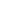

# Adding Location to an Email Tile

* [Overview](adding-location-email-tile.md#overview)
* [Getting Started](adding-location-email-tile.md#getting-started)
* [Google Maps](adding-location-email-tile.md#google)

## Overview

This article will instruct how to add a map visual to the base of an Email Tile to visualize the location where a UGC Tile was created using Google Static Maps API.

To achieve this we will adjust the Tile Layout. Nosto's UGC Layout editors are built using the [Mustache](https://mustache.github.io) template framework, which is what we will be editing to add the Map visuals to the Tile.

We will not be adjusting the CSS or any other component of the Email template. For information on how to style your Email Tile, [click here](styling-the-email-plugin.md).

[Back to Top](adding-location-email-tile.md#top)

## Getting Started

Assuming that you have already created your Email Campaign and have configured your Campaign Settings and Email Tile Appearance, we can now look to add our Map visual.

For this guide, we are going to explore using Google Maps to provide the render that we will append to the base of the Tile. We have chosen OSM and Google as Map providers that offer a Static Map API.

### Google Maps

Google offers its own Static Map API, called [Maps Static API](https://developers.google.com/maps/documentation/maps-static/intro). Much like other vendors, the Maps Static API lets you embed a Google Maps image on your web page without requiring JavaScript or any dynamic page loading, however, the Map Static API requires you to generate a Google API Key before you can use it.

To find out how to generate your API Key, [click here](https://developers.google.com/maps/documentation/maps-static/get-api-key).

The structure of the Static Map API endpoint is as follows:

```
/staticmap?center={{Latitude}},{{Longitude}}&zoom={{Zoom}}&size={{Width}}x{{Height}}&maptype={{MapType}}&key={{APIKey}}
```

You can also add Markers to your output by adding the following parameters

```
&markers=color:{{Colour}}%7Clabel:{{Label}}%7C{{Latitude}},{{Longitude}}
```

Following a similar process to what we did with OSM, we will look to add the following code to the Tile Partial in our Code editor:

```
<div id="{{_id.$id}}" class="tile {{source}} {{media}}"
    style="background-color:#{{style.text_tile_background}}">
    <div class="tile-content">
        {{>tpl-image}}
        {{>tpl-profile}}
        {{>tpl-message}}
		{{#location}}
		
		{{/location}}
    </div>
</div>
```




[Back to Top](adding-location-email-tile.md#top)
