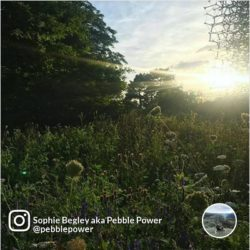
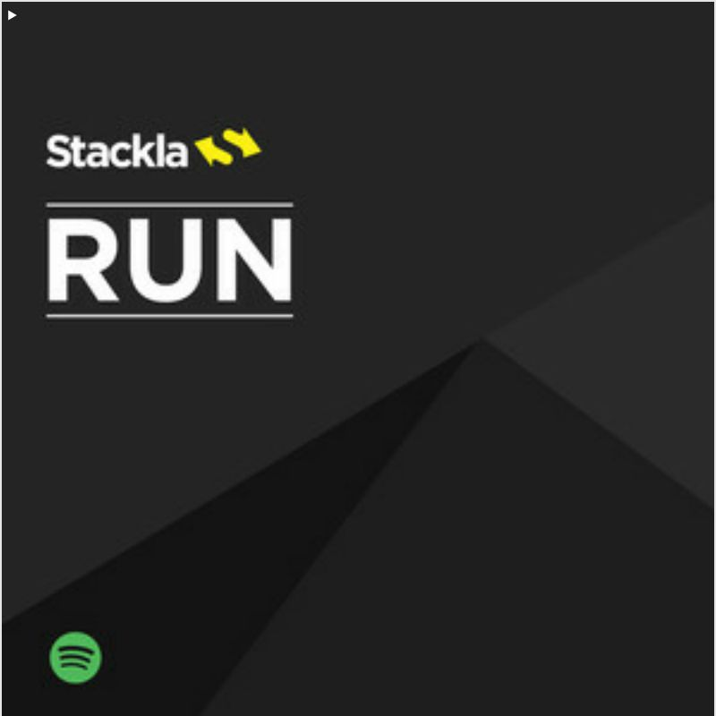

# Styling the Email Widget

* [Overview](styling-the-email-plugin.md#overview)
* [Using the Code Editor](styling-the-email-plugin.md#code-editor)
* [Getting Started](styling-the-email-plugin.md#getting-started)
* [Create the Square Tiles](styling-the-email-plugin.md#create-the-square-tiles)
* [End Result](styling-the-email-plugin.md#end-result)

## Overview

This article will instruct you on how to custom style our Email Plugin Tile Snaps using Custom CSS.

[Back to Top](styling-the-email-plugin.md#top)

## Using the Code Editor

You can use the Code Editor to modify the CSS, JavaScript and the Layout for our Tiles. For the purpose of this guide, we will be focusing on manipulating the CSS and Layout for our Tiles.

**Note:** Nosto's UGC CSS editors support the [LESS CSS pre-processor](http://lesscss.org). This means you are free to use either the traditional CSS syntax or the LESS syntax when designing your Tile Snap. Nosto's UGC Layout editors are built using the [Mustache](https://mustache.github.io) template framework.

### Template Structure

Whilst the Tiles generated from Nosto's UGC Email widget are static, the design of the Tiles are based upon our Waterfall Widget.

This means the class selectors and ID selectors used to style our Waterfall Widget are exactly the same, by default, in our Email Plugin. It also means that there a selectors referenced within the Email Plugin, which will not render within a static image (ie. Hover / Mouse-Over Effects).

The basic structure of the Tiles are as follows:

| <p><strong>Diagram</strong></p><p></p> | <p><strong>Snapshot</strong></p><p></p> |
| ------------------------------------------------------------------------------------------------------------------------------------ | ----------------------------------------------------------------------------------------------------------------------------------- |

### Fork Process:

The best place to start when it comes to manipulating your Email Tile Snap is to leverage the fork link at the top-right hand corner of each editor pane. This exposes the Mustache and CSS code from the Nosto's UGC codebase for you to edit.

This approach is different from our Nosto's UGC Widgets, with exception to the Blank Canvas, which will only present the boilerplate when your click fork within each of these panes. As such, Nosto's UGC treats the code within the Code Editor as the only code for this output. It means if you remove any reference to a Mustache partial or a CSS selector, then this will not be loaded within the Tile Snap.

.png>)

## Getting Started

### Create your Email Campaign

First step in the process is to create an Email campaign. To start, please ensure that the Email plugin has been installed on your Stack, and then go to **Display > Email** and select **New Campaign**.

From here you should be presented with the default, Waterfall inspired, Email campaign.

### Configure your Campaign’s Settings

Before you apply your imagination and innovative ideas to your Email Campaign’s Tile Snaps, it's suggested to set up it correctly.

In Email Campaign setup, we only provide very basic setting options. These include Name, Filter, Slug, Show Tags and Tile Creation under Settings, and some basic Tile Configurations under Appearance.

Arguably Selected Filter is the most important setting among them.

### Custom Code Editors

Unlike other widgets which have the CSS and JavaScript editors, the Blank Canvas widget provides the other Layout and Tile editors so that you can write code in [Mustache](https://mustache.github.io).

### Coding for Layouts:

If you are familiar with the [Mustache](https://mustache.github.io) template engine, you probably know the [Partials](https://mustache.github.io/mustache.5.html#Partials). The Partials feature just makes it easier to modulize your templates.

Nosto's UGC introduces the Mustache Partials feature. You can add, remove, or rename any templates. By default we have included the following:

* Layout
  * Tile
    * Image
    * Profile
    * Message
    * Tags

Image, Profile, Message and Tags are simply partials of the Tile template and can be rolled up into the Tile template.

### Coding for CSS

As Tile Snaps are generated as JPEG images, any CSS rules you apply won’t impact any Email campaigns or anywhere else you might add these outputs.

The CSS is simply used to help inform Nosto's UGC how the Tiles should render.

As mentioned above, to access the default CSS which is applied to a Tile Snap, simply press on the Fork button.

[Back to Top](styling-the-email-plugin.md#top)

## Creating the Square Tile

A possible use-case for clients who are using our Email Plugin to create Tile Snaps, is that they want to ensure all Snaps have a consistent Height and Width.

Naturally, as Images files aggregated by Social Networks may have varying sizes, we are going to crop our Images to be not only square, but for the Image to be centred.

Using the standard, Waterfall inspired template, we are going to show how you can achieve this quickly and easily in Nosto's UGC to render something similar to the below:



### Tile

To begin with, as we have no need for the message associated with our tiles, we are going to load up the Tile partial within the Custom Code editor and select Fork.

From here we are going to delete references to `{{>tpl-message}}`, `{{>tpl-tags}}` and `{{>tpl-actions}}` to leave us with the following Mustache markup.

```

<div id="{{_id.$id}}" class="tile {{source}} {{media}}"
    style="background-color:#{{style.text_tile_background}}">
    <div class="tile-content">
        {{>tpl-image}}
        {{>tpl-profile}}
    </div> 
</div>
```

### Image

Next we are going to manipulate the Image partial. Now for this partial, when we hit fork, you will notice references to Shopspots. As we don’t need these for this example, we are going to remove all that code.

Next we are going to make the Image for the Tile a background image so we can easily re-size, crop and position.

```

{{#image}}
    <div class="tile-image-wrapper" style="background-image:url({{image}})">
    </div>
{{/image}}
```

### CSS

Last step now is to change the CSS. Again, much like the two partials, we are going to hit fork to load the basic CSS for the Nosto's UGC output.

From here we wish to do the following, we want to assign a fixed Width and Height to our `.tile` class of 400px each.

We then want to change `.tile-source`, `.tile-user-info` and `.tile-avatar-wrapper` to be `position:absolute` and then to apply fixed positions based upon how far from the top, bottom, left and/or right we would like them to be.

We will then define our `.tile-image-wrapper` with the following:

```

.tile-image-wrapper {
    width: 400px;
    height: 400px;
    overflow: hidden;
    margin: 0px;
    position: relative;

	background-size: cover;
	background-position: center center;
}
```

And finally we remove any CSS which we feel isn’t relevant for our output. Leaving us with something like the below:

```

@import url(https://fonts.googleapis.com/css?family=Lato:400,300,100,700,900);
html, body, div, span, applet, object, iframe, h1, h2, h3, h4, h5, h6, p, blockquote, pre, a, abbr, acronym, address, big, cite, code, del, dfn, em, img, ins, kbd, q, s, samp, small, strike, strong, sub, sup, tt, var, b, u, i, center, dl, dt, dd, ol, ul, li, fieldset, form, label, legend, table, caption, tbody, tfoot, thead, tr, th, td, article, aside, canvas, details, embed, figure, figcaption, footer, header, hgroup, menu, nav, output, ruby, section, summary, time, mark, audio, video {
    margin: 0;
    padding: 0;
    border: 0;
    font-size: 100%;
    font: inherit;
    vertical-align: baseline; }

/* HTML5 display-role reset for older browsers */
article, aside, details, figcaption, figure, footer, header, hgroup, menu, nav, section {
    display: block; }

ol, ul {
    list-style: none; }

blockquote, q {
    quotes: none; }

blockquote:before, blockquote:after, q:before, q:after {
    content: '';
    content: none; }

table {
    border-collapse: collapse;
    border-spacing: 0; }

@font-face {
    font-family: 'stackla-icons';
    src: url('/media/fonts/stackla-icons/stackla-icons20140417.eot');
    src: url('/media/fonts/stackla-icons/stackla-icons20140417.eot?#iefix') format('embedded-opentype'), url('/media/fonts/stackla-icons/stackla-icons20140417.woff') format('woff'), url('/media/fonts/stackla-icons/stackla-icons20140417.ttf') format('truetype'), url('/media/fonts/stackla-icons/stackla-icons20140417.svg#stackla-icons') format('svg');
    font-weight: normal;
    font-style: normal; }

[class^="stackla-icon-"], [class*=" stackla-icon-"] {
    font-family: 'stackla-icons';
    speak: none;
    font-style: normal;
    font-weight: normal;
    font-variant: normal;
    text-transform: none;
    line-height: 1;
    /* Better Font Rendering =========== */
    -webkit-font-smoothing: antialiased;
    -moz-osx-font-smoothing: grayscale; }

body {
    color: #666;
    font-family: 'Lato', sans-serif;
    font-size: 12px;
    font-weight: 300;
    line-height: 1.0;
	color: #fff;
    margin: 0;
    padding: 0;
    width: 100%; }

a:link, a:visited {
    color: #fff;
    text-decoration: none; }

strong {
    font-weight: bold; }

.clearfix:after, .tile-sharing-expanded:after, .tile-belt:after, .tile-interactions:after {
    clear: both; }

.clearfix, .tile-sharing-expanded, .tile-belt, .tile-interactions {
    zoom: 1; }
.clearfix:after, .tile-sharing-expanded:after, .tile-belt:after, .tile-interactions:after {
    clear: both;
    content: '';
    display: block;
    overflow: hidden; }

.hidden {
    display: none; }

.isotope-item.isotope-hidden {
    pointer-events: none; }

.track {
    position: relative;
    overflow: hidden; }

.container {
    margin-top: -1px;
    margin-right: -1px;
    position: relative; }


.tile-source {
	position: absolute;
    font-size: 40px;
    line-height: 40px;
    margin-right: 8px;
	bottom: 40px;
	left: 10px;
    width: 40px;
	text-shadow: 1px 1px 3px #000000; }
.tile-source-twitter {
    color: #fff; }
.tile-source-flickr {
    color: #fff; }
.tile-source-instagram {
    color: #fff; }
.tile-source-sta_feed {
    color: #fff; }
.tile-source-gplus {
    color: #fff; }
.tile-source-rss {
    color: #fff; }
.tile-source-youtube {
    color: #fff; }
.tile-source-facebook {
    color: #fff; }

.tile-user-info {
	position: absolute;
    display: table;
	bottom: 40px;
	left: 52px;}
.tile-user-info .tile-user {
    width: 100%; }
.tile-user-info a {
    text-decoration: none; }
.tile-user-info a:link, .tile-user-info a:visited {
    color: #fff; }
.tile-user-info a:hover {
    text-decoration: underline; }
.tile-user-top, .tile-user-bottom {
    display: block;
    line-height: 1.0;
    width: 100%; }
.tile-user-name, .tile-user-handle {
    display: inline-block;
	color: #fff !important;
    font-weight: 700;
	text-shadow: 1px 1px 3px #000000;
    overflow: hidden;
    text-overflow: ellipsis;
    white-space: nowrap;
    width: 100%; }

/* Tile */
.tile {
    cursor: pointer;
    font-weight: 300;
    position: relative;
	height: 400px !important;
	width: 400px !important;
    -webkit-font-smoothing: antialiased;
    -moz-osx-font-smoothing: grayscale; }
.tile-content {
    position: relative;
    overflow: hidden;
    margin-bottom: 0px; }
.tile-content > div:last-child {
    margin-bottom: 0; }
.tile-image-wrapper, .tile-video-wrapper {
    position: relative; }
.tile-video-wrapper, .tile-image-wrapper {
    margin-bottom: -36px;
    position: relative; }
.tile-video-wrapper iframe, .tile-image {
    display: block;
    margin: 0 auto;
    z-index: 1; }
.tile-image {
    height: auto;
    width: 100%; }
.tile-video-icon {
    background: url(http://sdp-media.dev/images/video-icon.png) no-repeat 0 0; }
.tile-avatar-wrapper {
    display: block;
    margin: 0 auto;
    position: absolute;
	bottom: 32px;
	right: 20px;
    text-align: right;
    width: 100%; }
.tile-avatar-link {
    display: inline-block;
    height: 56px;
    width: 56px; }
.tile-avatar-placeholder, .tile-avatar-image {
    background-color: rgba(255, 255, 255, 0.5);
    border: solid 2px #fff;
    border-radius: 50%;
    display: inline-block;
    height: 52px;
    vertical-align: middle;
    width: 52px; }
.tile-avatar-placeholder {
    display: inline-block;
    position: absolute; }
.tile-avatar-placeholder img {
    border-radius: 50%;
    border: none;
    box-sizing: border-box;
    height: 100%;
    width: 100%; }
.facebook .tile-avatar-placeholder {
    background: #39579a; }
.twitter .tile-avatar-placeholder {
    background: #00abf0; }
.gplus .tile-avatar-placeholder {
    background: #dd4b39; }
.instagram .tile-avatar-placeholder {
    background: #80413c; }
.stackla .tile-avatar-placeholder, .sta_feed .tile-avatar-placeholder {
    background: #75c237; }
.rss .tile-avatar-placeholder {
    background: #ff6600; }
.weibo .tile-avatar-placeholder {
    background: #e6162d; }
.youtube .tile-avatar-placeholder {
    background: #d32325; }
.pinterest .tile-avatar-placeholder {
    background: #c3090c; }
.ecal .tile-avatar-placeholder {
    background: #1e8fcf; }
.tumblr .tile-avatar-placeholder {
    background: #45556b; }
.flickr .tile-avatar-placeholder {
    background: #ed1e83; }
.wordpress .tile-avatar-placeholder {
    background: #21759B; }
.tile-belt {
    margin-bottom: 0px; }
.tile-title {
    margin-bottom: 0px; }
.tile-caption, .tile-html {
    color: #333;
    font-weight: 400;
    margin-bottom: 0px;
    overflow: hidden;
    word-wrap: break-word; }
.tile-caption .emoji, .tile-html .emoji {
    vertical-align: middle; }
.tile-emoji {
    margin-right: 2px;
    vertical-align: middle;
    width: 13px; }

.tile.html {
    padding: 0; }

.tile iframe {
    display: block; }

.tile-custom-clickthru {
    position: absolute;
    width: 100%;
    height: 100%;
    top: 0;
    left: 0;
    z-index: 1; }

.tile-official-star {
    position: absolute;
    top: 0;
    right: 0;
    color: #ffcc00 !important;
    font-size: 18px; }

.tile-title {
    font-weight: bold;
    font-size: 20px;
    color: #333;
    max-height: 80px;
    overflow: hidden; }

.anonymous .tile-image-wrapper, .anonymous .tile-video-wrapper, .content-only .tile-image-wrapper, .content-only .tile-video-wrapper {
    margin-top: 0; }


.icon {
    position: absolute;
    left: 50%;
    top: 50%;
    margin-left: -15px;
    margin-top: -15px;
    width: 30px;
    height: 30px; }

.stackla .tile-html {
    max-height: none; }


.tile-html {
    background: #eee;
    padding: 0px; }

.stackla .tile-html {
    margin: 0;
    padding: 0;
    background: none; }

.tile {
  	border: solid 1px #e5e5e5;
    box-sizing: border-box;
    width: 320px; }
.tile-content {
    box-sizing: border-box;
    position: relative;
    padding: 0px; }
.tile-video-wrapper {
    margin: 0; }
.tile-source {
    float: left; }
.tile-timestamp {
    float: right; }

.tile-image-wrapper {
    width: 400px;
    height: 400px;
    overflow: hidden;
    margin: 0px;
    position: relative;

	background-size: cover;
	background-position: center center;
}
```

From here we hit Save and away we go.

[Back to Top](styling-the-email-plugin.md#top)

## End Result

Assuming you've copied the code from above, your Email Tile should look very similar to the live version below



[Back to Top](styling-the-email-plugin.md#top)
