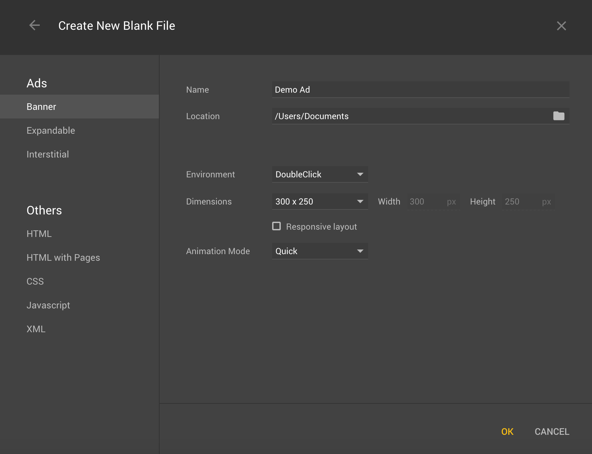
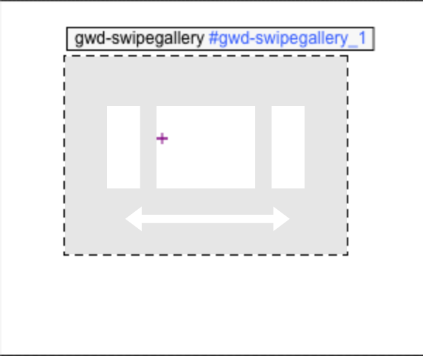
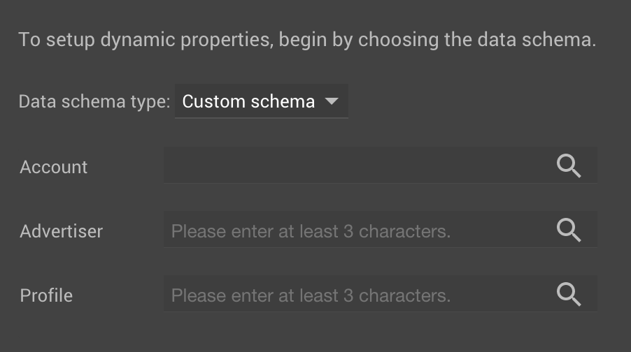
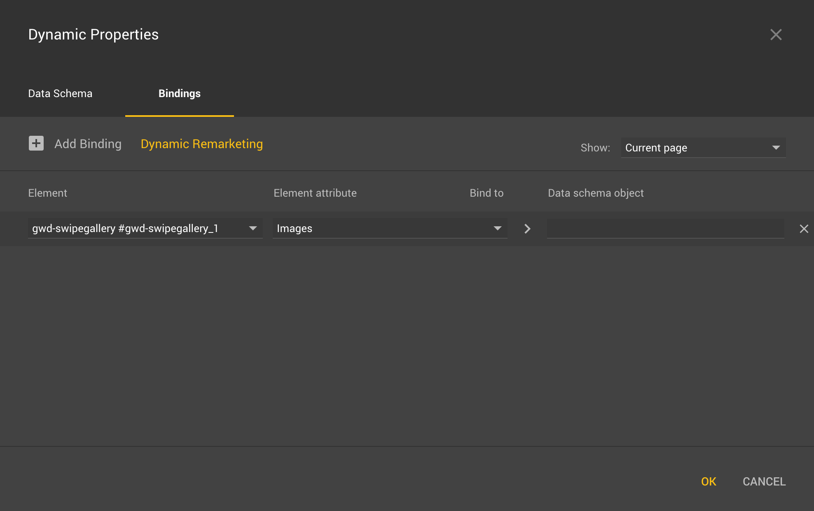

# UGC Ads with Nosto and Google DoubleClick

This guide provides a high level overview around how Nosto's UGC can be utilised to empower Banner Ads generated across the Google DoubleClick network.

* [Overview](user-generated-content-ads-with-stackla-and-google-doubleclick.md#overview)
* [Building a Banner Ad](user-generated-content-ads-with-stackla-and-google-doubleclick.md#building-a-banner-ad)
  * [Generate the Feed](user-generated-content-ads-with-stackla-and-google-doubleclick.md#generate-the-feed)
  * [Add the Feed to DoubleClick Studio](user-generated-content-ads-with-stackla-and-google-doubleclick.md#add-the-feed-to-doubleclick-studio)
  * [Build the Ad Template](user-generated-content-ads-with-stackla-and-google-doubleclick.md#build-the-ad-template)
  * [Publish the Template](user-generated-content-ads-with-stackla-and-google-doubleclick.md#publish-the-template)

## Overview

One of the strengths of the Nosto's UGC platform is the ability to serve aggregated and curated User Generated Content (UGC) through display outputs beyond those offered within the package.

From Digital Out Of Home (DOOH) displays to Banner Advertising, Nosto's UGC can provide a XML or JSON content feed which can be translated by many of the industry's leading AdTech or Digital Display providers to generate dynamic, authentic displays.

Google DoubleClick is one such provider which supports this approach, by allowing clients to provide a feed of content to generate a Banner Ad seamlessly.

This guide outlines at a high level one of the approaches a client can take to creating Ads in Google DoubleClick using Nosto's UGC as the source.

## Building a Banner Ad

There are a number of ways in which Google DoubleClick can accept a content feed from a third party source like Nosto's UGC to help generate a Banner Ad.

This guide focuses on using DoubleClick Studio and Google Web Designer, however customers can also use DoubleClick Creative Solutions or the DoubleClick Rich Media editor to also create dynamic ads powered by Stackla.

### Generate the Feed

Step one to integrating Nosto's UGC with your Google DoubleClick account is to generate the feed that will power your Ad Units.

_Note: It is assumed prior to this step that the client has already setup their Stack and defined a Filter where approved content for the Ad Units is available._

To start the process, the client should install the Nosto's UGC REST API Plugin and generate an Authentication Token for their account. To do this the client should:

* Go to the Nosto Admin Portal > UGC and click **‘Plugins’**
* Find the Plugin titled **‘REST API’** and hit install
* Once installed, they can now generate an Authentication Token by hitting **‘Generate’**
* The user will be asked to confirm their password
* The Authentication Token will now be generated

Once generated, the user can now visit the REST API section of the Admin Interface to find the feed endpoint. To do this, the user should click on **‘Developer’** and then **‘REST API Console’**.

The REST API endpoint we will be using in DoubleClick Studio is called **GET/Filter/{FilterID}/Content**. It is located under the **‘Filters’** section within the REST API Console.

The minimum parameters the user will need to define when generating the endpoint are:

* **filterID** - ID of the Filter of the content the client wishes to use
* **limit** - Number of pieces of content they want to make available in the feed
* **status** - Should be set to published

The **‘Response Content’** type should also be set to application/xml.

Once these values have been set, the user can hit **‘Try it Out’** to generate the endpoint URL they’ll need for Google DoubleClick Studio.

### Add the Feed to DoubleClick Studio

Once you have generated your Feed it is now possible to add it to DoubleClick Studio.

To do this, the user should log into their DoubleClick Studio account and click on the tab **‘Dynamic Content’**.

From here, the user can setup their respective **‘Profiles’** and **‘Content Sources’** for their display ads.

The Nosto's UGC Feed endpoint should be added as a **‘Content Source’** within DoubleClick Studio and associated with a Profile(s).

### Build the Ad Template

Once the feed has been added as a ‘Content Source’ in DoubleClick Studio, you can now load Google Web Designer to create your respective banner ads.

Google Web Designer provides the opportunity for clients to create their own Banner Ads from scratch or use a pre-built ad template. For the purposes of this guide we will create a blank MREC (300x250) banner ad.

Once we have specified the Dimensions, Environment, Name and Location we can hit OK to proceed to the canvas editor.

Once in the Canvas Editor you can now start building our your Banner Ad design. For the purposes of this example, we are going to leverage an out of the box component titled **‘Swipeable Gallery’**.

To add a **‘Swipeable Gallery’** simply click on the ‘Components’ section on the Right Hand Size and select the option from the list provided. Once selected you can now drag this onto the canvas into the position you would like the images to render.

.png>)

Once added to the Canvas, Google will apply an automatic ID to the component. In this example the **‘Swipeable Gallery’** we have just added is titled **gwd-swipegallery #gwd-swipegallery\_1**.

This title will be required once we start binding these components to our Dynamic feeds.

Next step is again on the right hand side to find the section titled **‘Dynamic’** and press the + button to create some Dynamic Properties.

From here you will be presented with a Prompt allowing you to pick a **Data Schema Type**. We will want to select **‘Custom Schema’** as we will be using the Content Feed we specified earlier.

Google will prompt you to log into your DoubleClick account, before then presenting you the option to specify your **Account**, **Advertiser** and **Profile**.

**Profile** relates to the Custom Profile we created in DoubleClick Studio earlier in this guide. Make sure to select the Profile which is associated with your Nosto's UGC feed.

Once done, you may now click on the **‘Bindings’** Tab and select to add a binding.

When creating a Binding you must specify three values:

* Element
* Element Attribute
* Data Schema Object

**Element** refers to both components and any other items added to the Banner display. For the purpose of this guide, we will specify the component **gwd-swipegallery #gwd-swipegallery\_1**.

**Element Attribute** refers to all the configurable attributes that relate to that item / component. For a **‘Swipeable Gallery’** this includes image, text, HTML, sizing and transitional attributes.

Each attribute selected needs to be associated with an object within the Nosto's UGC Feed. As such if you pick the **Element Attribute** ‘Images’ you will want to find the relevant ‘Image’ in the Nosto's UGC feed.

From here you can elect to join as many Element Attributes to as many Data Schema Objects as you like. You can also choose to apply additional Filters in this view as well if desired.

### Publish the Template

Once you have created your template and are happy with it, you may now choose to Publish and add this to your DoubleClick account for use.
