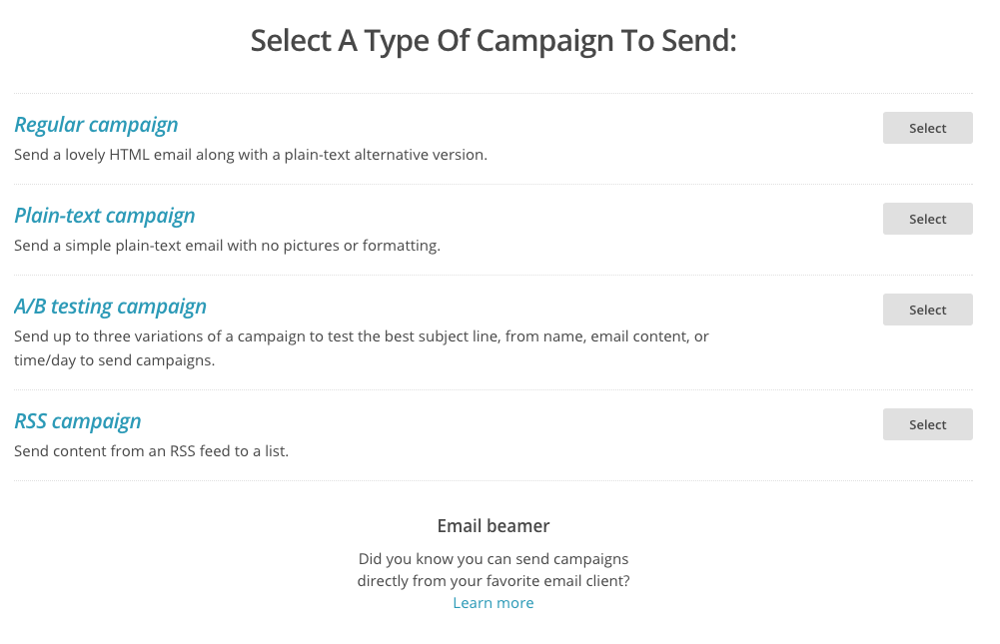
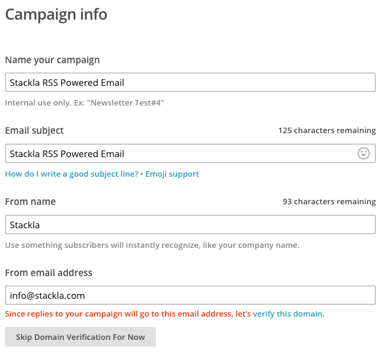
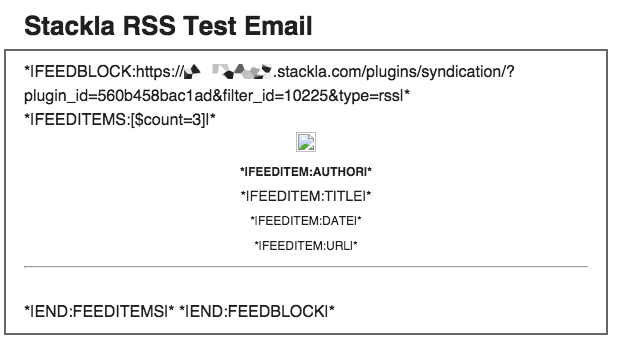
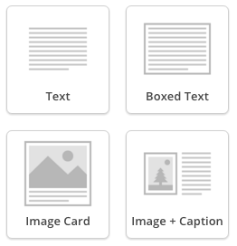
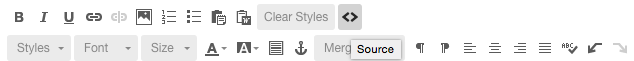
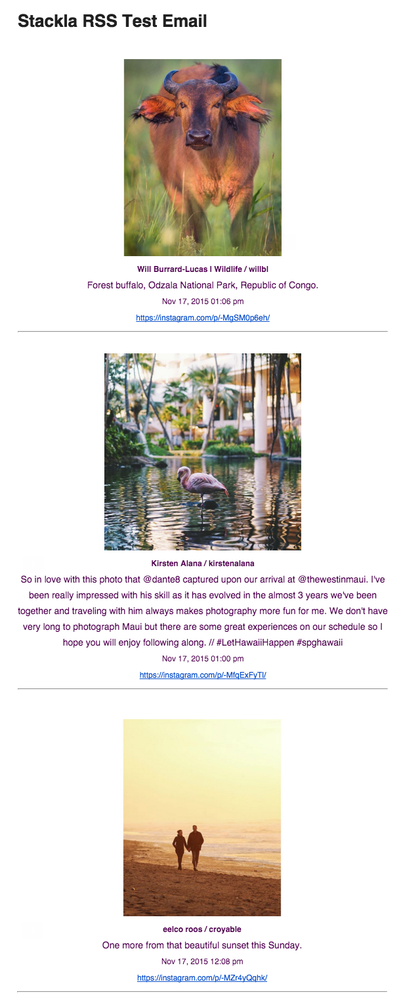

# Bring Social Content into a Mailchimp Campaign

## Overview

In this guide, we explore the general concept of displaying User Generated Content that has been aggregated by Nosto's UGC into a standard MailChimp campaign.

This guide focuses on the simplest and most effective way of displaying the content by using an out-of-the-box MailChimp template.

## Key Concepts

### RSS

Rich Site Summary (RSS), often called Simple Syndication, uses a family of standard web feed formats to publish frequently updated information such as blog entries, news headlines, audio or video.

Nosto's UGC provides a feed of ingested social tiles in compliance with the RSS file format as part of its Content Feed Plugin.

### MailChimp

MailChimp is a web-based email marketing service used by over 9 million people and businesses around the world to send email communications.

## The Fun Part

In this guide we will do the following:

* Install and configure the Nosto's UGC ‘Content Feed’ plugin
* Add RSS content to a MailChimp template

### Install and Configure the Nosto's UGC ‘Content Feed’ Plugin

Go to the Plugin directory within your Stack and install the plugin titled Content Feed - if Plugins are not available in your Stack and you wish to access them, please contact Nosto Support for more information.

Once set, you will be provided a feed URL, which will contain a series of parameters, these are:

* Filter - Filter of Content
* Type - RSS or ATOM

Select the Filter of the content you wish to add to your MailChimp campaign, and the output of RSS before hitting save.

Once saved the endpoint provided will be what you can use within your MailChimp template.

The structure of data within the Nosto's UGC RSS feed is outlined below:

```
<item>
            <title>Tile Comment</title>
            <link>Source Link</link>
            <description></description>
            <pubDate>Date Published</pubDate>
            <guid isPermaLink="false">GUID</guid>
                        <author>Author</author>
                        <enclosure url="Image URL" 
                        length="0" 
                        type="image/jpeg" />
</item>
```

### Add RSS to your MailChimp Campaign

The first step is to build a new MailChimp campaign. For this guide we will be creating a 'Regular Campaign', however, the same principles can be used for 'A/B Testing Campaigns' and of course 'RSS Campaigns'



Once you have selected your campaign, select who you wish to send the email to, and fill out your campaign information.



You can now select a template or upload your HTML. For this guide, we are going to leverage the 'Simple Text' template within MailChimp



Once your Template has loaded up you can now start leveraging MailChimp's Template Editor to insert the RSS feed. It should be noted, that the four content modules RSS can be added into are Text, Boxed Text, Image Cards, and Image + Caption. For this demo, we are going to use Text.



Once the WYSIWYG editor has loaded up, look for the 'Source' Icon (indicated by the ) from the toolbox.



From here MailChimp allows you to insert a Feed Block which will allow you to specify the feed, how many items to show, and the other values you wish to display. The table below specifies what each line of code does and how it can be used.

| MailChimp Tag                   | Description                                                                                                              |
| ------------------------------- | ------------------------------------------------------------------------------------------------------------------------ |
| \*\|FEEDITEM:URL\|\*            | Display the URL to your social post on the source network. Relates to RSS tag \<url>                                     |
| \*\|FEEDITEMS:\[$count=X]\|\*   | Define where the individual RSS item starts and how many items you wish to display. Relates to RSS tag \<item>           |
| \*\|FEEDITEM:TITLE\|\*          | Display the title for your social post. Relates to RSS tag \<title>                                                      |
| \*\|FEEDITEM:ENCLOSURE\_URL\|\* | Display the URL of any images in your social post. Relates to the RSS tag \<enclosure>                                   |
| \*\|FEEDITEM:DATE\|\*           | Display the date for your social post. Relates to RSS tag \<PubDate>                                                     |
| \*\|FEEDITEM:AUTHOR\|\*         | Display the author of your social post. Relates to the RSS tag \<author>                                                 |
| \*\|FEEDITEM:URL\|\*            | Define where RSS feed starts and what feed you are bringing into your MailChimp Campaign. Relates to RSS tags \<channel> |
| \*\|END:FEEDITEMS\|\*           | Define where the feed item information ends                                                                              |
| \*\|END:FEEDBLOCK\|\*           | Define where the feed block ends                                                                                         |

Using these MailChimp Tags, we inserted the below information for the demo:

```
*|FEEDBLOCK:https://client.stackla.com/plugins/syndication/?plugin_id=560b458bac1ad&filter_id=10225&type=rss|*<br />
*|FEEDITEMS:[$count=3]|*
<div style="text-align: center;"><br />
<strong><span style="font-size:12px">*|FEEDITEM:AUTHOR|*</span></strong><br />
<span style="font-size:14px">*|FEEDITEM:TITLE|*</span><br />
<span style="font-size:12px">*|FEEDITEM:DATE|*</span><br />
<span style="font-size:12px">*|FEEDITEM:URL|*</span></div>

<hr /><br />
*|END:FEEDITEMS|* 
*|END:FEEDBLOCK|*
```

Once entered, we hit save to generate an email template like below:


Provided you are happy with the rest of the email look and feel you are right to send

Once you hit send, MailChimp and Nosto's UGC will handle the heavy lifting of taking the right UGC content and embedding it into the email. The end result is something similar to below


