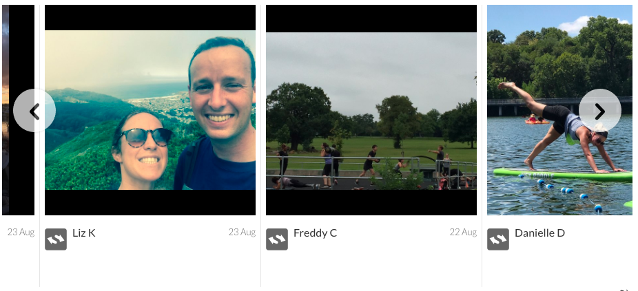
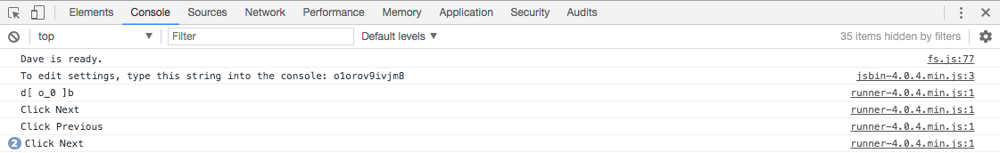
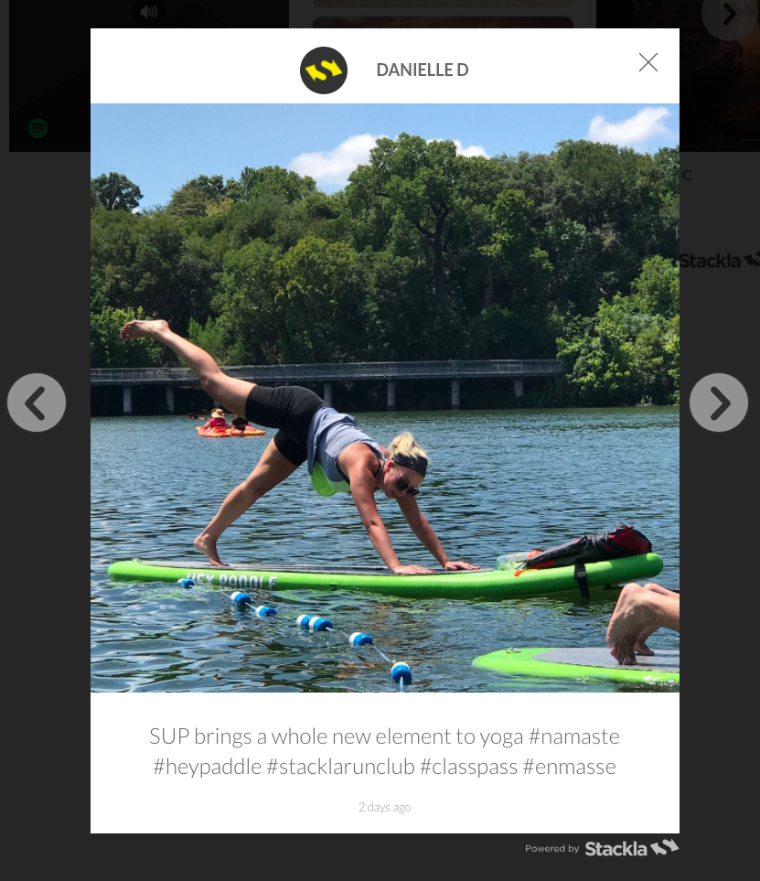

# Bind your own Events


You are reading the Classic Widget Documentation

Nextgen widgets are a new and improved way to display UGC content.&#x20;

Read the [Nextgen widget documentation here](../widgets-nextgen/).


* [Introduction](bind-your-own-events.md#introduction)
* [Creating your Custom Event](bind-your-own-events.md#custom-events)

## Introduction

Nosto's UGC Global Widgets API empowers users to feed their favorite Analytics tools with useful interaction information from their UGC Widgets based on common user behavior.

These common events relate to items such as Expanding a Tile, Loading more Content, or Clicking on a Shopspot link, and are based on the areas our users have wanted to track the most.

Now whilst these ‘Events’ cover the most common areas a client may wish to track, there are always scenarios where you need to track the less common areas and thus need to be able to create your events.

This guide provides a few examples as to how a user can create their custom events.

[Back to Top](bind-your-own-events.md#top)

## Creating your Custom Event

Now for this guide, we are going to focus on tracking the Left / Right arrows that are available on the Carousel Widget on the In-Line tile.



In this use case, we want to understand whether or not people are clicking on these buttons to see either new content or previous content.

Now as these buttons aren’t offered as part of Nosto's UGC standard [Global Widgets Event API](../../api-docs/javascript/widgets/reference.md#parent-page), we are going to create our Events by binding a click function to the CSS classes associated with these buttons (`.track-controller.prev` & `.track-controller.next`)

To do this, we would look to implement code similar to the below in the Custom Javascript section on the In-Line tile:

```

window.setTimeout(function (){
	$('.track-controller.prev').on('click', function () {
		parent.postMessage('inlinePrevClicked', "*");
    });
	$('.track-controller.next').on('click', function () {
		parent.postMessage('inlineNextClicked', "*");
    });
}, 1000);
```

As you will see in the code above, we are defining the CSS class (`.track-controller.prev`), and the function (ie. `Click`) and as well we are posting a message to our parent page (`postMessage>`).

By posting to our parent page, we can both test whether or not our custom events are working in the console, but can then consider sending these insights to an Analytics platform like Google Analytics or Adobe Analytics.

Now naturally, despite the fact we are posting a message to our parent page, unless our parent page is listening to it, it won’t achieve much, so we will need to add something on this page to allow us to test.

The easiest way to do this is to add the below code to the Custom JS on the Expanded Tile (which loads on the parent page versus in an iFrame like the In-Line Tile).

```

window.addEventListener("message", function (e) {
	if (e.data === 'inlinePrevClicked') {
		console.log('Click Previous');
	} else if (e.data === 'inlineNextClicked') {
		console.log('Click Next');
	}
}, false);
```

In the above code, we are looking for the messages we’ve sent (defined as `inlinePrevClicked` and `inlineNextClicked`) and then have defined what we want to push to our Console log.

Once added we should be able to Save our Widget and see the events in our Console log on a browser like Google Chrome.



Great, so now that we’ve done that, why don’t we also create a custom event to track the Left / Right arrows on the Expanded Tile?



Now naturally as we are updating the Expanded Tile, we don’t need to specify any listening events, which means we can just define the CSS class, and the function and then add a log message in the console.

As such, we can look to add something similar to the below to our Custom JS section on the Expanded Tile:

```

$tackla(document).on('click', '.stacklapopup-arrow-left', function () {
	console.log('Click Expanded Previous');
});
$tackla(document).on('click', '.stacklapopup-arrow-right', function () {
	console.log('Click Expanded Next');
});
```

Once added, we can then simply save and test.

[Back to Top](bind-your-own-events.md#top)
