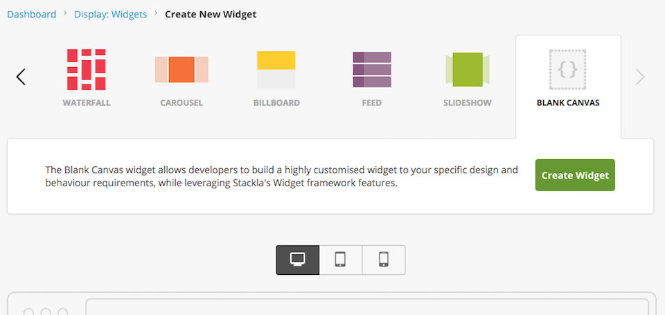
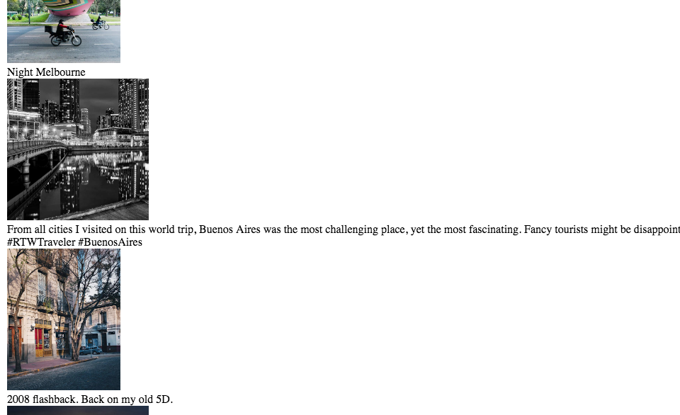
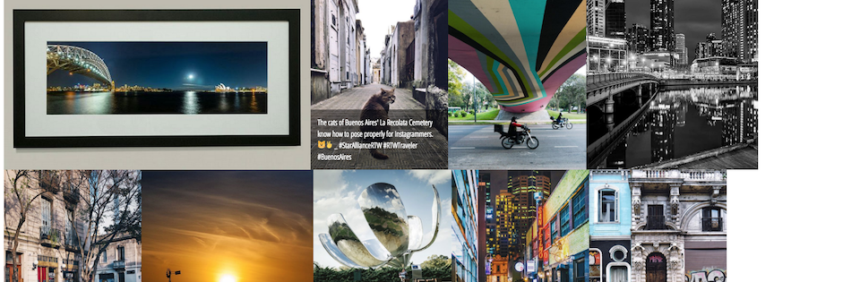
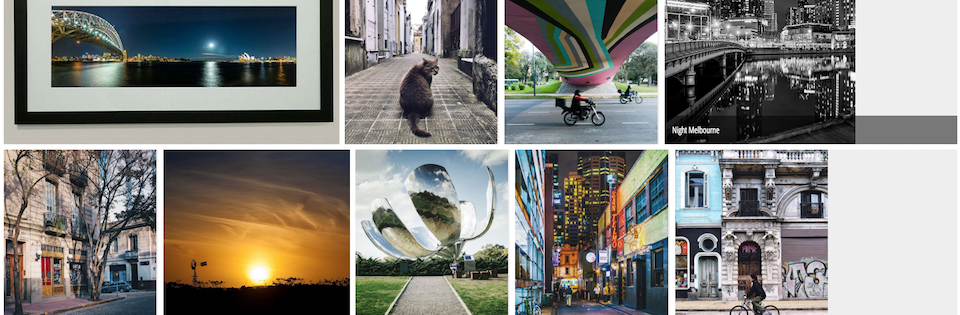
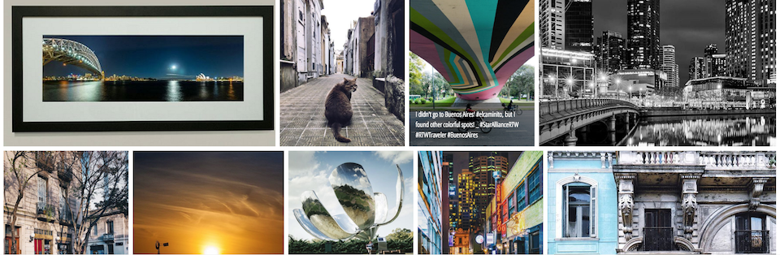

# Creating Gallery Widget by Using the Blank Canvas Widget


You are reading the **Classic Widget Documentation**

Classic widgets are a previous widget version for onsite widgets created before September 23rd.

From September 23rd 2025, all new widgets created will be NextGen.

Please check your widget version on the **Widget List page** to see if it is **Classic** or **NextGen** widget.

You can read the [Nextgen widget documentation here](../../widgets-nextgen/).



* [Overview](creating-gallery-widget-by-using-the-blank-canvas-widget.md#overview)
* [Step 1 - Settings](creating-gallery-widget-by-using-the-blank-canvas-widget.md#step1)
* [Step 2 - Coding for Layout and Tile Templates](creating-gallery-widget-by-using-the-blank-canvas-widget.md#step2)
* [Step 3 - Coding for CSS](creating-gallery-widget-by-using-the-blank-canvas-widget.md#step3)
* [Step 4 - Coding for JavaScript](creating-gallery-widget-by-using-the-blank-canvas-widget.md#step4)
* [Step 5 - Refinement](creating-gallery-widget-by-using-the-blank-canvas-widget.md#step5)
* [Result - The Gallery Widget](creating-gallery-widget-by-using-the-blank-canvas-widget.md#result)

## Overview

If you need a widget that Nosto's UGC hasn't supplied out of the box yet, Blank Canvas allows you to create your widget from scratch. In this guide, we will show you how to create a Gallery widget with Blank Canvas step by step. You can learn more information about the Blank Canvas Widget in the following guide: [Creating Your Own Widget Type by Using the Blank Canvas Widget](creating-your-own-widget-type-by-using-the-blank-canvas-widget.md).

## Step 1 - Settings



If the widget is enabled in your stack, you will see the extra widget type, Blank Canvas, appear in your Widget creation page.

Just click the Create Widget button to start.


Before you start getting creative with the Blank Canvas you will need to set it up properly to ensure that it all works.

The **Selected Filter** is the most important setting among them as it involved the data that you can fetch from Stackla.

## Step 2 - Coding for Layout and Tile Templates

Now let's start writing some HTML. Blank Canvas introduces the [Mustache](https://mustache.github.io) template engine and the Mustache Partials feature. In the following example, we will use partial template **tpl-tile** to render **tiles** objects. The **tiles** objects must be prepared in the Custom JS Editor - which we will talk about later.

### Sample Code

#### Layout

```

<div class="track">
    <div class="container" id="gallery">
        {{#tiles}}
            {{>tpl-tile}}
        {{/tiles}}
        <div class="clear"></div>
    </div>
</div>
```

#### Tile

The following Tile template will be included by the **\{{>tpl-tile\}}** syntax above. We will use classnames **.g-tile**, **.g-caption**, **.g-photo**, **.g-img** to style with CSS in the next section.

```

<div class="g-tile">
    <div class="g-caption">
        {{#emoji}}{{{message}}}{{/emoji}}
    </div>
    {{#image}}
    <div class="g-photo">
        
    </div>
    {{/image}}
</div>
```

In the above sample code, we created a tile template that will display the image and caption with the **id**, **emoji**, **message**, and **image** properties. We have provided quite a few Tile properties so that you can assemble your own structure easily. Please check the [Tile Properties section in the API documentation](../../../api-docs/javascript/widgets/blank-canvas.md#helper-methods-tile-properties) for more details.

To preview the result of HTML template, we need to get data using JavaScript. Click on the **fork** button on the JavaScript panel, you will get the minimal code needed.

```

Stackla.loadTilesByFilter(function (tiles) {
    // Render the layout template
    Stackla.render({tiles: tiles});
});
```

Click on the button "Update Preview", you should see plain stacked images and captions.



## Step 3 - Coding for CSS

All of the CSS rules reside within the iframe, so you don't need to worry about any conflicts with your page. Please make use of the **@import** directive to import the external CSS stylesheets you need.

### Sample Code

```

@import url(https://fonts.googleapis.com/css?family=Open+Sans+Condensed:300|Rajdhani);

body {
  font-family: 'Open Sans Condensed', sans-serif;
}

.g-tile {
    position:relative;
    float:left;
    height: 360px;
    overflow: hidden;
    background: #eee;
}
.g-tile .emoji {
    height: 1em;
}
.g-img {
    height: 360px;
}
.g-caption {
    position:absolute;
    left: 0;
    right:0;
    bottom:0;
    background: rgba(0,0,0,0.5);
    color: #fff;
    padding: 15px;
    line-height: 1.5;
    display:none;
}
.g-tile:hover .g-caption {
    display:block;
}
.clear {
    clear: both;
}
    
```

Click on button "Update Preview", you should see images aligned in rows.



## Step 4 - Coding for JavaScript

We want photos to fill each row's space, so we'll need some help from Javascript. We will use a library [Freewall](http://vnjs.net/www/project/freewall) to help us do the job.

By applying **Freewall** plugin to our widget's container(#gallery), we will get a gallery layout. Please note that the cellH (360) is the same as height property in CSS.

```


Stackla.loadJS([
    'https://cdnjs.cloudflare.com/ajax/libs/freewall/1.0.5/freewall.min.js',
    'https://unpkg.com/imagesloaded@4.1/imagesloaded.pkgd.min.js'
]).then(function(){
    // Load tiles data from selected filter
    Stackla.loadTilesByFilter(function (tiles) {

    // Render the layout template
    Stackla.render({tiles: tiles});
        var wall = new Freewall("#gallery");
        wall.reset({
            selector: '.g-tile',
            cellW: 30,
            cellH: 30,
            gutterX : 10,
            gutterY : 10,
            cacheSize : false,
            onResize: function() {
                wall.fitWidth();
            }
        });

        // images have loaded
        $('#gallery').imagesLoaded().done(function() {
            wall.fitWidth();

            var height = $('#gallery').height();
            // set ifrmae height
            Stackla.postMessage('resize', {height: height+'px'});

            // for scroll bar appear;
            $(window).trigger("resize");
        });
    });
});


```

Click on the button "Update Preview", you should see now **tiles** have filled all spaces of each row, but not images. We will fix it on the next step.



## Step 5 - Refinement

We want images to fill each tile as well. So we set images to a background, and make it fill by CSS (background-size: cover). The tag remains but hidden to let **Freewall** calculate layout by images width.

### Sample Code

```

<div class="g-tile">
    <div class="g-caption">
        {{#emoji}}{{{message}}}{{/emoji}}
    </div>
    {{#image}}
    <div class="g-photo"
         style="background-image: url({{image}})">
        
    </div>
    {{/image}}
</div>
```

```

@import url(https://fonts.googleapis.com/css?family=Open+Sans+Condensed:300|Rajdhani);

body {
  font-family: 'Open Sans Condensed', sans-serif;
}

.g-tile {
    position:relative;
    float:left;
    height: 360px;
    overflow: hidden;
}
.g-tile .emoji {
    height: 1em;
}
.g-img {
    height: 360px;
}
.g-photo {
    background-size: cover;
    background-repeat: no-repeat;
}
.g-photo img{
    visibility: hidden;
}
.g-caption {
    position:absolute;
    left: 0;
    right:0;
    bottom:0;
    background: rgba(0,0,0,0.5);
    color: #fff;
    padding: 15px;
    line-height: 1.5;
    display:none;
}
.g-tile:hover .g-caption {
    display:block;
}
.clear {
    clear: both;
}
    
```

## Result - The Gallery Widget



After applying all the Layout, Tile, CSS, and JS code by the above code, you should get a Gallery Widget [(Live demo in JS Bin)](http://output.jsbin.com/zicake/1).

That's it! Get your code and embed your Gallery Widget!!

## Live Demo!

```html
<script type="text/javascript">(function (d, id) { if (d.getElementById(id)) return; var t = d.createElement('script'); t.type = 'text/javascript'; t.src = '//assetscdn.stackla.com/media/js/widget/fluid-embed.js'; t.id = id; (document.getElementsByTagName('head')[0] || document.getElementsByTagName('body')[0]).appendChild(t); }(document, 'stackla-widget-js'));</script>
```
