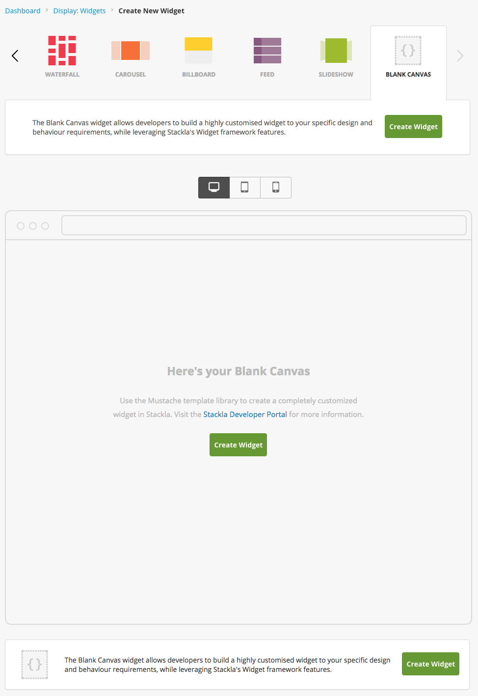
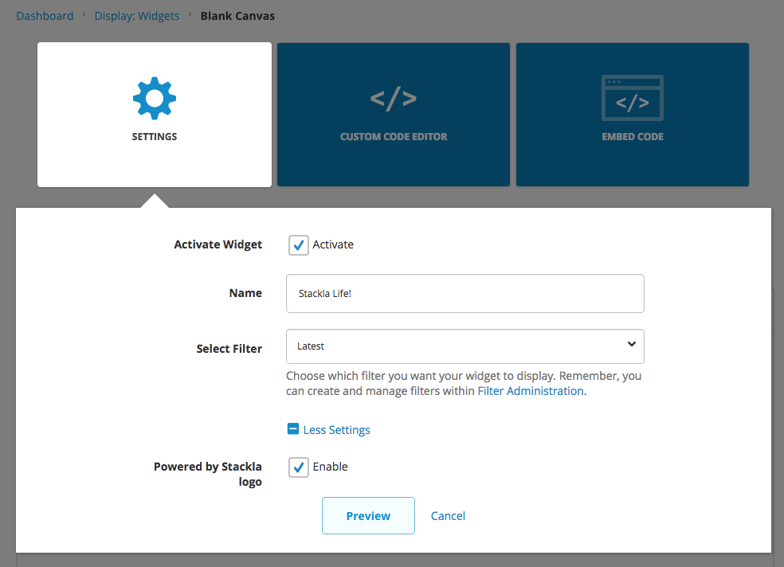
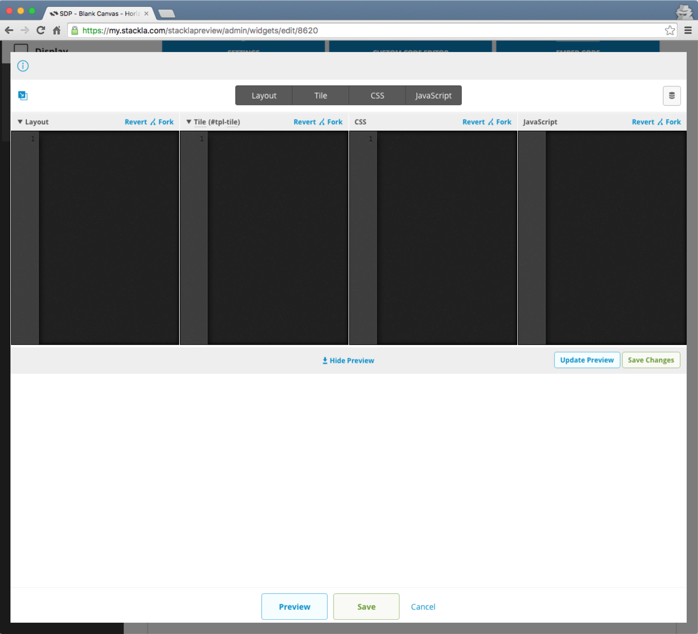
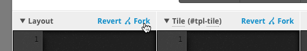
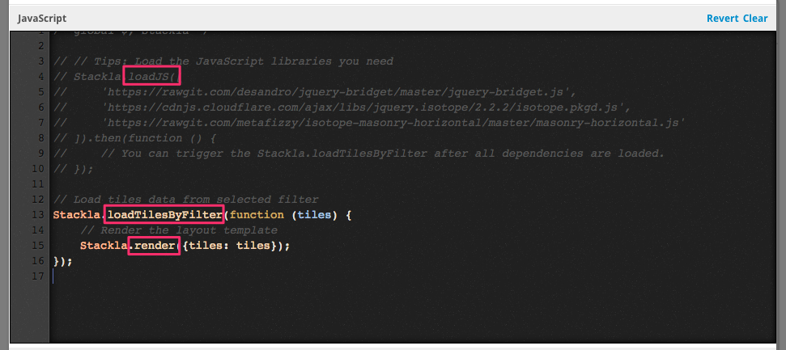

# Creating Your Widget by Using the Blank Canvas


You are reading the Classic Widget Documentation

NextGen widgets are a new and improved way to display UGC content.&#x20;

On Oct 1st, all widgets created will be NextGen.

Please check your widget version on the Widget List page to see if it is **Classic** or **NextGen** widget.

You can read the [Nextgen widget documentation here](../../widgets-nextgen/styling-guides/).



* [Overview](creating-your-own-widget-type-by-using-the-blank-canvas-widget.md#overview)
* [Step 1 - Getting a Canvas with Single Click!](creating-your-own-widget-type-by-using-the-blank-canvas-widget.md#step1)
* [Step 2 - Super Simple Settings!](creating-your-own-widget-type-by-using-the-blank-canvas-widget.md#step2)
* [Step 3 - Custom Code Editors](creating-your-own-widget-type-by-using-the-blank-canvas-widget.md#step3)
* [Step 4 - Coding for Layout and Tile Templates](creating-your-own-widget-type-by-using-the-blank-canvas-widget.md#step4)
* [Step 5 - Coding for CSS](creating-your-own-widget-type-by-using-the-blank-canvas-widget.md#step5)
* [Step 6 - Coding for JavaScript](creating-your-own-widget-type-by-using-the-blank-canvas-widget.md#step6)
* [Result - The Boilerplate Widget](creating-your-own-widget-type-by-using-the-blank-canvas-widget.md#result)
* [Bonus - Creating the Horizontal Masonry Widget](creating-your-own-widget-type-by-using-the-blank-canvas-widget.md#bonus)

## Overview

Though Nosto's UGC provides several different types of widgets and has the great ability of customization, we still can't satisfy some of our customers' unique needs. For example, some customers want to use the [Horizontal Masonry](http://isotope.metafizzy.co/layout-modes/masonryhorizontal.html), which Nosto's UGC doesn't have. This then leads to our customer to using hack solutions or forces them to build from scratch which can take a lot of effort. That's not okay for both Nosto's UGC and our clients.

To resolve this, we have provided a new widget type. Blank Canvas allows you to create your widget from scratch whilst providing developers with some great utility functions and tools to achieve their solution efficiently.

In this tutorial, we will show you how to create a Blank Canvas widget step by step.

## Step 1 - Getting a Canvas with Single Click!



Once the widget is available to you, you will see an extra widget type, Blank Canvas, in your widget creation page.

It doesn't have any JavaScript, CSS, or HTML by default. That's the reason why you can only see the prompt text in the preview widget area.

Just click the **Create Widget** button to start! It's easy!!

## Step 2 - Super Simple Settings!



Before you start to put your imagination and innovative ideas onto the canvas, it's suggested to set up it correctly.

In Blank Canvas, we only provide very basic setting options. That is the Activate Widget, Name, Select Filter, and the Powered by Nosto's UGC Logo fields.

The **Selected Filter** is the most important setting among them. It involves with the data you can fetch from Nosto's UGC.

## Step 3 - Custom Code Editors



Unlike other widgets which have the CSS and JavaScript editors, the Blank Canvas widget provides the other **Layout** and **Tile** editors so that you can write code in [Mustache](https://mustache.github.io).

## Step 4 - Coding for Layout and Tile Templates

### Understanding the Mustache Partials

If you are familiar with the [Mustache](https://mustache.github.io) template engine, you probably know the [Partials](https://mustache.github.io/mustache.5.html#Partials). The Partials feature just makes it easier to **modulize your templates**.

Nosto's UGC introduces the Mustache Partials feature. You can add, remove, or rename any templates. **The only necessary one is the Layout**. You can remove the Tile template if you think you can finish everything in one template.


The above diagram illustrates the Layout template which includes Header, Navigation, Tile (inside the loop), and Map templates. We've created the following widget with this templates structure. See? You basically can create a micro-site with our Blank Canvas. Awesome right?

```html
<script type="text/javascript">(function (d, id) { if (d.getElementById(id)) return; var t = d.createElement('script'); t.type = 'text/javascript'; t.src = '//assetscdn.stackla.com/media/js/widget/fluid-embed.js'; t.id = id; (document.getElementsByTagName('head')[0] || document.getElementsByTagName('body')[0]).appendChild(t); }(document, 'stackla-widget-js'));</script>
```

Note the above example just demonstrates the ability to use multiple templates. There is no interaction between photos and map.

### Sample Code

You can copy and paste the following code as your boilerplate. Or you can just click the **Fork** link (at the top-right corner) to get them directly.



#### Layout

```
<div class="track">
    <div class="container">
        {{#tiles}}
            {{>tpl-tile}}
        {{/tiles}}
    </div>
</div>
```

The following Tile template will be included by the **\{{>tpl-tile\}}** syntax. The **tiles** is an array collection containing tile objects. It must be prepared in the Custom JS Editor - which \[we will talk about later]\(#js-stackla.loadTilesByFilter).

#### Tile

```
<div class="tile">
    <div class="hd">#{{id}}</div>
    <div class="bd">
        {{#emoji}}{{{message}}}{{/emoji}}
    </div>
    {{#image}}
    <div class="ft">
        
    </div>
    {{/image}}
</div>
```

In the above sample code, we use **id**, **emoji**, **message**, and **image** properties. We have provide quiet a few Tile properties so that you can assemble your own structure easily. Please check the [Tile Properties section in the API documentation](../../../api-docs/javascript/widgets/blank-canvas.md#helper-methods-tile-properties) for more details.

## Step 5 - Coding for CSS

All the CSS rules reside within the iframe, so you don't need to worry about any conflicts with your page.

Please make use of the **@import** directive to import the external CSS stylesheets you need.

### Sample Code

Again, you can click the **Fork** link to grab the following code.


```
// Tips: You can use @import rule to load the CSS files you need
// @import url(https://cdnjs.cloudflare.com/ajax/libs/font-awesome/4.6.2/css/font-awesome.min.css);

@import url(https://fonts.googleapis.com/css?family=Open+Sans);
body {
    background: #ccc;
    padding: 10px 0 0 10px;
    font-family: 'Open Sans', sans-serif;
    -webkit-font-smoothing: antialiased;
    -moz-osx-font-smoothing: grayscale;
}
.tile {
    background: #fff;
    border: solid 1px #ccc;
    color: #666;
    font-size: 13px;
    padding: 10px;
    margin-right: 10px;
    margin-bottom: 10px;
    .hd {
        margin-bottom: 10px;
    }
    .bd {
        color: #333;
        font-size: 16px;
    }
    &-emoji {
        margin-right: 2px;
        vertical-align: middle;
        width: 16px;
    }
}
```

## Step 6 - Coding for JavaScript

Blank Canvas provides a simple SDK, which allows you to boost the development speed. Let's learn this SDK by reading the following boilerplate code.

### Used JavaScript Libraries

The Blank Canvas currently has the following JavaScript libraries installed.

* **jQuery**: You can access it by using the `$` global variable. The current version is 1.11.0.
* **lodash**: You can access it by using the `_` global variable. The current version is 3.10.1.
* **Mustache.js**: You can access it by using the `Mustache` global variable. The current version is 0.8.1.
* **twemoji**: You can access it by using the `twemoji` global variable. The current version is 2.
* **jquery.cookie**: You can access it by using the `jQuery.fn.cookie`.
* **lazyload**: You can access it by using the `Lazyload` global variable.
* **js-xss**: You can access it by using the `filterXSS` global variable.
* **twitter-text**: You can access it by using the `twttr.txt` global variable. The current version is 1.13.0

### Global Setting Object

You can access some basic information about this widget from the `Stackla.widgetOptions` global variable. Please check the [API documentation](../../../api-docs/javascript/widgets/blank-canvas.md#setting-object) for more details.

### JavaScript SDK Methods

I would like to highlight the three used methods which are S**tackla.loadJS**, S**tackla.loadTilesByFilter**, and the S**tackla.render**.



#### Stackla.loadJS

This method helps you to **load the external JavaScript files parallelly and execute by order**. It has better performance than using the multiple tags. Please check the How to Load External JS and CSS into Widgets to get more details.

It supports both the callback-style and the promise-style.

```javascript
Stackla.loadJS([
    'https://foo.com/lib1.js',
    'https://foo.com/lib2.js',
    'https://foo.com/lib3.js',
], function () {
    // The callback after lib1.js, lib2.js, and lib3.js are loaded.
});
```

#### Stackla.loadTilesByFilter

This method helps you to **load the data from the selected filter**, which reduces a lot of work relating to API requests and pinned tiles ordering.

It supports both the callback-style and the promise-style.

```
Stackla.loadTilesByFilter()
.then(function (tiles) {
     // You will get the tiles collection data.
});
```

The only argument of the callback function is the tiles data which we [mentioned above](creating-your-own-widget-type-by-using-the-blank-canvas-widget.md#layout-tiles).

#### Stackla.render

This method helps you to render the Mustache templates you defined. After all content is rendered, it will automatically resizes the belonging iframe to proper height.

```
//Stackla.loadTilesByFilter(function (tiles) {
    // Render the layout template
    Stackla.render({tiles: tiles});
//});
```

The only parameter is the data object which you want pass to the Mustache template.

#### Sample Code - Gathering Everything Together

Now hope you fully understand how these methods work.

```
/* global $, Stackla */

// // Tips: Load the JavaScript libraries you need
// Stackla.loadJS([
//     'https://rawgit.com/desandro/jquery-bridget/master/jquery-bridget.js',
//     'https://cdnjs.cloudflare.com/ajax/libs/jquery.isotope/2.2.2/isotope.pkgd.js',
//     'https://rawgit.com/metafizzy/isotope-masonry-horizontal/master/masonry-horizontal.js'
// ]).then(function () {
//     // You can trigger the Stackla.loadTilesByFilter after all dependencies are loaded.
// });

// Load tiles data from selected filter
Stackla.loadTilesByFilter(function (tiles) {
    // Render the layout template
    Stackla.render({tiles: tiles});
});
```

## Result - The Boilerplate Widget

After applying all the Layout, Tile, CSS, and JS code by the above boilerplate code, you should get a [simple widget](http://output.jsbin.com/xikelan). It's not fancy at all. However, it's just easy enough for you to understand how Blank Canvas works quickly.

***

## Bonus - Creating the Horizontal Masonry Widget

You are probably one of our clients who wants to use the Horizontal Masonry Widget. Now you can use our Blank Canvas Widget to achieve it!

### Layout

The Layout is the same as the boilerplate code.

```
<div class="track">
    <div class="container">
        {{#tiles}}
            {{>tpl-tile}}
        {{/tiles}}
    </div>
</div>
```

### Tile

Tile is also pretty much the same as the boilerplate code. We just add an `tile--double` class when the `isDouble` property of the tile object is valid.

```
<div class="tile{{#isDouble}} tile--double{{/isDouble}}">
    
    <div class="tile-content">
        {{#emoji}}{{{message}}}{{/emoji}}
    </div>
</div>
```

### CSS

We want the content to be displayed only when the user hovers over the tile. This effect is done by the CSS.

```
@import url(https://fonts.googleapis.com/css?family=Open+Sans+Condensed:300|Rajdhani);

.track {
    overflow: auto;
    position: relative;
}

.container {
    position: absolute;
}

* {
  -webkit-box-sizing: border-box;
     -moz-box-sizing: border-box;
          box-sizing: border-box;
}

/* inherit height from window */
html, body { height: 100%; }

body {
  font-family: 'Open Sans Condensed', sans-serif;
}


.container {
  background: #000;
  border: 2px solid #333;
  border-width: 2px 0 0 2px;
  height: 604px;
}

/* clear fix */
.container:after {
  content: '';
  display: block;
  clear: both;
}

.tile {
    float: left;
    width: 200px;
    height: 200px;
    background: #fff;
    border: 2px solid #333;
    border-width: 0 2px 2px 0;
    overflow: hidden;
    position: relative;
    &-content {
        color: #fff;
        background: rgba(0, 0, 0, 0.7);
        padding: 10px;
        position: absolute;
        top: 0;
        left: 0;
        right: 0;
        bottom: 0;
        opacity: 0;
        transition: opacity 0.8s linear;
        &:hover {
            opacity: 1;
        }
    }
    &-emoji {
        width: 16px;
        height: 16px;
    }
    &-image {
        position: absolute;
        width: 100%;
        height: 100%;
        object-fit: cover;
    }
    &--double {
        width: 400px;
        height: 400px;
    }
}
```

### JavaScript

We use `Stackla.loadJS` to load the three required libraries. In the example below, I have randomly chosen maximum four tiles to append the `isDouble` attributes which optimizes the visualization.

```
Stackla.loadJS([
    'https://rawgit.com/desandro/jquery-bridget/master/jquery-bridget.js',
    'https://cdnjs.cloudflare.com/ajax/libs/jquery.isotope/2.2.2/isotope.pkgd.js',
    'https://rawgit.com/metafizzy/isotope-masonry-horizontal/master/masonry-horizontal.js'
]).then(function () {
    Stackla.loadTilesByFilter(render);
});

function render(tiles) {
    var specialTile;
    _.times(4, function () {
        specialTile = _.sample(tiles);
        specialTile.isDouble = true;
    });

    Stackla.render({tiles: tiles});

    $('.container').isotope({
        layoutMode: 'masonryHorizontal',
        itemSelector: '.tile',
        masonryHorizontal: {
            rowHeight: 100
        }
    });

    Stackla.postMessage('resize', {height: 610});
}
```

## Live Demo!

That's it! It's time for you to create a brand new widget to amaze your users!!

```html
<script type="text/javascript">(function (d, id) { if (d.getElementById(id)) return; var t = d.createElement('script'); t.type = 'text/javascript'; t.src = '//assetscdn.stackla.com/media/js/widget/fluid-embed.js'; t.id = id; (document.getElementsByTagName('head')[0] || document.getElementsByTagName('body')[0]).appendChild(t); }(document, 'stackla-widget-js'));</script>
```
