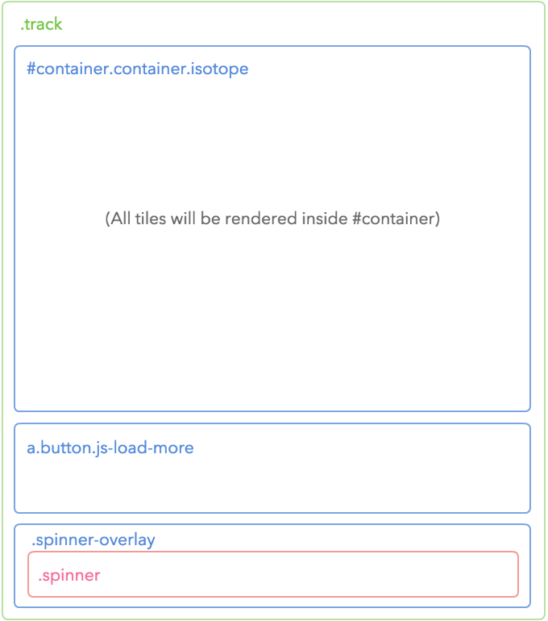
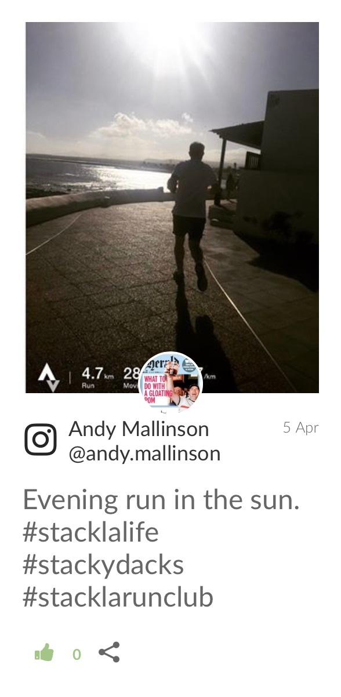
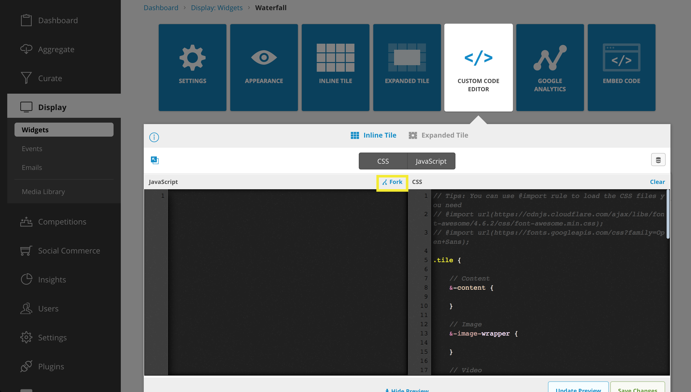
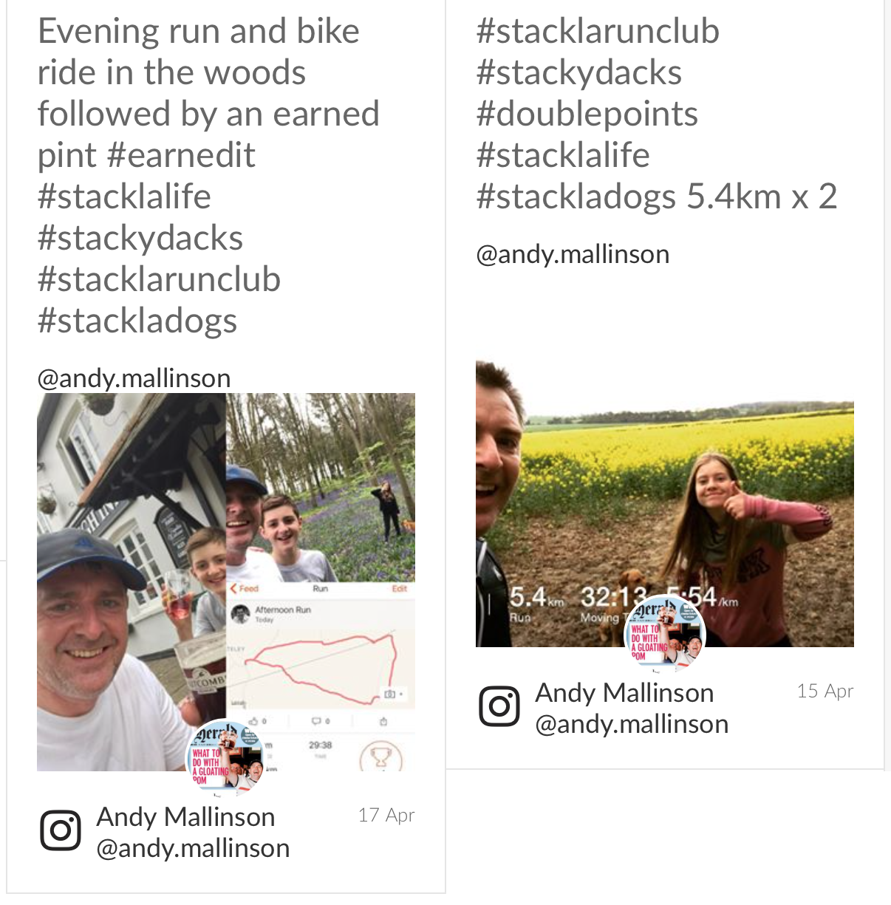
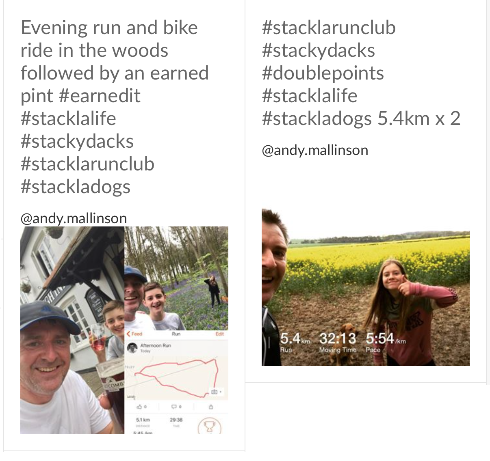
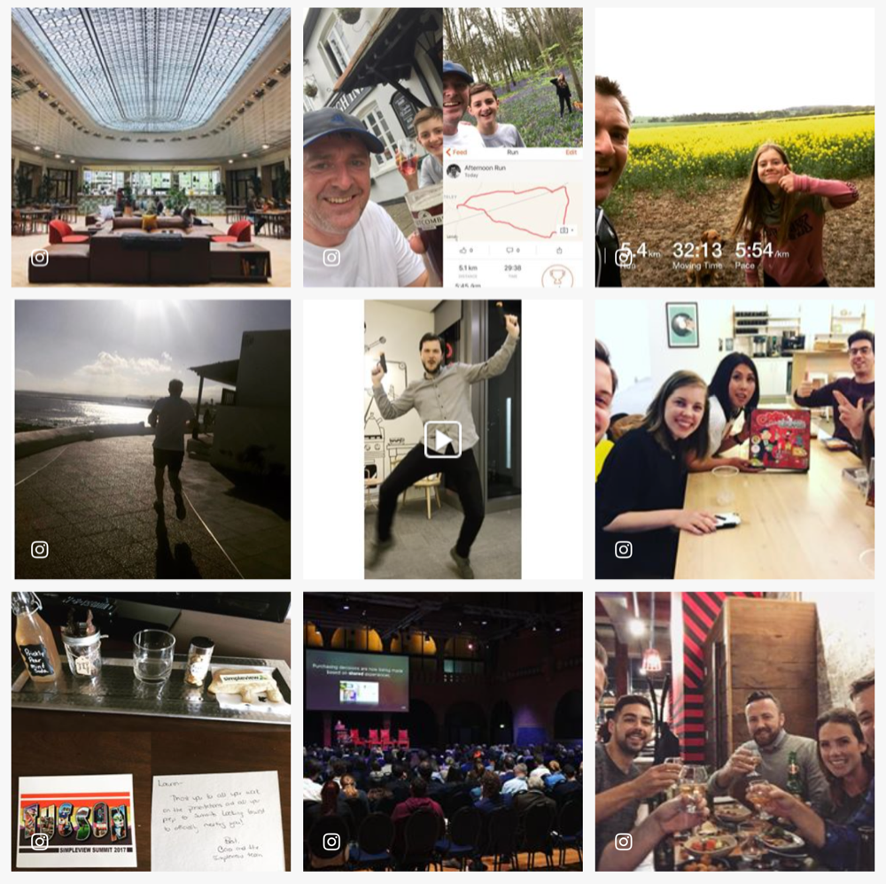
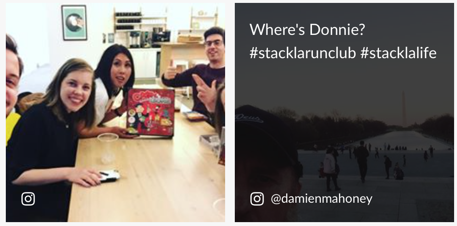
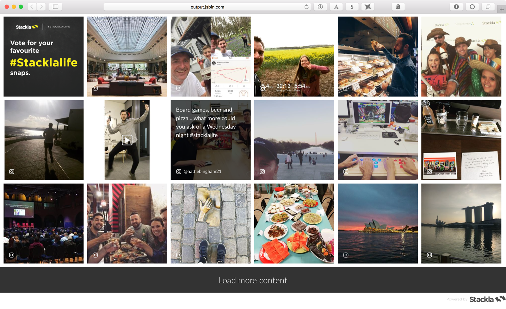

# Creating a Grid Widget from Waterfall


You are reading the **Classic Widget Documentation**

Classic widgets are a previous widget version for onsite widgets created before September 23rd.

From September 23rd 2025, all new widgets created will be NextGen.

Please check your widget version on the **Widget List page** to see if it is **Classic** or **NextGen** widget.

You can read the [Nextgen widget documentation here](../widgets-nextgen/).

**Note: This feature is unique to Classic widgets**



* [Overview](create-a-grid-widget-from-waterfall.md#overview)
* [Step 1 - Widget Settings](create-a-grid-widget-from-waterfall.md#step-1)
* [Step 2 - Understanding the Waterfall widget](create-a-grid-widget-from-waterfall.md#step-2)
* [Step 3 - Custom CSS](create-a-grid-widget-from-waterfall.md#step-3)
* [Step 4 - Custom JavaScript](create-a-grid-widget-from-waterfall.md#step-4)
* [Step 5 - Refinement](create-a-grid-widget-from-waterfall.md#step-5)
* [Result - A Custom Grid Widget](create-a-grid-widget-from-waterfall.md#result)

## Overview

If you need specfic widget interactions, but you are keen on using either our Grid widget or Masonry widget (which do not support all Nosto's UGC interactions), there is now a way to do so! In this guide, we will show you how to create a Grid widget by customizing a Waterfall widget. _One thing to keep in mind with this custom widget: it will function differently than our standard Grid widgets, which are built to fill a specific space. Due to the Waterfall's "Load More" functionality, this widget will expand in height upon loading more content._

## Step 1 - Settings

Once you create your new Waterfall widget, you'll need to set it up properly to ensure everything works with the customizations.

* The **Selected Filter** is the most important setting among them as it involves the data that you can fetch from Stackla.
* We can use the **Max Tile Width** setting to mimic the Grid/Masonary's sizing options (small/medium/large).
* **Margins** can be set to your liking, however, **10px** will match the OOB Grid widget's settings.

In order to more closely resemble the Grid widgets, we will avoid enabling any **Inline Tile** options _(don't worry, these can all be enabled on the Expanded Tile)_. !\[]\(https://web-assets.stackla.com/zachdrago.stackla.comhttp://sdp-media.dev/images/customimages/2017-04/1492567097/screen-shot-1.png =300x)

## Step 2 - Understanding the Waterfall widget

Before jumping into the customizations, we first need to understand how the Waterfall widget is built. This will make it much easier to customize with our code.

### Widget Layout

The layout below demonstrates the wrappers of our Widget tiles.  Check the complete Widget structure from our [Waterfall Guide](styling-waterfall-widget.md#layout-structure)

### Tile Layout

The Waterfall widget is mostly composed by tiles - as such it is much easier to customize the Waterfall widget when you are familiar with it's structure. .png>)  _The diagram above only shows until the 4th level. Check the complete Tile structure from our_ [_Waterfall Guide_](styling-waterfall-widget.md#tile-structure)

### Code Editors

In this guide we will be using the custom code editors to modify both your CSS and JavaScript. The CSS editor supports LESS CSS pre-processor. That means you can use both traditional CSS syntax or the better LESS syntax.

Additionally, you will want to **fork** the code from the top-right corner of each editor pane. This loads the boilerplate code from the Nosto's UGC codebase copy & paste from our Developer Portal. 

## Step 3 - Coding for JavaScript

Let's begin with the Custom JavaScript. From the **onCompleteJsonToHtml** callback, we can target the DOM elements of the tile, and easily manipulate them.

**Step 1**

We will first use this to create a new element to hold all of our hover tile data. We'll then prepend this to the **tile-content**. Additionally, we will reposition the **tile-source** to the bottom of the tile-content.

```
onCompleteJsonToHtml: function ($tile, tileData) {
    // FIND THE TILE-CONTENT ELEMENT
    // AND PREPEND OUR NEW HOVER ELEMENT CALLED TILE-HOVER
    var $content = $tile.find('.tile-content');
    $content.prepend('<div class="tile-hover"></div>');

    // REPOSITION TILE-SOURCE TO BOTTOM OF TILE-CONTNENT
    $content.append($tile.find('.tile-source'));

    return $tile;
},
```

_You will not yet see any visible changes ._

**Step 2**

Next we will move the **tile-caption** into our new tile-hover element. We will also create and append a new **tile-user** element to hold the post's user handle.

```
onCompleteJsonToHtml: function ($tile, tileData) {
    // FIND THE TILE-CONTENT ELEMENT
    // AND PREPEND OUR NEW HOVER ELEMENT CALLED TILE-HOVER
    var $content = $tile.find('.tile-content');
    $content.prepend('<div class="tile-hover"></div>');

    // REPOSITION TILE-SOURCE TO BOTTOM OF TILE-CONTENT
    $content.append($tile.find('.tile-source'));

    // FIND TILE-HOVER ELEMENT
    // AND MOVE TILE-CAPTION INTO IT
    var $hover = $tile.find('.tile-hover');
    $hover.append($tile.find('.tile-caption'));

    // CREATE AND APPEND A NEW TILE-USER ELEMENT
    // MOVE POST'S USER INFO TO TILE-USER ELEMENT
    $hover.append('<div class="tile-user"></div>');
    $tile.find('.tile-user').append($tile.find('.tile-user-bottom'));

    return $tile;
},
```

Let's go ahead and click "Preview" to see these changes. You will notice that the tile-caption and the tile-user info is now above the tile-image. This is ok, as we will be using CSS to hide and style this later. 

**Step 3**

Finally, we will remove all of the leftover tile elements that don't need to be displayed: \* Tile Avatar \* Tile Belt \* Tile Tags \* Tile Interactions \* Twitter Buttons

```
onCompleteJsonToHtml: function ($tile, tileData) {

    // FIND THE TILE-CONTENT ELEMENT
    // AND PREPEND OUR NEW HOVER ELEMENT CALLED TILE-HOVER
    var $content = $tile.find('.tile-content');
    $content.prepend('<div class="tile-hover"></div>');

    // REPOSITION TILE-SOURCE TO BOTTOM OF TILE-CONTNENT
    $content.append($tile.find('.tile-source'));

    // FIND TILE-HOVER ELEMENT
    // AND MOVE TILE-CAPTION INTO IT
    var $hover = $tile.find('.tile-hover');
    $hover.append($tile.find('.tile-caption'));

    // CREATE AND APPEND A NEW TILE-USER ELEMENT
    // MOVE POST'S USER INFO TO TILE-USER ELEMENT
    $hover.append('<div class="tile-user"></div>');
    $tile.find('.tile-user').append($tile.find('.tile-user-bottom'));

    // REMOVE ALL LEFTOVER ELEMENTS THAT AREN'T NEEDED
    $tile.find('.tile-timestamp').remove();
    $tile.find('.tile-belt').remove();
    $tile.find('.tile-avatar-wrapper').remove();
    $tile.find('.tile-twitter-intent').remove();
    $tile.find('.tile-interactions').remove();
    $tile.find('.tile-tags').remove();

    return $tile;
},
```

Let’s go ahead and click “Preview” to see these changes one more time. You will notice that the leftover elements have been removed.



**Step 4**

The last thing that we need to do, is resize the tiles so they appear as perfect squares.

From the **onCalculateDimensions** callback we will need to add the following JavaScript:

```
onCalculateDimensions: function ($tile) {
    var tileWidth = $tile.width();
    $tile.height(tileWidth);
},
```



We now have all of the tile elements in place for our CSS. Let's Save your work up to now, and move on to the CSS.

## Step 4 - Coding for CSS

All of the CSS rules reside within the iframe, so you don't need to worry about any conflicts with your page. _NOTE: You can make use of the **@import** directive to import the external CSS stylesheets you need, etc._

**Step 1**

Let's begin our CSS customizations by forking the CSS boilerplate, and adding our new tile-hover and tile-user elements to it, as well as a few others to help mimic the Grid widgets: \* tile-hover \* tile-caption links \* tile-user \* tile-user-bottom

**New CSS boilerplate**

```
// Tips: You can use @import rule to load the CSS files you need
// @import url(https://cdnjs.cloudflare.com/ajax/libs/font-awesome/4.6.2/css/font-awesome.min.css);
// @import url(https://fonts.googleapis.com/css?family=Open+Sans);

.tile {

    // Content
    &-content {

    }

    // Hover
    &-hover {

    }

    // Image
    &-image-wrapper {

    }

    // Video
    &-video-wrapper {

    }

    // Avatar
    &-avatar-wrapper {

    }
    &-avatar-link {

    }
    &-avatar-placeholder {

    }
    &-avatar-image {

    }

    // Belt (Source + User + Timestamp)
    &-belt {

    }

    // Title
    &-title {

    }

    // Caption
    &-caption,
    &-html {

    }

    // Caption Links (remove hover affect from links)
    &-caption a:hover {

    }

    // Source
    &-source {

    }

    // User
    &-user {

    }

    &-user-bottom {

    }

    // Timestamp
    &-timestamp {

    }

    // Interactions (Like/Dislike/Vote/Sharing)
    &-interactions {

    }

    // Tags
    &-tags {

    }

    // Twitter Intention
    &-twitter-intent {

    }
}
```

**Step 2**

Next we will add the necessary styles to our adjusted elements (this will replace the current boilerplate code, so feel free to copy & paste the whole thing).

```
// Tips: You can use @import rule to load the CSS files you need
// @import url(https://cdnjs.cloudflare.com/ajax/libs/font-awesome/4.6.2/css/font-awesome.min.css);
// @import url(https://fonts.googleapis.com/css?family=Open+Sans);

.tile {
    border: none;

    // Content
    &-content {
        height: 100%;
        margin: 0;
    }

    // Hover
    &-hover {
        opacity: 0;
        transition: opacity 1s;
        background: rgba(0, 0, 0, .7);
        position: absolute;
        left: 0;
        right: 0;
        bottom: 0;
        top: 0;
        z-index: 10;
        padding: 15px;
    }

    // Image
    &-image-wrapper {
        height: 100% !important;
        overflow: hidden;
    }

    // Video
    &-video-wrapper {

    }

    // Avatar
    &-avatar-wrapper {

    }
    &-avatar-link {

    }
    &-avatar-placeholder {

    }
    &-avatar-image {

    }

    // Belt (Source + User + Timestamp)
    &-belt {

    }

    // Title
    &-title {

    }

    // Caption
    &-caption,
    &-html {
        height: 172px;
        line-height: 1.5;
        position: absolute;
        bottom: 50px;
        top: 0;
        left: 0;
        right: 0;
        display: -webkit-box;
        -webkit-line-clamp: 8;
        -webkit-box-orient: vertical;
        overflow: hidden;
        text-overflow: ellipsis;
        padding: 15px;
    }

    // Caption Links
    // REMOVE HOVE EFFECT FROM LINKS WITHIN CAPTION
    &-caption a:hover {
        text-decoration: none;
        color: #ffffff;
    }

    // Source
    &-source {
        color: #ffffff;
        z-index: 100;
        bottom: 16px;
        font-size: 16px;
        left: 15px;
        overflow: hidden;
        position: absolute;
        right: 15px;
        text-overflow: ellipsis;
        vertical-align: middle;
        white-space: nowrap;
        line-height: initial;
        margin-right: 0;
        width: initial;
    }

    // User
    &-user {
        bottom: 15px;
        font-size: 16px;
        left: 15px;
        overflow: hidden;
        position: absolute;
        right: 15px;
        text-overflow: ellipsis;
        vertical-align: middle;
        white-space: nowrap;
    }

    &-user-bottom {
        display: inline-block;
        width: auto;
        white-space: nowrap;
        margin-left: 22px;
    }

    // Timestamp
    &-timestamp {

    }

    // Interactions (Like/Dislike/Vote/Sharing)
    &-interactions {

    }

    // Tags
    &-tags {

    }

    // Twitter Intention
    &-twitter-intent {

    }
}
```

**Step 3**

Add the CSS to enable our tile hover effect. _This can be added to the very top or very bottom of the custom CSS; outside of the current boilerplate._

```
.tile:hover {
    .tile-hover {
        opacity: 1;
    }
}
```



Save your changes, and close the code editors!

## Step 5 - Refinement

Now that we have all of the custom code in place, and our Grid widget built, you will want to refine some of the widget settings to better fit your needs. \* **Settings > Max Tile Width:** Using this setting, you can adjust the tile sizes to better resemble the Grid's settings (small, medium, large). \* **Appearance > Tiles:** Here you will want to adjust the text to fit your tile size. \* _UGC Text:_ \* Color: #ffffff \* Text Size: 16 \* _Username_ \* Color: #ffffff \* Text Size: 13 \* _User Handle_ \* Color: #ffffff \* Text Size: 13 \* _Link Color_ \* Color: #ffffff

## Result - A Grid Widget



That's it! Get your code and embed your Grid Widget! [(Live demo in JS Bin)](http://output.jsbin.com/mocaroh).
