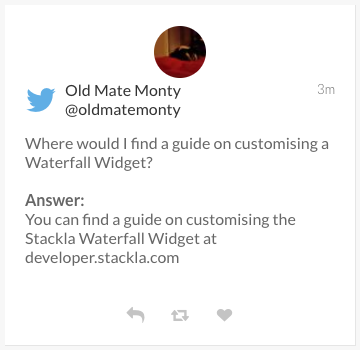
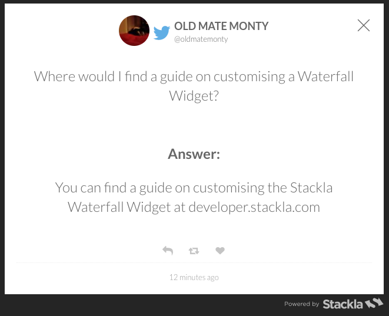

# Create a Q\&A Widget using Data Templates


You are reading the Classic Widget Documentation

NextGen widgets are a new and improved way to display UGC content.&#x20;

On Oct 1st, all widgets created will be NextGen.

Please check your widget version on the Widget List page to see if it is **Classic** or **NextGen** widget.

You can read the [Nextgen widget documentation here](../widgets-nextgen/).

**Note: This feature is unique to Classic widgets**


* [Introduction](create-qa-widget-using-data-templates.md#introduction)
* [Build the Data Template](create-qa-widget-using-data-templates.md#build-the-template)
* [Setup In-Line Tile](create-qa-widget-using-data-templates.md#setup-inline-tile)
* [Setup Expanded Tile](create-qa-widget-using-data-templates.md#setup-expanded-tile)
* [Next Steps](create-qa-widget-using-data-templates.md#conclusion)

## Introduction

Nosto's UGC offers the ability for clients to append their own Custom Data to any Tile or Tag on the Platform, allowing for clients to enrich the content on their Stack with additional data.

This custom data, which is then appended to the Tile or Tag, can be used through Nosto's UGC outputs including Widgets, Event Screens and the Nosto's UGC API.

In this guide we are going to create a simple Question & Answer (Q\&A) Widget, allowing Moderators to add, using Data Templates, answers to questions which have been submitted.

[Back to Top](create-qa-widget-using-data-templates.md#top)

## Build the Data Template

First step in the process is to build a Data Template. For the purpose of this guide, we are going to create a simple, one field template for Tiles, where we can add an 'answer' to a question we've aggregated into our Stack.

To find out how to create a Data Template for Tiles, we recommend following this [guide](../data-templates/creating-data-template.md) first.

For this example, our **Schema** and **Options** will be similar to the below:

**Schema:**

```
{
    "type":"object",
    "properties": {
        "response": {
            "type":"string"
        }
    }
}
```

**Options:**

```
{
    "fields": {
        "response": {
            "type":"textarea",
            "label": "Answer"
        }
    }
}
```

Once we have built out the template, we can start populating our template via the Curate Content section of your Stack. To do this, simply pick a Tile within your Curate Content screen, click on the Action Button and from the overflow menu your Data Template should be available.

_Note: It is recommended that you provide an answer for at least one tile before customising your Widget_

[Back to Top](create-qa-widget-using-data-templates.md#top)

## Setup In-Line Tile

Once we've setup our template, we can now start to customise our Widgets so that the answers will render on both the In-Line and Expanded Tile.

For this guide we are going to customise a Waterfall Widget.

To begin, we will need to append the below Custom Javascript to the Widget. This will add both an 'Answer' title to the base of the Tile, plus the relevant response we specified in the data template. It will also only render a Tile, if it has a Data Template response in it, meaning if this information is empty, the Tile won't appear on the Widget, even if it is published.

**Custom Javascript:**

```
onCompleteJsonToHtml: function ($tile, tileData) {
		$tile.find('.tile-caption').append("<br/><br/>Answer:");
		if (tileData && tileData.custom_fields.response) {			
			var response = tileData.custom_fields.response;
			$tile.find('.tile-caption').append('<br/>'+response+'<br/><br/>');
		} 
		console.log('[onCompleteJsonToHtml]', $tile, tileData);
		return $tile;
    },
```

Once added and saved, it should render similar to the below on the In-Line Tile:



[Back to Top](create-qa-widget-using-data-templates.md#top)

## Setup Expanded Tile

Next step is adding these responses to the Expanded Tile. Again, like on the In-Line tile, we are going to append an 'Answer' value to the base of the Expanded Tile, and then add the relevant response from the Data Template below.

**Custom Javascript:**

```
.on('expandedTileOpen', function (e, data) {
		var response = data.tileData.custom_fields.response;
		var $p = $tackla('<p></p>').html(response.replace(/docs/(\r|\n)/g, '<br />'));
        	console.log('response', $p, $tackla('.stacklapopup-caption').length);
		$tackla('.stacklapopup-caption').append("<br/><br/>Answer:");
		$tackla('.stacklapopup-caption').append($p);
    })
```

Once added and saved, it should render similar to the below on the Expanded Tile:



[Back to Top](create-qa-widget-using-data-templates.md#top)

## Next Steps

From here, we can look to either style our data template content to make it stand out from the ingested Social Content, or we can look to include more values / insights.

[Back to Top](create-qa-widget-using-data-templates.md#top)
