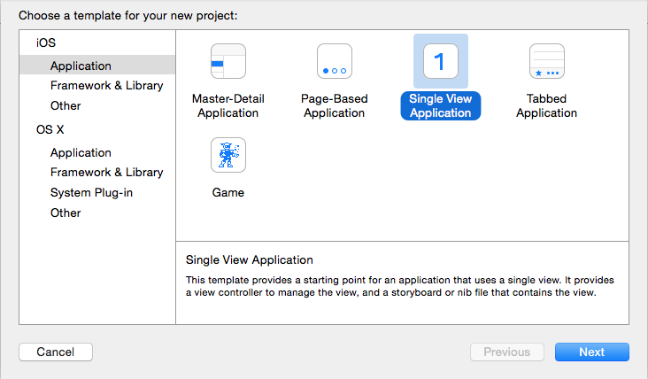
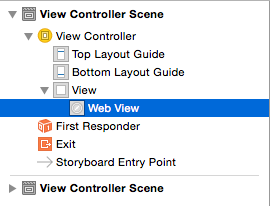
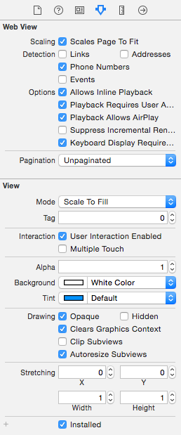
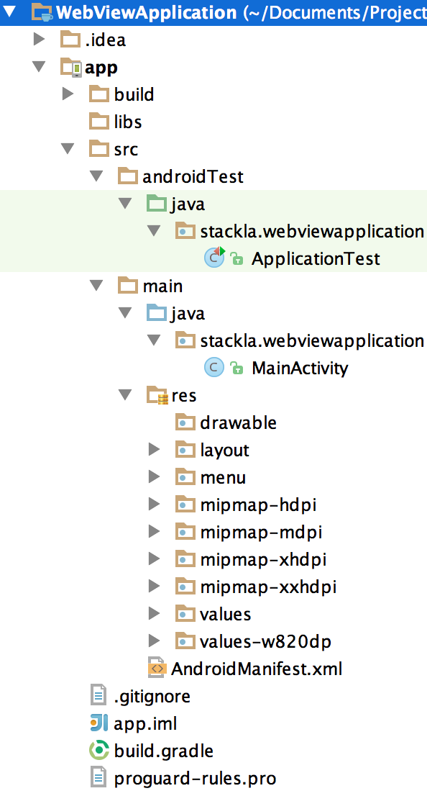

# Displaying a Widget in a Mobile App

## Overview

In this guide we explore the general concept of displaying a Nosto's UGC Widget into within an Android and iOS Mobile Application. This will enable you to render social media content inside of your app without a lot of hassle.

This guide focuses on the simplest and effective way of displaying the Widget through the use of WebViews.

## Key Concepts

### Parent Page

The page which will host the embedded UGC Widget and will be referenced by the relevant mobile app web view.

### Android Studio

Android Studio is an integrated development environment (IDE) for developing on the Android platform.

### XCode

XCode is an integrated development environment (IDE) for developing on the iOS platform.

## Requirements

To ensure our widgets function correctly, they must have access to the DOM. You can enable DOM Storage in your web view by following the instructions at this [link](https://developer.android.com/reference/android/webkit/WebSettings#setDomStorageEnabled\(boolean\))

## The Fun Part

In this guide we will do the following:

* Configure your Widget Parent Page
* Configure WebView on an iOS Mobile App via XCode
* Configure WebView on an Android Mobile App via Android Studio

### Configure your Widget Parent Page

Your Parent Page will be the hosted page that will contain your Embedded UGC Widget.

For the purposes of this guide, it is assumed that either a Fluid Horizontal or Fluid Vertical Widget will be used.

In order to ensure your Widget renders correctly when referenced from your Mobile Application it is important that you include the following META information in your page header.

```
<head>
    <meta name="apple-mobile-web-app-capable" content="YES"/>
    <meta name="viewport" content="width=device-width, initial-scale=1.0, maximum-scale=1.0, user-scalable=no, minimal-ui"/>
    <meta name="HandheldFriendly" content="true"/>
</head>
```

This information will tell the WebView the scale of the page, that it has been optimised for handheld devices and in the case of iOS that it is Apple Mobile App Capable.

The second step is ensure that there is no unnecessary padding or white space around your Widget. To remove this, please include the following CSS on your parent page:

```
<style>
    body {
        padding: 0;
        margin: 0;
    }
    body,
    .stacklahfw,
    .stacklahfw iframe {
        max-width: 100%;
    }
</style>
```

This CSS will remove the default padding that exists on all HTML pages, as well renders the UGC Widget at 100% the page width.

### Add WebView to your iOS Mobile App

For the purpose of this guide, we will create a brand new iOS Mobile Application on XCode.



Create a New Application with the following attributes:

* Template: Single View Application
* Application Name: WebView
* Language: Objective-C
* Devices: Universal
* Storyboards: True

And select where you would like to save the application files on your computer.

.png>)

Once setup you will notice on there left there will be a series of pre-generated files. These files will be called AppDelegate, ViewController and Main.Storyboard.

Both AppDelegate and ViewController will have a .h and .m version of the file.

For the purpose of app building, .h is the header file (the file that tells the app what to do), and .m is the implementation file (the file that does what the header told it to do).

#### Add the WebView to the Storyboard

The first step is adding the WebView to the Main.storyboard file. Upon selecting the file, you will be presented with a screen similar to below:

.png>)

You will also be presented with an updated object list (located on the right hand side).

.png>)

From this list find WebView and drag onto your Controller Canvas.

.png>)

This will open up the View Controller Scene within XCode. From here, make sure `View > Web View` is selected.



This will allow you to tweak the settings for the WebView within your Mobile Application.

Make sure within your settings you have ‘Scale Page to Fit’ selected.



#### Update ViewController.m

Next step is updating `ViewController.m`. Select the file from the left hand side. From the code that loads up, paste the following under the value `#import "ViewController.h"`.

```
@interface ViewController ()
@end
@implementation ViewController
- (void)viewDidLoad {
    UIWebView *webView = [[UIWebView alloc] initWithFrame:self.view.frame];
    webView.scalesPageToFit = YES;
    NSString *urlAddress = @"URL of a web page which has a UGC Widget";
    NSURL *url = [NSURL URLWithString:urlAddress];
    NSURLRequest *request = [NSURLRequest requestWithURL:url];
    [webView loadRequest:request];
    webView.contentMode = UIViewContentModeScaleAspectFit;
    webView.scalesPageToFit = YES;
    webView.autoresizingMask=(UIViewAutoresizingFlexibleHeight |UIViewAutoresizingFlexibleWidth);
    [self.view addSubview:webView];
    [super viewDidLoad];
    // Do any additional setup after loading the view, typically from a nib.
}
- (void)didReceiveMemoryWarning {
    [super didReceiveMemoryWarning];
    // Dispose of any resources that can be recreated.
}
@end
```

The section highlighted in yellow is where you will need to specify the URL to the page hosting your Widget.

Once done, save and build your Mobile Application.

### Add WebView to your Android Mobile App

For the purpose of this guide, we will create a brand new Android Mobile Application on Android Tools.

From Android Tools, select New Project and fill out the following attributes:

* Application Name: WebView Application
* Target Android Devices: Phone & Tablet
* Minimum SDK: API 15: Android 4.0.3 (IceCreamSandwich)
* Mobile Activity: Blank Activity
* Company Domain: Stackla

And select where you would like the application saved on your Computer.



Once setup you will notice on there left there will be a series of pre-generated files. The more important files to any Android App are:

* **src/main/java**. Android Java source code.
* **src/main/res**. Resources used by the native application.
* **src/main/res/drawable-type**. Image resources used by the native application.
* **src/main/res/layout**. XML layout files that define the structure of UI components.
* **src/main/res/values**. Dimensions, strings, and other values that you might not want to hard-code in your application.
* **src/main/AndroidManifest.xml**. The manifest file defines what's included in the application: activities, permissions, themes, and so on.

#### Add the WebView to the Main Activity Layout

Open the file `res/layout/activity_main.xml` and add the following code to the base of the document.

```
<WebView
        android:id="@+id/activity_main_webview"
        android:layout_width="match_parent"
        android:layout_height="match_parent" />
```

#### Update Main Activity Java Source Code:

Open the file `java/stackla/webviewapplication/MainActivity.java` and add the following highlighted code to the document.

```
package stackla.webviewapplication;

import android.support.v7.app.ActionBarActivity;
import android.os.Bundle;
import android.view.Menu;
import android.view.MenuItem;
import android.webkit.WebSettings;
import android.webkit.WebView;


public class MainActivity extends ActionBarActivity {

    @Override
    protected void onCreate(Bundle savedInstanceState) {
        super.onCreate(savedInstanceState);
        setContentView(R.layout.activity_main);

        WebView mWebView = (WebView) findViewById(R.id.activity_main_webview);

        WebSettings webSettings = mWebView.getSettings();
        webSettings.setJavaScriptEnabled(true);
        mWebView.setInitialScale(1);
        mWebView.getSettings().setJavaScriptEnabled(true);
        mWebView.getSettings().setLoadWithOverviewMode(true);
        mWebView.getSettings().setUseWideViewPort(true);
        mWebView.setScrollBarStyle(WebView.SCROLLBARS_OUTSIDE_OVERLAY);
        mWebView.setScrollbarFadingEnabled(false);

        mWebView.loadUrl("URL to Widget Parent Page");
    }

    // ... rest of the code
}
```

This code ensures that the standard Android WebSettings and WebView kit are imported.

* `import android.webkit.WebSettings;`
* `import android.webkit.WebView;`

Whilst this code determines the rendering of the app within the Web View.

* `WebView mWebView = (WebView) findViewById(R.id.activity_main_webview);`
* `WebSettings webSettings = mWebView.getSettings();`
* `webSettings.setJavaScriptEnabled(true);`
* `mWebView.setInitialScale(1);`
* `mWebView.getSettings().setJavaScriptEnabled(true);`
* `mWebView.getSettings().setLoadWithOverviewMode(true);`
* `mWebView.getSettings().setUseWideViewPort(true);`
* `mWebView.setScrollBarStyle(WebView.SCROLLBARS_OUTSIDE_OVERLAY);`
* `mWebView.setScrollbarFadingEnabled(false);`

This final line of code tells the Mobile Application what URL to load:

* `mWebView.loadUrl("URL to Widget Parent Page");`

#### Update Android Manifest

Open the file /manifests/AndroidManifest.xml and add the following line of code right after the parameter `<application>`.

```
<uses-permission android:name="android.permission.INTERNET" />
```

#### Update Build Tool Version

If you see error "Cannot resolve symbol R", you might need to downgrade the build tool version.

Please open the file `build.gradle` and change `buildToolsVersion` to `"21.0.1"`

Once done, save and build your Mobile Application.

## Best Practices for Web Apps

It is important to have a valid DOCTYPE and viewport in the parent page to prevent unexpected behaviours from different browsers. The article below listed some web apps best practices. Please ensure the web app follows the best practices at all times.

[Best Practices for Web Apps](http://developer.android.com/guide/webapps/best-practices.html)

## Summary and Next Steps

This example can be further expanded with the following activities:

* Customise Widget to suit the look and feel of your current app
* Integrate the above to switch Filters or Widgets within the Web Views
