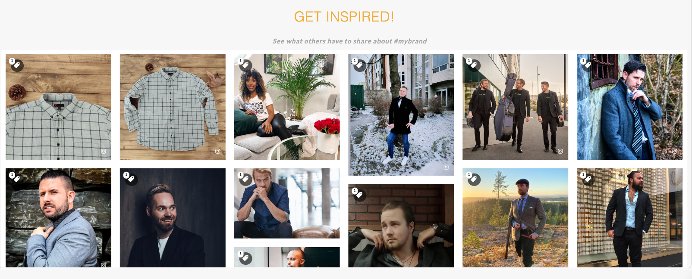
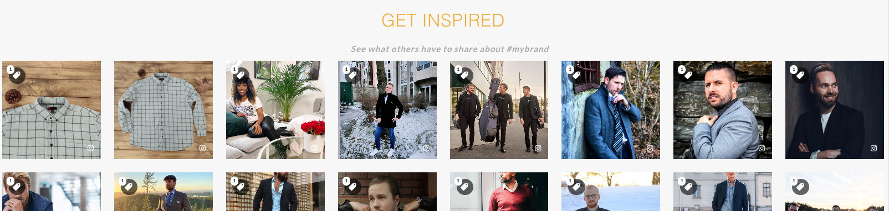

# How to add a title / subtitle to a widget

## Pre-Requisites

* If you are not familiar with customizing widgets using CSS & Javascript, we suggest you start [here](https://developer.stackla.com/guides/styling-widget-expanded-tile/) first as some of those details will come in handy.

## Overview

Nosto's UGC offers the ability to create advanced customizations to your widgets to match your brand needs.

In this guide, we are going explain how you can add a Title & Sub-Title directly to your widgets to ensure if a widget hides in your website because it doesn't have enough content to be displayed the entire header hides with it.

Please note that this customization is currently not supported for Story widgets.

## Getting Started

Different widget templates require slightly different Javascript to add a Header section to them. Below you can find the different examples for each template type.

### **Waterfall & Carousel Widgets:**

#### Create a Widget

Create a Waterfall or Carousel Widget and leave all the settings as per default.

#### Add a Title & Sub-Title

* Open the Custom Code editor and click Inline Tile. Under the Javascript section add the following code:

```
var widgetTitle = 'Get Inspired!';
var widgetSubTitle = 'See what others have to share about #mybrand';

$.extend(Callbacks.prototype, {
  onCompleteRenderTiles: function($addedTiles, addedData) {

    if (!document.querySelector("span.ugc-title")) {
      var widgetHeader = document.createElement("span");
      var widgetHeaderWrapper = document.createElement("div");
      widgetHeader.innerHTML = widgetTitle;
      widgetHeader.classList.add('ugc-title');
      widgetHeaderWrapper.classList.add('ugc-headline');
      widgetHeaderWrapper.insertBefore(widgetHeader, widgetHeaderWrapper.firstChild);
      var bodyElement = document.body;
      bodyElement.insertBefore(widgetHeaderWrapper, bodyElement.firstChild);
    }
    var subTitleWrapper = document.createElement("div");
    var subTitle = document.createElement("div");
    subTitle.innerHTML = widgetSubTitle;
    subTitleWrapper.classList.add("ugc-widget-subtitle");
    subTitleWrapper.insertBefore(subTitle, subTitleWrapper.firstChild);
    widgetHeaderWrapper.after(subTitleWrapper);
  }
});
```

* Then click Save.

#### Style your Title & Sub-Title

Customise the style of your Title & Sub-Title using the CSS section of the Inline Title Custom Code Editor.

#### Sample

The following is an example of a waterfall widget with custom Title & Sub-Title:



### **Nightfall, Quadrant, Grid, Slider, Masonry and Direct Uploader Widgets:**

#### Create a Widget

Create a Nightfall, Quadrant, Grid, Slider, Masonry or Direct Uploader Widget and leave all the settings as per default.

#### Add a Title & Sub-Title

* Open the Custom Code editor and click Inline Tile. Under the Javascript section add the following code:

```
$(document).on('widget:ready', function(e, instance) {

  //====================== // Customisable Strings //====================== 
  var widgetTitle = 'Get Inspired'; 
  var widgetSubTitle = 'See what others have to share about #mybrand';
  
  instance.on('render', function(e, $appendRoot, listData) {
    if (!document.querySelector("span.ugc-title")) {
      var widgetHeader = document.createElement("span");
      var widgetHeaderWrapper = document.createElement("div");
      widgetHeader.innerHTML = widgetTitle;
      widgetHeader.classList.add('ugc-title');
      widgetHeaderWrapper.classList.add('ugc-headline');
      widgetHeaderWrapper.insertBefore(widgetHeader, widgetHeaderWrapper.firstChild);
      var bodyElement = document.body;
      bodyElement.insertBefore(widgetHeaderWrapper, bodyElement.firstChild);
      var subTitleWrapper = document.createElement("div");
      var subTitle = document.createElement("div");
      subTitle.innerHTML = widgetSubTitle;
      subTitleWrapper.classList.add("ugc-widget-subtitle");
      subTitleWrapper.insertBefore(subTitle, subTitleWrapper.firstChild);
      widgetHeaderWrapper.after(subTitleWrapper);
    }
  });
});
```

* Then click Save

#### Style your Title & Sub-Title

Customise the style of your Title & Sub-Title using the CSS section of the Inline Title Custom Code Editor.

#### Sample

The following is an example of a Grid widget with custom Title & Sub-Title:



### **Blank Canvas Widgets:**

#### Create a Widget

Create a Blank Canvas Widget and leave all the settings as per default.

#### Add a Title & Sub-Title

* Open the Custom Code editor and and under the Javascript section add the following code:

```
Stackla.loadTilesByFilter(function(tiles) {
  Stackla.render({
    tiles: tiles
  }); 
  
  //====================== // Customisable Strings //====================== 
  var widgetTitle = 'Get Inspired'; var widgetSubTitle = 'See what others have to share about #mybrand';
  var widgetHeader = document.createElement("span");
  var widgetHeaderWrapper = document.createElement("div");
  
  widgetHeader.innerHTML = widgetTitle;
  widgetHeader.classList.add('ugc-title');
  widgetHeaderWrapper.classList.add('ugc-headline');
  widgetHeaderWrapper.insertBefore(widgetHeader, widgetHeaderWrapper.firstChild);
  var bodyElement = document.body;
  bodyElement.insertBefore(widgetHeaderWrapper, bodyElement.firstChild);
  var subTitleWrapper = document.createElement("div");
  var subTitle = document.createElement("div");
  subTitle.innerHTML = widgetSubTitle;
  subTitleWrapper.classList.add("ugc-widget-subtitle");
  subTitleWrapper.insertBefore(subTitle, subTitleWrapper.firstChild);
  widgetHeaderWrapper.after(subTitleWrapper);
});
```

* Then click Save

#### Style your Title & Sub-Title

Customise the style of your Title & Sub-Title using the CSS section of the Custom Code Editor.
