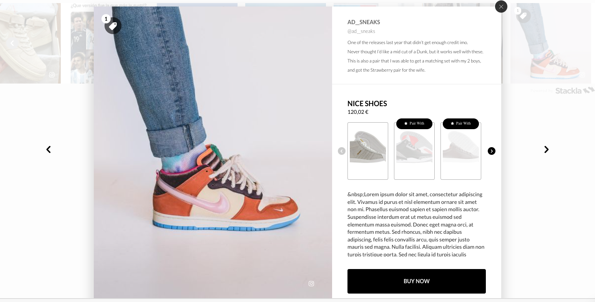

# Styling cross-sellers on Grid and Carousel Widgets


You are reading the Classic Widget Documentation

Nextgen widgets are a new and improved way to display UGC content.&#x20;

Read the [Nextgen widget documentation here](../widgets-nextgen/).


## Pre-Requisites

* If you are not familiar with customising widgets using CSS, we suggest you start [here](styling-widget-expanded-tile.md) first as some of those details will come in handy.
* Cross-Sellers on UGC widgets require the subscription of the [Nosto Product Recommendations](https://www.nosto.com/products/product-recommendations) Module.
* Cross-Sellers are only supported on Grid and Carousel widgets.

## Overview

When using Nosto Product Recommendations as cross-sellers in UGC widgets, you combine the power of social proof with recommendations to drive your conversion rate by increasing relevance and boost average order value.

This guide will explore how to style the layout of how cross-sellers are displayed in widgets.

## Getting Started

### Tag Content with Tags

Start by going to the Curate view, apply shopspots to 4 or 5 tiles and publish those tiles.

### Create a Filter

Creating a Filter in Nosto's UGC is really simple as outlined in [this Knowledgebase article](https://help.nosto.com/en/articles/5793303-how-do-i-create-a-filter). Assuming that we would like to only showcase content with products, select the following options:

* Name it "Cross-Sellers"
* Set it to sort by "Latest"
* Select the filter "Shopspots" and choose the "Show Shopspots" option

The rest of the options can be left to default.

### Create a Widget

Create a Grid or Carousel Widget and set its filter to "Cross-Sellers". Save and observe the preview with your content.

### Update the Widget Expanded Tile CSS

Open the Custom Code editor and click Expanded Tile. Here some examples of cross-sellers styling that you can customise:

#### Color of the ribbon (e.g. Grey):

```
.stacklapopup-products-item-image-recommendation-label {
```

#### Position of the ribbon (e.g. at the bottom):

```
.stacklapopup-products-item-image-recommendation-label {
```

#### Color, Font & Text of the Cross-Seller label (e.g. Label "Pair With", Color "white", Font "Lato, sans-serif)

```
.stacklapopup-products-item-image-recommendation-label:after {
content: "Pair with";
color: white;
font: 400 10px/18px "Lato, sans-serif";
}
```

#### Color, Font & Text of the See Recommendations label (e.g. Label "show me recommendations", Color "#2C2C2C", Font "Lato, sans-serif)

```
.stacklapopup-products-amount-over-3:after {
content: "see recommendations:";
color: #2C2C2C;
font: 400 10px/18px "Lato, sans-serif";
}
```

## Sample

The following is an example of a grid widget with customised cross-sellers:


