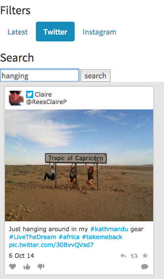

# How to use Filter and search in a Widget


You are reading the Classic Widget Documentation

NextGen widgets are a new and improved way to display UGC content.&#x20;

On Oct 1st, all widgets created will be NextGen.

Please check your widget version on the Widget List page to see if it is **Classic** or **NextGen** widget.

You can read the [Nextgen widget documentation here](../widgets-nextgen/).

**Note: This feature is unique to Classic widgets**


## Overview

When Stackla widgets are shown, often a custom menu will be built. The menu will drive the Filter-changing in the widget and often perform other functions too, not necessarily related to Stackla.

In this guide, we will build a case where we can trigger the widget filter by clicking on a menu.

## Key concepts

### Tile

In your Stack, the name Tile is given to a piece of content that has been saved and made available for moderation. It could be a Tweet, an Instagram photo or a YouTube video, amongst others. It could also be a user-generated post to your photo competition.

### Widget

A Stackla Widget will be created to demonstrate the use of the [JavaScript API](../../api-docs/javascript/) to switch the filters being displayed.

### Filter

Stackla Filters drive the content being displayed in the Widget, so they are a key resource used for the menu. The [REST API](../../api-docs/rest/) will be used to grab them from

### JavaScript API

The [JavaScript API](../../api-docs/javascript/) is will be used to talk to the Widget on the site and get it to switch the Filter being displayed.

## The Fun Part

### Getting Started

In this example we will need to do the following:

1. Configure Filters & Tags
2. Enable 'Allow Filter Tags to be overwritten'
3. Enable 'Enable Text Search'
4. Create an application to grab the Filter data from Stackla

### Configure Filters

For this example, we will have some filters to choose from: Latest, Twitter and Instagram. Remove the other Filters, or if you're starting from scratch, create them so that they sort by Latest, with Twitter and Instagram filtering by the Twitter and Instagram networks respectively.

### Create the Example Application

To simplify the example, we will create a simple HTML page and will have clickable filters and tags listing.

### Lets jump to the geek's mode to see how it works.

Lets add the widget embed code to the page.

```
<div class="widget">
    <div class='stacklafw' data-id='9999' data-hash='abcd123efgh5678' data-ct='' data-alias='myawesomestack.stackla.com' data-ttl="30" ></div>
    <script type="text/javascript">
        (function (d, id) {
            if (d.getElementById(id)) return;
            var t = d.createElement('script');
            t.type = 'text/javascript';
            t.src = '//assetscdn.stackla.com/media/js/widget/fluid-embed.js';
            t.id = id;
            (document.getElementsByTagName('head')[0] || document.getElementsByTagName('body')[0]).appendChild(t);
        }(document, 'stacklafw-js'));
    </script>
</div>
```

To see this example work, we will need to add this. This _widgetId_ will be use to target selected widget.

```
<script> window.widgetId = 9999; // manually added </script>
```

### Filters

Let's add clickable filters listing, you will notice the filter-id are attached to the listing, it will be used to do the javascript filtering.

**note:** don't forget to change the filter-id to your filter-id.

```
<nav class="filters">
    <div>
        <ul class="nav nav-pills">
            <li class="col-xs-4 col-sm-4 col-md-4 col-lg-2" data-filter="1031"><a href="#latest">Latest</a></li>
            <li class="col-xs-4 col-sm-4 col-md-4 col-lg-2" data-filter="1035"><a href="#twitter">Twitter</a></li>
            <li class="col-xs-4 col-sm-4 col-md-4 col-lg-2" data-filter="1034"><a href="#gratest">Greatest</a></li>
        </ul>
    </div>
</nav>
```

This is how we are going to drive the clickable filters listing. We call the **Stackla.WidgetManager** class to apply the selected filtering.

```
$('.filters a').click(function(){
    var filter = $(this).parent();
    $('.filters li').removeClass('active');
    filter.addClass('active');
    Stackla.WidgetManager.changeFilter(window.widgetId, filter.attr('data-filter'));
});
```

### Keyword / Full Text Search

You will need to request from [Stackla Support](http://support.stackla.com/) to enable the 'Text Search' option in your Stack. By default, this feature is off.

Let's build the keyword input form and add JavaScript to it.

```
<form id="search-form" action="#">
    <input type="text" name="keyword"> <button type="submit">search</button>
</form>
```

```
var refSearch = null;
function search(keyword) {
    if (refSearch) {
       clearTimeout(refSearch);
    }
    refSearch = setTimeout(function(){
        console.log('keyword', keyword);

        if (keyword.length > 0 && keyword.length < 3) {
            return;
        }
        StacklaFluidWidget.searchFilter(window.widgetId, keyword);
    }, 100);
}

$('#search-form').submit(function(event){
    search($(this).find('input[name="keyword"]').val());
    return false;
});
```



## Summary and Next Steps

This was a very basic example to demonstrate some use of the Widgets Filtering on the same page. You can expand this example to:

* Build a better menu for switching
* Use dynamic generated filters for flexibility
* Use keyword validation
