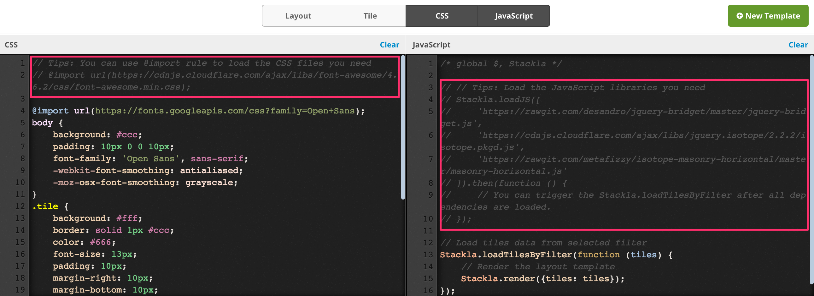

# How to Load External JS and CSS into Widgets


You are reading the Classic Widget Documentation

NextGen widgets are a new and improved way to display UGC content.&#x20;

On Oct 1st, all widgets created will be NextGen.

Please check your widget version on the Widget List page to see if it is **Classic** or **NextGen** widget.

You can read the [Nextgen widget documentation here](../widgets-nextgen/typescript-api-guides/loading-external-js-and-css-libraries-to-widgets.md).


* [Overview](loading-external-js-and-css-libraries-to-widgets.md#overview)
* [Loading the External CSS](loading-external-js-and-css-libraries-to-widgets.md#loading-the-external-css)
* [Loading the External JavaScript](loading-external-js-and-css-libraries-to-widgets.md#loading-the-external-javascript)
  * [jQuery.getScript](loading-external-js-and-css-libraries-to-widgets.md#jquery-getscript)
  * [Stackla.loadJS](loading-external-js-and-css-libraries-to-widgets.md#stackla-loadjs)
* [Tips](loading-external-js-and-css-libraries-to-widgets.md#tips)
  * [1. Getting Stackla.loadJS Example with a Click](loading-external-js-and-css-libraries-to-widgets.md#getting-stackla-loadjs-example-with-a-click)
  * [2. Available Hosts for the Wanted External Files](loading-external-js-and-css-libraries-to-widgets.md#available-hosts-for-the-wanted-external-files)

## Overview

This article will demonstrate how to load external JavaScript and CSS into your widgets using our custom code editors.

## Loading the External CSS

Loading the external CSS is very straight-forward. You just need to use the CSS `@import`.

### Example

You can write the following code in your Custom CSS code editor to load [Bootstrap](http://getbootstrap.com) and [Font Awesome](http://fontawesome.io) libraries.

```
@import url(https://cdnjs.cloudflare.com/ajax/libs/twitter-bootstrap/4.0.0-alpha/css/bootstrap.min.css);
@import url(https://cdnjs.cloudflare.com/ajax/libs/font-awesome/4.6.2/css/font-awesome.min.css);
```

[Back to Top](loading-external-js-and-css-libraries-to-widgets.md#top)

## Loading the External JavaScript

Loading the external JavaScript is a bit more tricky because it involves the **dependency order**.

### jQuery.getScript

You can use the `$.getScript` method to load external JavaScript files one after the other in your preferred order. The following example loads **jquery-bridget**, **isotope**, and **masonry-horizontal** one by one as the order is critical.

#### Example

```
$.getScript('https://rawgit.com/desandro/jquery-bridget/master/jquery-bridget.js')
    .then($.getScript('https://cdnjs.cloudflare.com/ajax/libs/jquery.isotope/2.2.2/isotope.pkgd.js'))
    .then($.getScript('https://rawgit.com/metafizzy/isotope-masonry-horizontal/master/masonry-horizontal.js'))
    .then(function () {
        // Do something after the external files are loaded
    });
```

### Stackla.loadJS

The disadvantage of the previous code snippet is that **the preceding JavaScript blocks the next one from loading**. (The jquery-bridget blocks the isotope and the isotope blocks masonry-horizontal.) If one of them is a slow asset, your widget rendering could be slower than what you expect.

Thus, we introduce the `Stackla.loadJS` method to fix this issue. It **starts to load all JavaScript files altogether** but **executes them in order**. The following is the example.

#### Example

```
Stackla.loadJS([
    'https://rawgit.com/desandro/jquery-bridget/master/jquery-bridget.js',
    'https://cdnjs.cloudflare.com/ajax/libs/jquery.isotope/2.2.2/isotope.pkgd.js',
    'https://rawgit.com/metafizzy/isotope-masonry-horizontal/master/masonry-horizontal.js'
]).then(function() {
    // Do something after the external files are loaded
});
```

[Back to Top](loading-external-js-and-css-libraries-to-widgets.md#top)

## Tips

### 1. Getting Stackla.loadJS Example with a Click

When you click the **Fork** links in the Code Editor, the generated code will include the usage of `Stackla.loadJS` example.



### 2. Available Hosts for the Wanted External Files

You may be wondering what the public URLs are for your wanted libraries. You may use some of the following resources.

* [**cdnjs**](https://cdnjs.com): All of the popular libraries such as Bootstrap, Font Awesome and Animated.css are all available on cdnjs.com.
* [**RawGit**](http://rawgit.com): RawGit serves raw files directly from GitHub with proper Content-Type headers. That means, you can place your libraries as the GitHub repositories and load it with the rawgit!
* **Host your files with Nosto's UGC**: This feature is not available unless requested, to enable the "CSS/JS Upload" in the Media Library you will need to contact [Visual UGC Support](http://support.stackla.com).

[Back to Top](loading-external-js-and-css-libraries-to-widgets.md#top)

Please note - not all of our code editors allow you to load external JS and CSS. This is currently only available for our Widget editors.
